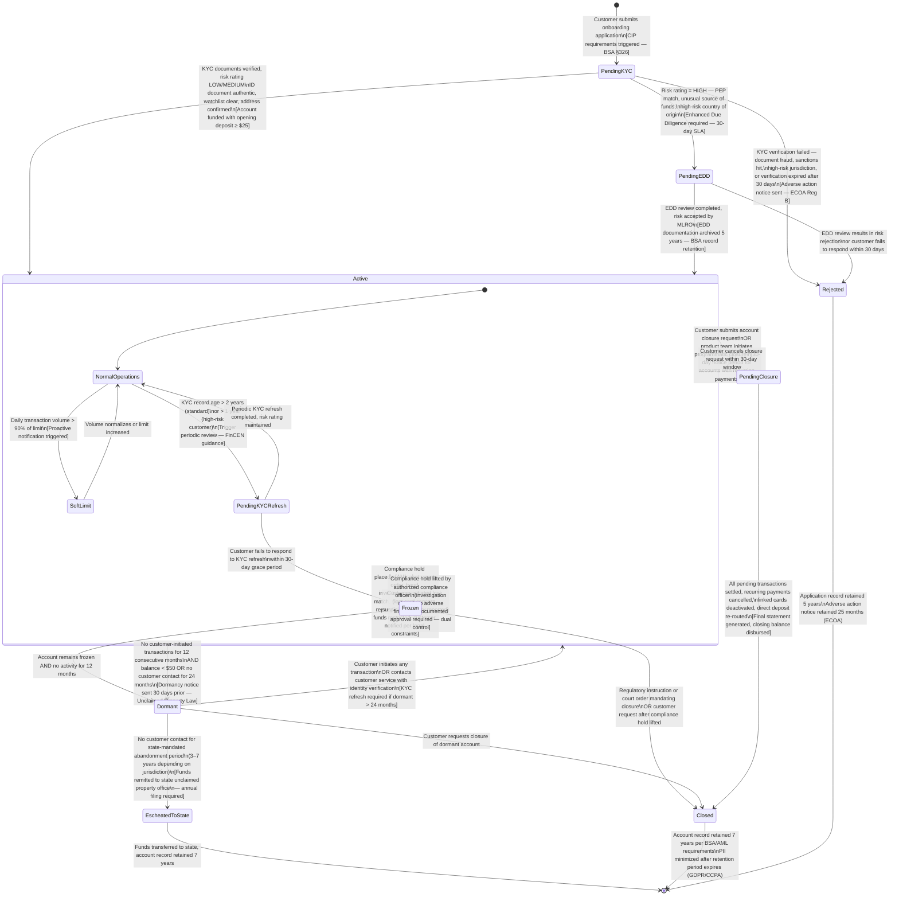
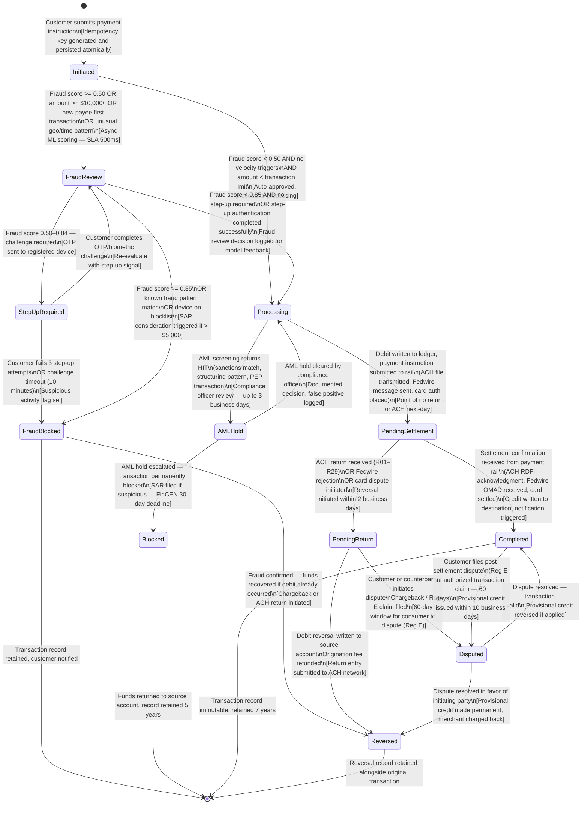
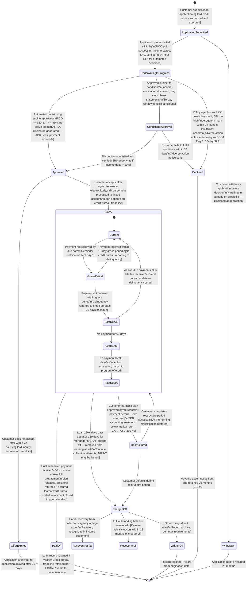
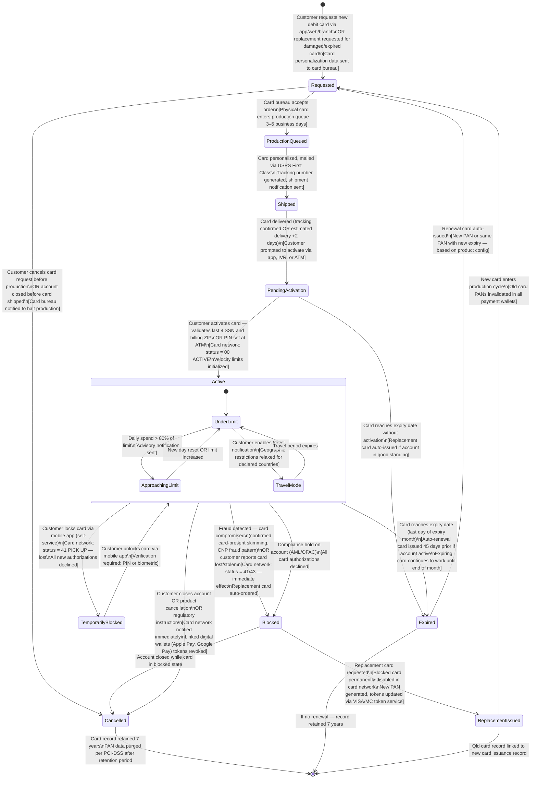
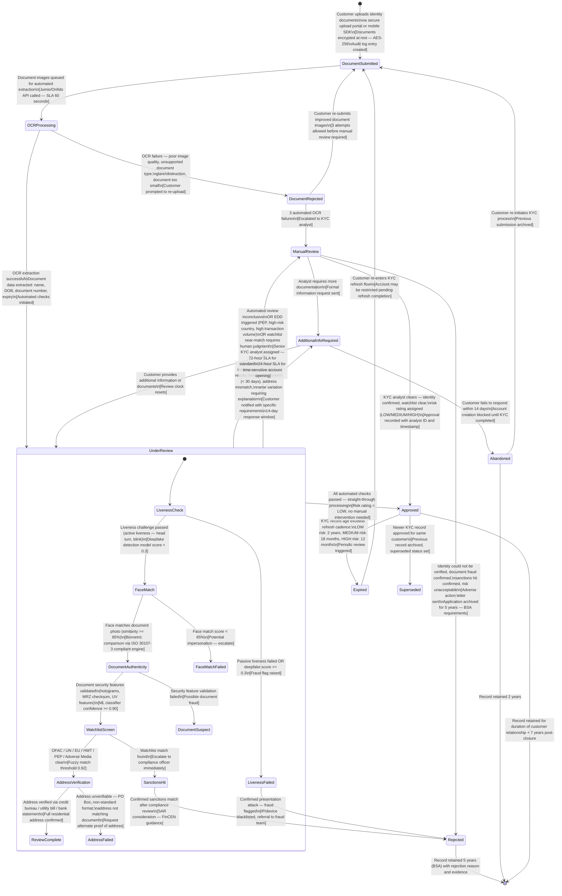

# State Machine Diagrams — Digital Banking Platform

All state machines are modelled as `stateDiagram-v2` using Mermaid. Each state includes entry/exit conditions, guard clauses, and regulatory constraints.

---

## Account Lifecycle State Machine

An account progresses from creation through identity verification, operational use, and eventual closure. Regulators mandate documented transitions, especially for dormancy and closure processes.

**Key Regulatory Constraints:**
- Dormancy thresholds vary by US state (NY: 3 years, CA: 3 years, TX: 3 years).
- Escheatment filing is an annual obligation; late filing attracts penalties.
- Frozen accounts must have legal basis documented; blanket freezes without documented grounds expose the institution to liability.
- KYC refresh cadence is risk-based: standard customers every 2 years, high-risk annually, EDD customers reviewed on every material event.

---

## Transaction Lifecycle State Machine

Every transaction — domestic transfer, card payment, or bill pay — follows this state machine. The design ensures exactly-once processing semantics and provides clear audit points for reconciliation.

---

## Loan Lifecycle State Machine

Loan states capture the full origination, servicing, and resolution lifecycle with payment-tracking granularity required for GAAP loan loss provisioning and regulatory capital calculation (Basel III).

---

## Debit Card Lifecycle State Machine

Card state management is tightly coupled to card network (Visa/Mastercard) system of record updates. Every state change must be reflected in the card network's card management system within 2 minutes to prevent authorization inconsistencies.

---

## KYC Record Lifecycle State Machine

KYC records are independent entities from accounts — a single customer may have multiple KYC records (initial, periodic refresh, EDD). Each record has its own state and validity period.

