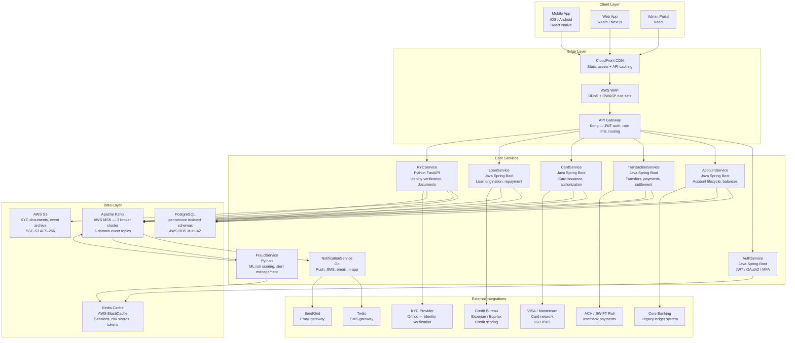

# Architecture Diagram — Digital Banking Platform

## Architecture Principles

The Digital Banking Platform is architected on the following foundational principles. All design
decisions and technology choices must be evaluated against these principles before adoption.

| Principle              | Statement                                                                                      | Implication                                                              |
|------------------------|-----------------------------------------------------------------------------------------------|--------------------------------------------------------------------------|
| Cloud-Native           | All components are designed to run on managed cloud infrastructure (AWS) without modification | No on-premises dependencies; leverage managed services over self-hosted  |
| Microservices          | Each bounded context is an independently deployable service with a single responsibility      | No shared databases; each service owns its schema                        |
| Event-Driven           | Cross-service communication for non-latency-sensitive operations uses async Kafka events       | Loose coupling; services can evolve and scale independently              |
| API-First              | All service capabilities are exposed through versioned, documented REST or gRPC APIs          | Contract-first design; OpenAPI / Protobuf specs committed before code    |
| Security by Design     | Authentication, authorization, encryption, and audit logging are mandatory at every layer     | Zero-trust network model; mTLS between services; no plaintext PII at rest|
| Resilience by Default  | Every service implements circuit breakers, retries, bulkheads, and graceful degradation       | System continues to function under partial failure conditions            |
| Observability First    | Distributed tracing, structured logging, and metrics are built into every service from day one| Full request traceability from client to database and back               |

---

## Full Microservices Architecture

---

## Service Responsibility Matrix

| Service             | Domain                              | Primary DB          | Key APIs                                            | Publishes Events                                       | Consumes Events                         |
|---------------------|-------------------------------------|---------------------|-----------------------------------------------------|--------------------------------------------------------|-----------------------------------------|
| AuthService         | Authentication, session management  | Redis (sessions)    | `POST /auth/token`, `POST /auth/refresh`, `POST /auth/mfa` | None                                              | None                                    |
| AccountService      | Account lifecycle, balances, holds  | PostgreSQL (acct)   | `POST /accounts`, `GET /accounts/{id}`, `POST /holds` | `banking.account.opened.v1`, `banking.account.frozen.v1` | `identity.kyc.completed.v1`          |
| TransactionService  | Transfers, payments, settlement     | PostgreSQL (txn)    | `POST /transfers`, `GET /transfers/{id}`, `GET /history` | `banking.transfer.*`                               | `fraud.alert.raised.v1`                 |
| CardService         | Card issuance, authorization, limits | PostgreSQL (card)  | `POST /cards`, `POST /cards/{id}/authorize`, `PUT /cards/{id}/freeze` | `banking.card.issued.v1`, `banking.card.frozen.v1` | `fraud.alert.raised.v1`          |
| LoanService         | Loan origination, repayment         | PostgreSQL (loan)   | `POST /loans/apply`, `GET /loans/{id}`, `POST /loans/{id}/repay` | `banking.loan.approved.v1`, `banking.loan.disbursed.v1` | None                           |
| KYCService          | Identity verification, documents    | PostgreSQL (kyc)    | `POST /kyc/submit`, `GET /kyc/{id}`, `POST /webhooks/kyc/result` | `identity.kyc.completed.v1`                       | None                                    |
| FraudService        | Risk scoring, fraud alerts          | Redis + PostgreSQL  | `POST /fraud/pre-check`, `POST /fraud/card-check`, `GET /alerts/{id}` | `fraud.alert.raised.v1`                          | `banking.transfer.initiated.v1`, `banking.card.issued.v1` |
| NotificationService | Multi-channel notification delivery | PostgreSQL (notif)  | `POST /notifications`, `GET /notifications/{customerId}` | None                                              | All domain events                       |

---

## Inter-Service Communication

| Interaction                                     | Pattern       | Protocol     | Rationale                                                               |
|-------------------------------------------------|---------------|--------------|-------------------------------------------------------------------------|
| Client App → API Gateway                        | Sync — REST   | HTTPS/TLS    | Stateless request–response; client-facing                               |
| API Gateway → Core Services                     | Sync — REST   | HTTP/2       | Low-latency path for user-facing operations                             |
| TransactionService → AccountService (balance)   | Sync — gRPC   | HTTP/2       | Strongly typed; high-throughput inner-service calls                     |
| TransactionService → FraudService (pre-check)   | Sync — REST   | HTTP/2       | Synchronous fraud decision required before hold placement               |
| TransactionService → Core Banking               | Sync — REST   | HTTPS        | Ledger posting must succeed before payment rail submission              |
| TransactionService → Payment Rail               | Sync — REST   | HTTPS/mTLS   | Rail submission requires synchronous acknowledgement                   |
| AccountService → KYCService (tier update)       | Async — Event | Kafka        | Non-blocking; KYC completion drives account upgrade asynchronously      |
| FraudService → TransactionService (alert)       | Async — Event | Kafka        | Alert response actions applied asynchronously after score computation   |
| All Services → NotificationService              | Async — Event | Kafka        | Notifications are best-effort; decoupled from core transaction path     |
| All Services → AuditService                     | Async — Event | Kafka        | Audit logging must not block business operations                        |
| KYCService → Document Store                     | Sync — SDK    | HTTPS/S3     | Direct S3 put/get using AWS SDK with IAM role-based credentials         |

---

## Technology Stack

| Layer               | Component               | Technology Choice                   | Rationale                                                            |
|---------------------|-------------------------|-------------------------------------|----------------------------------------------------------------------|
| Client              | Mobile App              | React Native                        | Single codebase for iOS and Android; native performance via JSI      |
| Client              | Web App                 | React / Next.js                     | SSR for SEO and performance; React ecosystem compatibility           |
| Client              | Admin Portal            | React (SPA)                         | Consistent component library with web app; no SSR needed             |
| Edge                | CDN                     | AWS CloudFront                      | Global PoPs; integrated with WAF and S3                              |
| Edge                | WAF                     | AWS WAF                             | Managed rule sets for OWASP Top 10; DDoS mitigation                  |
| Edge                | API Gateway             | Kong Gateway                        | Plugin ecosystem (JWT, rate-limit, mTLS); Kubernetes-native          |
| Services            | Java services           | Spring Boot 3 / Java 21             | Mature ecosystem; virtual threads for high concurrency               |
| Services            | Python services         | FastAPI + Uvicorn                   | Async I/O; excellent ML library integration for FraudService         |
| Services            | Go service              | Go 1.22 stdlib + goroutines         | Low memory footprint; high concurrency for notification fan-out      |
| Messaging           | Event broker            | Apache Kafka on AWS MSK             | Exactly-once semantics; 7-day retention; Confluent Schema Registry   |
| Persistence         | Primary DB              | PostgreSQL 16 on AWS RDS Multi-AZ   | ACID compliance; row-level security; JSON support                    |
| Persistence         | Cache                   | Redis 7 on AWS ElastiCache          | Sub-millisecond latency; TTL support; pub/sub for sessions           |
| Persistence         | Object store            | AWS S3                              | Unlimited scale; SSE-S3 encryption; versioning; lifecycle policies   |
| Persistence         | Analytics DB            | Amazon Redshift RA3                 | Columnar storage; managed scaling; Redshift Spectrum for S3 queries  |
| Observability       | Tracing                 | AWS X-Ray + OpenTelemetry           | Distributed trace correlation across all services                    |
| Observability       | Metrics                 | Prometheus + Grafana                | Custom dashboards; alerting via Alertmanager                         |
| Observability       | Logging                 | ECS + Elasticsearch + Kibana (ELK)  | Structured JSON logs; full-text search; retention policies           |
| Security            | Secrets management      | AWS Secrets Manager                 | Automatic rotation; IAM policy-based access; audit trail             |
| Security            | TLS certificates        | AWS Certificate Manager             | Automated renewal; integrated with CloudFront and ALB                |

---

## Non-Functional Requirements

| NFR Category    | Requirement                                              | Target                                         |
|-----------------|----------------------------------------------------------|------------------------------------------------|
| Availability    | Core banking services (Account, Transaction, Card)       | 99.99% uptime (< 52 min/year downtime)         |
| Availability    | Supporting services (Notification, Reporting)            | 99.9% uptime (< 8.76 h/year downtime)          |
| Latency         | Transfer initiation API (p99)                            | ≤ 500 ms                                       |
| Latency         | Card authorization API (p99)                             | ≤ 200 ms                                       |
| Throughput      | Sustained transfer processing                            | 500 TPS sustained; 2,000 TPS burst             |
| Throughput      | Card authorization                                       | 1,000 TPS sustained; 5,000 TPS burst           |
| Data Durability | Customer financial records                               | 99.999999999% (11 nines) — AWS S3 + RDS        |
| RTO             | Recovery time objective (major incident)                 | ≤ 4 hours                                      |
| RPO             | Recovery point objective                                 | ≤ 15 minutes (continuous replication)          |
| Security        | Encryption at rest                                       | AES-256 for all PII and financial data         |
| Security        | Encryption in transit                                    | TLS 1.3 minimum; mTLS for service-to-service   |
| Compliance      | PCI DSS                                                  | Level 1 (> 6 million transactions/year)        |
| Compliance      | Regulatory                                               | GDPR, PSD2, local banking regulations          |
