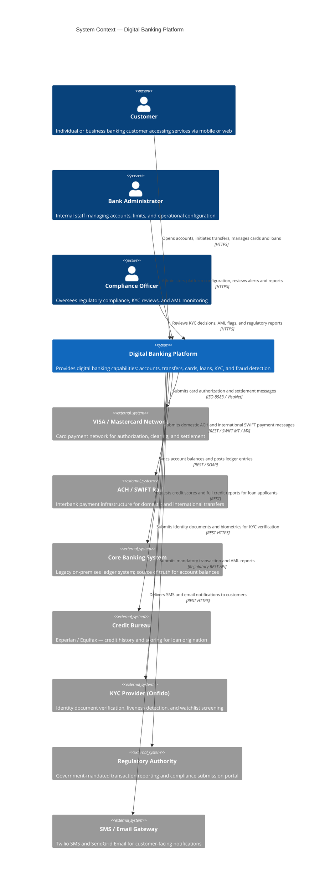

# C4 Architecture Diagrams — Digital Banking Platform

This document presents the C4 model architecture diagrams for the Digital Banking Platform at
three levels of abstraction: System Context (Level 1), Container (Level 2), and Component
(Level 3 for TransactionService). Each level is accompanied by a description, technology
decisions table, and interaction matrix.

---

## C4 Level 1 — System Context

The System Context diagram shows the Digital Banking Platform as a single system and its
relationships with users and external systems. This is the highest-level view, intended for
stakeholder communication and scope definition.

### System Context — Key Relationships

| Relationship                           | Direction          | Protocol          | Sensitivity            | SLA                        |
|----------------------------------------|--------------------|-------------------|------------------------|----------------------------|
| Customer ↔ Platform                    | Bidirectional      | HTTPS TLS 1.3     | PII + Financial        | 99.99% availability        |
| Platform → VISA/MC Network             | Outbound           | ISO 8583 / mTLS   | PCI CHD                | p99 ≤ 200 ms               |
| Platform → ACH / SWIFT Rail            | Outbound           | REST / SWIFT MX   | Financial              | p99 ≤ 500 ms               |
| Platform → Core Banking                | Outbound           | REST / SOAP       | Financial              | p99 ≤ 1 s                  |
| Platform → KYC Provider                | Outbound           | REST HTTPS        | PII + Biometric        | Async; webhook within 5 min|
| Platform → Credit Bureau               | Outbound           | REST HTTPS        | PII + Financial        | p99 ≤ 3 s                  |
| Platform → Regulatory Authority        | Outbound           | Regulatory API    | Regulatory             | Batch; daily submission    |

---

## C4 Level 2 — Container Diagram

The Container diagram zooms into the Digital Banking Platform boundary and shows the high-level
technical building blocks (containers): applications, services, data stores, and messaging
infrastructure.

```mermaid
C4Container
    title Container Diagram — Digital Banking Platform

    Person(customer,    "Customer",          "Uses mobile or web app for banking")
    Person(bankAdmin,   "Bank Administrator","Uses admin portal for operations")

    System_Ext(visaMC,      "VISA / MC Network",   "Card network")
    System_Ext(achSwift,    "ACH / SWIFT Rail",    "Interbank payments")
    System_Ext(kycProvider, "KYC Provider (Onfido)","Identity verification")
    System_Ext(creditBureau,"Credit Bureau",        "Credit scoring")
    System_Ext(twilio,      "Twilio",               "SMS gateway")
    System_Ext(sendgrid,    "SendGrid",             "Email gateway")

    System_Boundary(dbp, "Digital Banking Platform") {
        Container(mobileApp,    "Mobile App",          "React Native",        "iOS and Android banking application")
        Container(webApp,       "Web App",             "React / Next.js",     "Browser-based banking portal")
        Container(adminPortal,  "Admin Portal",        "React SPA",           "Internal operations and configuration portal")
        Container(apiGateway,   "API Gateway",         "Kong",                "Request routing, JWT auth, rate limiting, mTLS termination")

        Container(authSvc,      "AuthService",         "Java / Spring Boot",  "JWT issuance, OAuth2, MFA, session management")
        Container(accountSvc,   "AccountService",      "Java / Spring Boot",  "Account lifecycle, balance management, hold placement")
        Container(txnSvc,       "TransactionService",  "Java / Spring Boot",  "Transfer processing, payment rail integration, settlement")
        Container(cardSvc,      "CardService",         "Java / Spring Boot",  "Card issuance, 3DS authorization, limit management")
        Container(loanSvc,      "LoanService",         "Java / Spring Boot",  "Loan origination, repayment scheduling, interest calculation")
        Container(kycSvc,       "KYCService",          "Python / FastAPI",    "KYC submission, document storage, provider integration")
        Container(fraudSvc,     "FraudService",        "Python",              "ML risk scoring, rule engine, fraud alert management")
        Container(notiSvc,      "NotificationService", "Go",                  "Multi-channel notification fan-out and delivery tracking")

        Container(kafka,        "Message Broker",      "Apache Kafka / MSK",  "Durable event streaming; 6 domain topics; 3-broker cluster")
        Container(docStore,     "Document Store",      "AWS S3",              "Encrypted KYC document storage and event archive")
        Container(cache,        "Cache",               "Redis / ElastiCache", "Session tokens, risk score cache, distributed locks")

        ContainerDb(accountDb,  "Account DB",          "PostgreSQL / RDS",    "Account records, balances, holds, statements")
        ContainerDb(txnDb,      "Transaction DB",      "PostgreSQL / RDS",    "Transaction records, payment orders, receipts")
        ContainerDb(cardDb,     "Card DB",             "PostgreSQL / RDS",    "Card records, authorizations, limit configurations")
        ContainerDb(loanDb,     "Loan DB",             "PostgreSQL / RDS",    "Loan records, repayment schedules, installments")
        ContainerDb(kycDb,      "KYC DB",              "PostgreSQL / RDS",    "KYC records, document references, compliance decisions")
        ContainerDb(notiDb,     "Notification DB",     "PostgreSQL / RDS",    "Notification records, delivery status, templates")
    }

    Rel(customer,     mobileApp,   "Uses",                         "HTTPS")
    Rel(customer,     webApp,      "Uses",                         "HTTPS")
    Rel(bankAdmin,    adminPortal, "Uses",                         "HTTPS")
    Rel(mobileApp,    apiGateway,  "API calls",                    "HTTPS REST / GraphQL")
    Rel(webApp,       apiGateway,  "API calls",                    "HTTPS REST")
    Rel(adminPortal,  apiGateway,  "Admin API calls",              "HTTPS REST")

    Rel(apiGateway,   authSvc,     "Authenticate requests",         "HTTP/2 REST")
    Rel(apiGateway,   accountSvc,  "Route account operations",      "HTTP/2 REST")
    Rel(apiGateway,   txnSvc,      "Route payment operations",      "HTTP/2 REST")
    Rel(apiGateway,   cardSvc,     "Route card operations",         "HTTP/2 gRPC")
    Rel(apiGateway,   loanSvc,     "Route loan operations",         "HTTP/2 REST")
    Rel(apiGateway,   kycSvc,      "Route KYC operations",          "HTTP/2 REST")

    Rel(accountSvc,   accountDb,   "Reads / Writes",               "JDBC / SQL")
    Rel(txnSvc,       txnDb,       "Reads / Writes",               "JDBC / SQL")
    Rel(cardSvc,      cardDb,      "Reads / Writes",               "JDBC / SQL")
    Rel(loanSvc,      loanDb,      "Reads / Writes",               "JDBC / SQL")
    Rel(kycSvc,       kycDb,       "Reads / Writes",               "SQLAlchemy / SQL")
    Rel(notiSvc,      notiDb,      "Reads / Writes",               "GORM / SQL")

    Rel(authSvc,      cache,       "Sessions and tokens",          "Redis Protocol")
    Rel(fraudSvc,     cache,       "Risk score cache",             "Redis Protocol")
    Rel(kycSvc,       docStore,    "Store KYC documents",          "AWS SDK S3")

    Rel(accountSvc,   kafka,       "Publish account events",       "Kafka Producer")
    Rel(txnSvc,       kafka,       "Publish transfer events",      "Kafka Producer")
    Rel(cardSvc,      kafka,       "Publish card events",          "Kafka Producer")
    Rel(loanSvc,      kafka,       "Publish loan events",          "Kafka Producer")
    Rel(kycSvc,       kafka,       "Publish KYC events",           "Kafka Producer")
    Rel(fraudSvc,     kafka,       "Publish fraud alerts",         "Kafka Producer")
    Rel(notiSvc,      kafka,       "Consume all domain events",    "Kafka Consumer")
    Rel(fraudSvc,     kafka,       "Consume transfer events",      "Kafka Consumer")

    Rel(txnSvc,       achSwift,    "Submit payments",              "REST / SWIFT MX mTLS")
    Rel(cardSvc,      visaMC,      "Card authorization",           "ISO 8583 mTLS")
    Rel(kycSvc,       kycProvider, "Submit KYC checks",            "REST HTTPS")
    Rel(loanSvc,      creditBureau,"Credit score requests",        "REST HTTPS")
    Rel(notiSvc,      twilio,      "Send SMS",                     "REST HTTPS")
    Rel(notiSvc,      sendgrid,    "Send email",                   "REST HTTPS")
```

---

## Technology Decisions by Container

| Container           | Runtime             | Framework / SDK            | Key Libraries / Dependencies                               | Deployment Unit    |
|---------------------|---------------------|----------------------------|------------------------------------------------------------|--------------------|
| Mobile App          | React Native 0.74   | Expo SDK 51                | React Query, Zustand, React Navigation, Plaid SDK          | App Store / Play Store |
| Web App             | Node.js 22 (Next.js)| Next.js 14 App Router      | React Query, Tailwind CSS, Zod, NextAuth.js                | AWS ECS Fargate    |
| Admin Portal        | Node.js 22          | React 18 + Vite            | React Query, MUI DataGrid, React Hook Form                 | AWS ECS Fargate    |
| API Gateway         | Kong 3.x            | Kong Gateway               | JWT plugin, Rate Limiting plugin, mTLS, OpenTelemetry      | AWS ECS Fargate    |
| AuthService         | JVM 21              | Spring Boot 3 + Spring Security | Spring OAuth2, Nimbus JOSE, BCrypt, Redis Lettuce      | AWS ECS Fargate    |
| AccountService      | JVM 21              | Spring Boot 3 + Spring Data JPA | Hibernate 6, Flyway migrations, Resilience4j          | AWS ECS Fargate    |
| TransactionService  | JVM 21              | Spring Boot 3 + Spring Kafka | Spring Data JPA, Resilience4j, OpenFeign               | AWS ECS Fargate    |
| CardService         | JVM 21              | Spring Boot 3 + gRPC        | Spring Data JPA, Resilience4j, net.devh grpc-java         | AWS ECS Fargate    |
| LoanService         | JVM 21              | Spring Boot 3               | Spring Data JPA, Flyway, OpenFeign for CreditBureau        | AWS ECS Fargate    |
| KYCService          | CPython 3.12        | FastAPI + Uvicorn           | SQLAlchemy 2, Alembic, boto3, httpx, pydantic v2           | AWS ECS Fargate    |
| FraudService        | CPython 3.12        | FastAPI + Uvicorn           | scikit-learn, XGBoost, Redis-py, kafka-python, pydantic    | AWS ECS Fargate    |
| NotificationService | Go 1.22             | Standard library + net/http | kafka-go, go-redis, sendgrid-go, twilio-go, GORM           | AWS ECS Fargate    |
| Message Broker      | Apache Kafka 3.7    | AWS MSK (managed)           | Confluent Schema Registry, Kafka Connect S3 Sink           | AWS MSK            |
| Document Store      | N/A                 | AWS S3                      | SSE-S3, Versioning, Lifecycle rules, Pre-signed URLs       | AWS S3             |
| Cache               | Redis 7.2           | AWS ElastiCache (cluster)   | Redis Cluster mode; TLS; AUTH; keyspace notifications      | AWS ElastiCache    |

---

## Container Interaction Matrix

The following matrix summarizes the communication pattern between each pair of containers that
interact directly. Sync denotes synchronous HTTP/gRPC; Async denotes Kafka event messaging.

| From → To                         | Pattern | Protocol           | Purpose                                              |
|-----------------------------------|---------|--------------------|------------------------------------------------------|
| API Gateway → AuthService         | Sync    | HTTP/2 REST        | Token validation on every inbound request            |
| API Gateway → AccountService      | Sync    | HTTP/2 REST        | Account CRUD and balance queries                     |
| API Gateway → TransactionService  | Sync    | HTTP/2 REST        | Transfer initiation and status queries               |
| API Gateway → CardService         | Sync    | HTTP/2 gRPC        | Card management and authorization endpoint           |
| API Gateway → LoanService         | Sync    | HTTP/2 REST        | Loan application and repayment management            |
| API Gateway → KYCService          | Sync    | HTTP/2 REST        | Document upload and KYC status retrieval             |
| TransactionService → AccountService | Sync  | gRPC               | Balance queries and debit / credit instructions      |
| TransactionService → FraudService | Sync    | HTTP/2 REST        | Pre-authorization fraud risk score                   |
| CardService → FraudService        | Sync    | HTTP/2 REST        | Card authorization fraud check                       |
| LoanService → CreditBureau        | Sync    | HTTPS REST         | Credit score retrieval for loan decisioning          |
| KYCService → KYC Provider         | Sync    | HTTPS REST         | Document and biometric submission for verification   |
| AccountService → Kafka            | Async   | Kafka Producer     | Publish account lifecycle events                     |
| TransactionService → Kafka        | Async   | Kafka Producer     | Publish transfer lifecycle events                    |
| FraudService → Kafka              | Async   | Kafka Producer     | Publish fraud alert events                           |
| NotificationService ← Kafka       | Async   | Kafka Consumer     | Consume all domain events for notification delivery  |
| FraudService ← Kafka              | Async   | Kafka Consumer     | Consume transfer events for risk model input         |
| KYCService → S3                   | Sync    | AWS SDK HTTPS      | Store and retrieve encrypted KYC documents           |
| AuthService → Redis               | Sync    | Redis Protocol     | Read / write session tokens and MFA state            |
| FraudService → Redis              | Sync    | Redis Protocol     | Read / write risk scores and velocity counters       |
