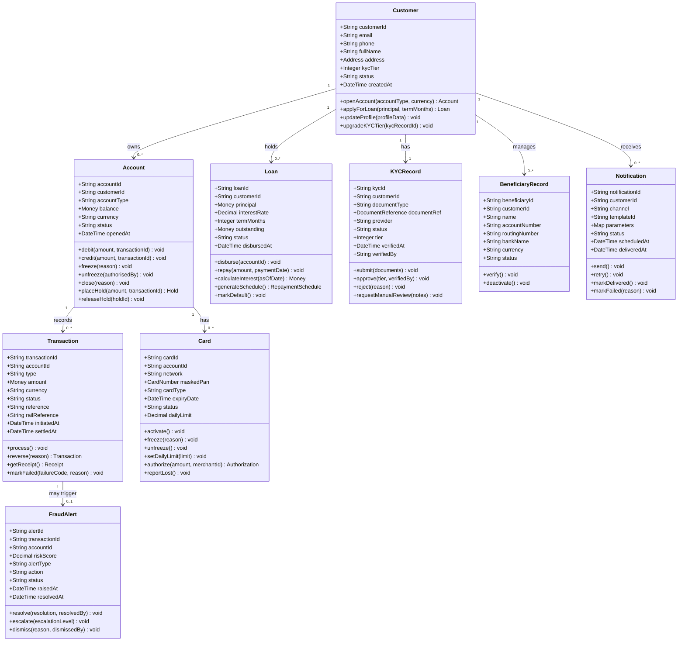
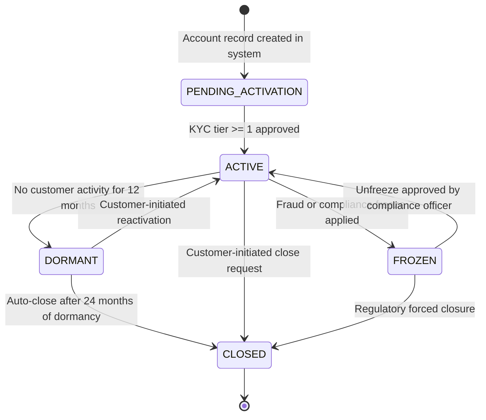

# Domain Model — Digital Banking Platform

## Introduction

The Digital Banking Platform domain model is designed using Domain-Driven Design (DDD) principles.
The model is organized into bounded contexts that define clear ownership boundaries, each with its
own ubiquitous language, aggregate roots, and isolated persistence. Services within each bounded
context are cohesive and communicate with other contexts exclusively through well-defined
integration events or anti-corruption layers.

The following DDD tactical patterns are applied throughout the model:

- **Aggregates** — clusters of domain objects treated as a consistency unit, accessed only
  through the aggregate root.
- **Entities** — objects with a unique identity that persists across state transitions.
- **Value Objects** — immutable descriptive concepts with no identity of their own
  (e.g., `Money`, `Address`, `CardNumber`).
- **Domain Events** — records of something significant that occurred within a bounded context;
  the primary integration mechanism between contexts.
- **Repositories** — abstraction layer for aggregate persistence; each aggregate root has
  exactly one repository.
- **Domain Services** — stateless operations that do not naturally belong to a single aggregate
  (e.g., `TransferDomainService`, `InterestCalculationService`).

---

## Bounded Contexts

| Bounded Context      | Domain Focus                                   | Core Aggregates                    | Publishes Events                                          | Consumes Events                                        | Persistence              |
|----------------------|------------------------------------------------|------------------------------------|-----------------------------------------------------------|--------------------------------------------------------|--------------------------|
| AccountContext       | Account management, balances, holds, ledger    | Account, Balance                   | `banking.account.opened.v1`, `banking.account.frozen.v1`  | `identity.kyc.completed.v1`                            | PostgreSQL (account-db)  |
| PaymentContext       | Transfers, payments, settlement lifecycle      | Transaction, PaymentOrder          | `banking.transfer.*`                                      | `fraud.alert.raised.v1`                                | PostgreSQL (txn-db)      |
| CardContext          | Card issuance, authorization, lifecycle        | Card, CardAuthorization            | `banking.card.issued.v1`, `banking.card.frozen.v1`        | `fraud.alert.raised.v1`                                | PostgreSQL (card-db)     |
| LoanContext          | Loan origination, repayment, interest          | Loan, RepaymentSchedule            | `banking.loan.approved.v1`, `banking.loan.disbursed.v1`   | None                                                   | PostgreSQL (loan-db)     |
| IdentityContext      | Customer profiles, KYC, authentication         | Customer, KYCRecord                | `identity.kyc.completed.v1`                               | None                                                   | PostgreSQL (identity-db) |
| FraudContext         | Risk assessment, alert management              | FraudAlert, RiskProfile            | `fraud.alert.raised.v1`                                   | `banking.transfer.initiated.v1`, `banking.card.issued.v1` | Redis + PostgreSQL    |
| NotificationContext  | Multi-channel notification delivery            | Notification, DeliveryRecord       | None                                                      | All domain events                                      | PostgreSQL (notif-db)    |

---

## Class Diagram

---

## Aggregate Roots

Aggregate roots are the sole entry points for all operations on an aggregate cluster. External
services and repositories must interact only with the root, never with internal entities directly.

| Aggregate Root  | Aggregate Members                              | Reason for Root Selection                                                             |
|-----------------|------------------------------------------------|---------------------------------------------------------------------------------------|
| Customer        | Customer, Address, ContactDetails              | Identity anchor for all profile changes; enforces KYC tier transitions                |
| Account         | Account, Balance, Hold, AccountStatement       | Controls all financial state mutations; balance integrity enforced exclusively here   |
| Transaction     | Transaction, TransactionLine, Receipt          | Unit of financial record; all reversal and receipt logic flows from this root         |
| Card            | Card, CardAuthorization, CardLimit             | Controls authorization decisions and limit enforcement as a single consistency unit   |
| Loan            | Loan, RepaymentSchedule, RepaymentEntry        | Manages its own amortisation schedule and payment recording as a cohesive unit        |
| KYCRecord       | KYCRecord, DocumentReference, BiometricCheck   | Compliance audit unit; documents are scoped to a specific verification cycle          |
| FraudAlert      | FraudAlert, RiskFactor, AlertResolution        | Aggregates all evidence and resolution actions for a single fraud incident            |

---

## Account Lifecycle State Machine

---

## Value Objects

Value objects are immutable domain concepts identified solely by their attributes. They carry
no lifecycle and are replaced entirely when any attribute changes.

| Value Object       | Attributes                                               | Invariants                                                                   | Primary Usage                                         |
|--------------------|----------------------------------------------------------|------------------------------------------------------------------------------|-------------------------------------------------------|
| Money              | amount (Decimal), currency (ISO 4217)                    | amount >= 0; currency is a valid ISO 4217 code                               | Account balance, transaction amount, loan principal   |
| Address            | street, city, state, postalCode, countryCode             | countryCode is ISO 3166-1 alpha-2; postalCode matches country pattern        | Customer home address, business address               |
| DocumentReference  | s3Key, bucketName, versionId, contentType, uploadedAt    | s3Key must be non-empty; contentType is a valid MIME type                    | KYC document storage references                       |
| CardNumber         | last4, binPrefix, network, hash                          | last4 is exactly 4 digits; hash is SHA-256 of the full PAN                  | Card display, network routing                         |
| InterestRate       | rate (Decimal), rateType (FIXED/VARIABLE), effectiveDate | rate >= 0 and <= 1.0; effectiveDate is in the past or present                | Loan interest calculation                             |
| PhoneNumber        | countryCode, localNumber                                 | countryCode is E.164 prefix; localNumber passes E.164 validation             | Customer contact details, OTP delivery                |

---

## Domain Events by Entity

| Entity          | Emits Event                          | Trigger Condition                                              |
|-----------------|--------------------------------------|----------------------------------------------------------------|
| Account         | `banking.account.opened.v1`          | New account created and KYC tier >= 1 assigned                 |
| Account         | `banking.account.closed.v1`          | Account closure request processed and confirmed                |
| Account         | `banking.account.frozen.v1`          | Freeze applied by fraud or compliance process                  |
| KYCRecord       | `identity.kyc.completed.v1`          | KYC verification reaches APPROVED or REJECTED terminal state   |
| Transaction     | `banking.transfer.initiated.v1`      | Transfer passes validation and enters processing pipeline      |
| Transaction     | `banking.transfer.completed.v1`      | Transfer settles on payment rail                               |
| Transaction     | `banking.transfer.failed.v1`         | Transfer cannot be completed for any reason                    |
| Card            | `banking.card.issued.v1`             | Card provisioned and activated in the Card bounded context     |
| Card            | `banking.card.frozen.v1`             | Card freeze applied (fraud, lost/stolen, customer request)     |
| Loan            | `banking.loan.approved.v1`           | Loan offer accepted by the customer                            |
| Loan            | `banking.loan.disbursed.v1`          | Loan principal transferred to the customer's account          |
| FraudAlert      | `fraud.alert.raised.v1`              | FraudService raises actionable alert with an assigned action   |

---

## Business Invariants

Business invariants are rules that must always hold true within the domain. They are enforced
at the aggregate root boundary before any state change is committed.

| Invariant                      | Aggregate Scope    | Rule                                                                                    | Enforcement Point                                           |
|--------------------------------|--------------------|-----------------------------------------------------------------------------------------|-------------------------------------------------------------|
| Non-negative balance           | Account            | Balance must never fall below zero unless explicit overdraft is enabled                 | `Account.debit()` — validated before applying the debit     |
| KYC-gated operations           | Account/Transaction | Account cannot initiate transfers until the customer has KYC tier >= 1                 | `TransactionService` pre-validation on every transfer       |
| Single active KYC process      | Customer           | A customer can have at most one KYC record in PENDING or IN_PROGRESS state at a time    | `KYCService` at submission — rejects duplicate submissions  |
| Card single freeze             | Card               | A FROZEN card cannot be frozen again; unfreeze must be applied first                    | `Card.freeze()` — guards on current status                  |
| Loan terminal immutability     | Loan               | A loan in CLOSED, CHARGED_OFF, or FULLY_REPAID cannot transition to any other status    | Status transition guard in `Loan` aggregate                 |
| Idempotent transactions        | Transaction        | Duplicate `transactionId` submissions return the existing result without re-processing  | Unique index on `transactionId` in Transaction DB           |
| Beneficiary verification       | BeneficiaryRecord  | Transfers to unverified beneficiaries are blocked at the payment context boundary        | `TransactionService` pre-validation — status check          |
| Card network consistency       | Card               | A card must be associated with exactly one network (VISA or Mastercard) at issuance     | Enforced in `CardService.issue()` factory method            |
