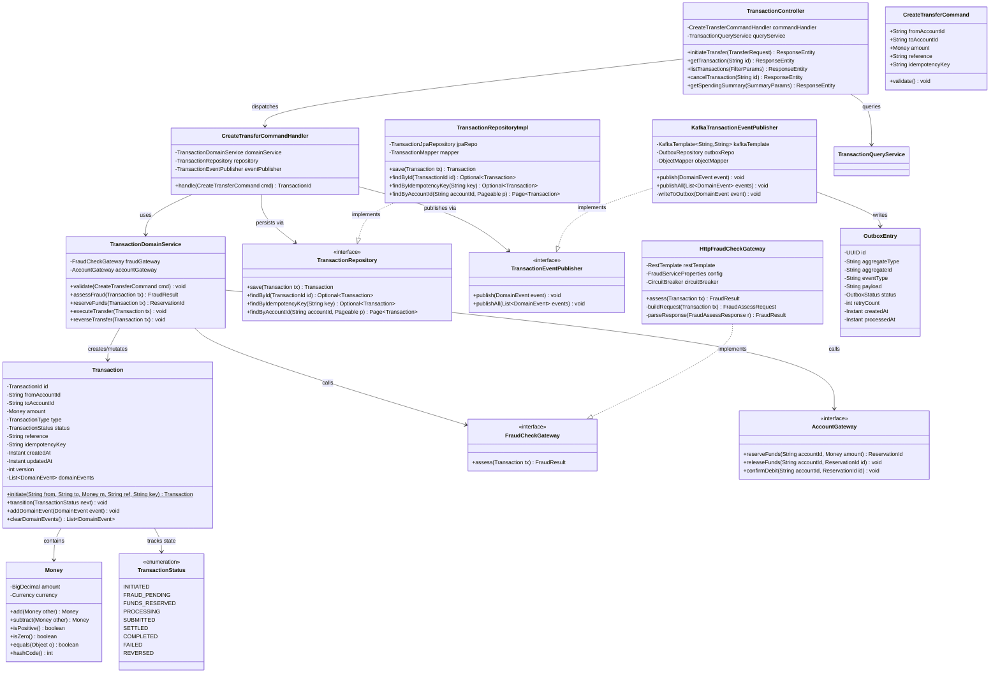

# C4 Code Diagram — TransactionService

## Introduction

The C4 Code diagram occupies the fourth and innermost level of the C4 model
hierarchy. Where the Container diagram identifies deployable units and the
Component diagram identifies logical components within a service, the Code
diagram exposes the classes, interfaces, and their relationships as they exist
in source code artefacts.

For the `TransactionService`, this diagram serves three complementary purposes:

- **Architectural alignment** — verifies that the implementation adheres to
  hexagonal architecture (ports and adapters), CQRS, and Domain-Driven Design
  principles agreed upon during system design.
- **Onboarding reference** — provides new engineers with an accurate structural
  map of the codebase before they read a single source file.
- **Compliance evidence** — demonstrates separation of concerns and controlled
  data flows for PCI-DSS Requirement 6 and SOX audit inquiries regarding
  financial transaction processing integrity.

The diagram captures: the CQRS command pipeline from the REST controller
through to domain execution; the `Transaction` aggregate root and its `Money`
value object; infrastructure adapters for persistence and messaging; and the
Transactional Outbox mechanism that guarantees at-least-once domain-event
delivery without distributed transactions.

---

## Class Diagram

The diagram below captures all key classes, interfaces, and enumerations within
the `TransactionService` bounded context, together with their principal
dependencies and implementations.



---

## Package Structure

The `TransactionService` follows hexagonal architecture with four canonical
layers — `api`, `application`, `domain`, and `infrastructure` — enforcing a
strict inward dependency rule: outer layers may depend on inner layers; inner
layers never import from outer layers.

```
transaction-service/
├── src/main/java/com/bank/transaction/
│   ├── api/                                    ← Inbound HTTP adapter
│   │   ├── TransactionController.java
│   │   ├── dto/
│   │   │   ├── TransferRequest.java
│   │   │   ├── TransferResponse.java
│   │   │   └── TransactionSummaryDto.java
│   │   └── mapper/
│   │       └── TransactionDtoMapper.java
│   ├── application/                            ← Use-case orchestration
│   │   ├── command/
│   │   │   ├── CreateTransferCommand.java
│   │   │   └── CreateTransferCommandHandler.java
│   │   ├── query/
│   │   │   ├── GetTransactionQuery.java
│   │   │   └── TransactionQueryService.java
│   │   └── port/
│   │       ├── in/
│   │       │   └── TransferUseCase.java
│   │       └── out/                            ← Outbound ports (interfaces)
│   │           ├── TransactionRepository.java
│   │           ├── TransactionEventPublisher.java
│   │           ├── FraudCheckGateway.java
│   │           └── AccountGateway.java
│   ├── domain/                                 ← Core domain — zero framework deps
│   │   ├── model/
│   │   │   ├── Transaction.java
│   │   │   ├── TransactionId.java
│   │   │   ├── TransactionStatus.java
│   │   │   ├── TransactionType.java
│   │   │   └── Money.java
│   │   ├── event/
│   │   │   ├── TransactionInitiatedEvent.java
│   │   │   ├── FundsReservedEvent.java
│   │   │   ├── TransactionSettledEvent.java
│   │   │   └── TransactionFailedEvent.java
│   │   └── service/
│   │       └── TransactionDomainService.java
│   └── infrastructure/                         ← Outbound adapters
│       ├── persistence/
│       │   ├── TransactionRepositoryImpl.java
│       │   ├── TransactionJpaRepository.java
│       │   ├── TransactionJpaEntity.java
│       │   ├── TransactionMapper.java
│       │   ├── OutboxEntry.java
│       │   └── OutboxRepository.java
│       ├── messaging/
│       │   ├── KafkaTransactionEventPublisher.java
│       │   └── OutboxRelayJob.java
│       └── gateway/
│           ├── HttpFraudCheckGateway.java
│           └── HttpAccountGateway.java
└── src/test/java/com/bank/transaction/
    ├── application/
    │   └── CreateTransferCommandHandlerTest.java
    ├── domain/
    │   ├── TransactionTest.java
    │   └── MoneyTest.java
    ├── infrastructure/
    │   ├── TransactionRepositoryImplTest.java
    │   └── HttpFraudCheckGatewayTest.java
    └── api/
        └── TransactionControllerIntegrationTest.java
```

---

## Key Design Patterns

### CQRS (Command Query Responsibility Segregation)

All write operations are modelled as explicit command objects dispatched to
dedicated handler classes. Query operations are served by a separate
`TransactionQueryService` that reads from a read-optimised PostgreSQL replica.
This strict separation enables independent scaling of the read and write paths,
and ensures command handlers apply optimistic locking without impacting query
throughput.

| Aspect | Command Side | Query Side |
|---|---|---|
| Handler | `CreateTransferCommandHandler` | `TransactionQueryService` |
| Data source | PostgreSQL primary | Read replica or Elasticsearch |
| Consistency | Strong — serializable isolation | Eventual |
| Locking | Optimistic (`@Version` column) | None |
| HTTP method | `POST /transactions/transfer` | `GET /transactions/**` |
| Side effects | Domain events emitted | None |

### Outbox Pattern

The Transactional Outbox Pattern eliminates the dual-write problem — the risk
that a PostgreSQL commit succeeds while a Kafka produce fails, leaving the
system in an inconsistent state.

**Execution sequence:**

1. `CreateTransferCommandHandler.handle()` opens a database transaction.
2. `TransactionRepository.save()` persists the `Transaction` aggregate.
3. `KafkaTransactionEventPublisher.publishAll()` serialises each domain event
   and writes an `OutboxEntry` row — committed atomically within the same
   database transaction.
4. `OutboxRelayJob` polls `outbox_entries WHERE status = 'PENDING'` every
   500 ms and produces each event to Kafka using `KafkaTemplate`.
5. On Kafka leader acknowledgment, the outbox entry status is set to
   `PROCESSED`.

If the application crashes after step 3 but before step 5, the relay job
replays the outbox on restart, guaranteeing at-least-once delivery. Kafka
consumers deduplicate using the domain event `id` field.

### Value Objects

`Money` is an immutable value object with no identity. Equality is structural
(amount + currency), not referential. All arithmetic operations return new
`Money` instances. This prevents subtle mutation bugs in financial calculations
where two code paths share the same object reference.

### Domain Events

`Transaction` accumulates `DomainEvent` instances in an in-memory list during
command execution, without directly invoking any publisher. The command handler
calls `transaction.clearDomainEvents()` and hands the events to
`TransactionEventPublisher.publishAll()` only after the aggregate is durably
saved. Events are therefore never emitted for uncommitted state changes.

---

## CreateTransferCommandHandler — Pseudocode

```java
@Component
@Transactional
public class CreateTransferCommandHandler {

    private final TransactionDomainService domainService;
    private final TransactionRepository    repository;
    private final TransactionEventPublisher eventPublisher;

    /**
     * Handles a CreateTransferCommand end-to-end.
     * The @Transactional boundary ensures the database save and outbox
     * write are atomic. Further lifecycle transitions (SUBMITTED → SETTLED
     * → COMPLETED) occur asynchronously via the PaymentRailAdapter.
     */
    public TransactionId handle(CreateTransferCommand command) {

        // 1. Validate command invariants: non-null fields, positive amount,
        //    valid ISO-4217 currency code, UUID v4 idempotency key format.
        command.validate();

        // 2. Idempotency check — return the existing result without
        //    re-executing any side effects.
        Optional<Transaction> existing =
            repository.findByIdempotencyKey(command.getIdempotencyKey());
        if (existing.isPresent()) {
            return existing.get().getId();
        }

        // 3. Create Transaction aggregate in INITIATED state.
        Transaction transaction = Transaction.initiate(
            command.getFromAccountId(),
            command.getToAccountId(),
            command.getAmount(),
            command.getReference(),
            command.getIdempotencyKey()
        );

        // 4. Persist in INITIATED state before external calls to establish
        //    the audit record and acquire the idempotency lock.
        repository.save(transaction);

        // 5. Assess fraud risk synchronously.
        transaction.transition(TransactionStatus.FRAUD_PENDING);
        FraudResult fraudResult = domainService.assessFraud(transaction);
        if (fraudResult.isBlocked()) {
            transaction.transition(TransactionStatus.FAILED);
            transaction.addDomainEvent(new TransactionFailedEvent(
                transaction.getId(), FailureReason.FRAUD_BLOCKED,
                fraudResult.getReason()));
            repository.save(transaction);
            eventPublisher.publishAll(transaction.clearDomainEvents());
            throw new TransactionBlockedException(fraudResult.getReason());
        }

        // 6. Reserve funds on the source account.
        try {
            ReservationId reservation = domainService.reserveFunds(transaction);
            transaction.transition(TransactionStatus.FUNDS_RESERVED);
            transaction.setReservationId(reservation);
        } catch (InsufficientFundsException ex) {
            transaction.transition(TransactionStatus.FAILED);
            transaction.addDomainEvent(new TransactionFailedEvent(
                transaction.getId(), FailureReason.INSUFFICIENT_FUNDS,
                ex.getMessage()));
            repository.save(transaction);
            eventPublisher.publishAll(transaction.clearDomainEvents());
            throw ex;
        }

        // 7. Transition to PROCESSING and emit TransactionInitiatedEvent so
        //    NotificationService and AuditService can react asynchronously.
        transaction.transition(TransactionStatus.PROCESSING);
        transaction.addDomainEvent(new TransactionInitiatedEvent(transaction));

        // 8. Persist final synchronous state; outbox entries written atomically
        //    within this @Transactional boundary.
        repository.save(transaction);
        eventPublisher.publishAll(transaction.clearDomainEvents());

        return transaction.getId();
    }
}
```

---

## Dependency Injection Wiring

All `TransactionService` beans use constructor injection exclusively.
Interface-to-implementation bindings are declared in `@Configuration` classes
within the `infrastructure` package, keeping the `domain` and `application`
layers free of framework annotations.

| Interface / Port | Implementation | Spring Scope | Configuration Class |
|---|---|---|---|
| `TransactionRepository` | `TransactionRepositoryImpl` | Singleton | `PersistenceConfig` |
| `TransactionEventPublisher` | `KafkaTransactionEventPublisher` | Singleton | `MessagingConfig` |
| `FraudCheckGateway` | `HttpFraudCheckGateway` | Singleton | `GatewayConfig` |
| `AccountGateway` | `HttpAccountGateway` | Singleton | `GatewayConfig` |
| `CreateTransferCommandHandler` | Concrete class | Singleton | `ApplicationConfig` |
| `TransactionDomainService` | Concrete class | Singleton | `DomainConfig` |
| `OutboxRelayJob` | Concrete class (scheduled) | Singleton | `MessagingConfig` |

**Resilience decorators.** `HttpFraudCheckGateway` and `HttpAccountGateway` are
decorated with Resilience4j `@CircuitBreaker` annotations. Fallback methods
apply safe defaults when the downstream service is unavailable: the fraud
gateway falls back to rule-based allow, while the account gateway throws a
`FundsReservationUnavailableException` that transitions the transaction to
`FAILED`. Circuit breaker thresholds (failure rate, slow call rate, wait
duration) are externalised to `application.yml` under
`resilience4j.circuitbreaker` to enable tuning without redeployment.

**Transaction boundary.** `@Transactional` is applied exclusively at the
`CreateTransferCommandHandler.handle()` method. Repository and domain service
methods are non-transactional and participate in the calling transaction via
Spring's default `REQUIRED` propagation. This guarantees the database save and
outbox write are always committed or rolled back together.

**Configuration externalisation.** All timeout values, Kafka topic names,
circuit breaker parameters, and gateway endpoint URLs are bound from
environment-specific `application.yml` files via `@ConfigurationProperties`
beans, enabling runtime configuration changes without code modification.
