# Cloud Architecture — Digital Banking Platform

AWS-native cloud architecture designed for PCI-DSS compliance, 99.99% availability, and horizontal scalability to 50,000 TPS peak load.

---

## Architecture Diagram

```mermaid
flowchart TB
    subgraph GlobalEdge["Global Edge Layer"]
        R53["Route 53\nLatency-based routing\nHealth checks: 30s intervals\nFailover policy: primary/secondary\nDNSSEC enabled\nPrivate hosted zone for internal"]
        CF["CloudFront Distribution\nOrigin: ALB (primary region)\nOAC for S3 static assets\nEdge caching: API responses (GET only)\nCustom SSL: *.digitalbank.com\nHTTPS only, TLS 1.3\nGeo-restriction: block OFAC jurisdictions\nWAF attached: OWASP + rate limit rules"]
        Shield["AWS Shield Advanced\nL3/L4/L7 DDoS protection\nDRT: proactive engagement\nCost protection SLA\nReal-time attack telemetry"]
    end

    subgraph Compute["Compute — AWS EKS (us-east-1)"]
        EKS["EKS Cluster\nKubernetes v1.30\nControl plane: managed (AWS)\nAPI endpoint: private only\nOIDC: enabled (IRSA)\nenvelopeEncryption: KMS CMK\nAudit logging → CloudWatch Logs\nAdd-ons: CoreDNS, kube-proxy, VPC CNI, EBS CSI"]

        subgraph NodeGroups["Managed Node Groups"]
            NG_App["App Node Group\nm6i.2xlarge × 6–30 nodes\nMulti-AZ: 1a, 1b, 1c\nSpot instances: 30% (non-CDE only)\nAuto Scaling: target tracking\nBottlerocket OS (security-hardened)\nIMDSv2 enforced"]
            NG_CDE["CDE Node Group\nm6i.4xlarge × 3–12 nodes\nOn-Demand ONLY (no Spot)\nTaint: pci-scope=true\nDedicated tenancy option\nBottlerocket OS\nIMDSv2 enforced"]
        end

        subgraph AddOns["Platform Add-ons"]
            Karpenter["Karpenter\nNode provisioner\nFlexible instance selection\nResponds in 60s vs 3min CA\nInterruption handling for Spot"]
            IRSA["IRSA (IAM Roles for Service Accounts)\nPer-service IAM roles\nNo static credentials in pods\nOIDC token lifetime: 1h"]
            NetworkPolicy["Calico Network Policy\nDefault deny all east-west\nExplicit allow per service\nCDE namespace: strict isolation\nFlow logs to S3"]
            OPA["OPA Gatekeeper\nAdmission controller\nConstraints: no privileged pods\nno hostNetwork: true\nrequire resource limits\nrequire readiness probes\nImage: ECR only"]
        end
    end

    subgraph Databases["Databases"]
        subgraph Aurora["RDS Aurora PostgreSQL 15 (Multi-AZ)"]
            AuroraWriter["Aurora Writer\ndb.r6g.4xlarge (32 vCPU, 256GB)\nStorage: auto-scaling 100GB → 128TB\nEncryption: KMS CMK (per-service key)\nSSL: require (ssl_mode=verify-full)\nDeletion protection: ON\nBackup: continuous (PITR 35 days)\nEnhanced monitoring: 1s granularity\nPerformance Insights: 7 days retention\nParameterGroup: max_connections=5000\npg_audit extension enabled"]
            AuroraReaders["Aurora Read Replicas (2–5)\nAuto-scaling: CPUUtilization > 70%\nReader endpoint: load balanced\nCross-AZ: 1b, 1c\nFast cloning for dev environments\nBacktrack: 24h window (point-in-time)"]
        end

        subgraph Schemas["Database Schema Segregation (PCI-DSS)"]
            PublicSchema["public schema\nCustomer profiles, accounts, loans\nKYC records, audit logs"]
            CardSchema["card_data schema\nSeparate RDS user: card_svc_user\nAccess: ONLY CDE service account\nColumn-level encryption on PAN fields\nRow Security Policies enforced"]
        end
    end

    subgraph Cache["Caching — ElastiCache Redis 7.x"]
        RedisCluster["Redis Cluster Mode (6 shards × 2 replicas)\ncache.r6g.xlarge per node\nIn-transit: TLS 1.3\nAt-rest: KMS CMK\nAuth: Redis AUTH token via Secrets Manager\nEviction: allkeys-lru\nMaxmemory: 80% node capacity\nUse cases:\n  - Session tokens (TTL: 30 min)\n  - Idempotency keys (TTL: 24h)\n  - Fraud rule cache (TTL: 5 min)\n  - Rate limit counters (sliding window)\n  - Loan offer cache (TTL: 72h)"]
    end

    subgraph Streaming["Event Streaming — MSK Apache Kafka"]
        MSK["MSK Kafka 3.6\nBroker: kafka.m5.2xlarge × 3 (multi-AZ)\nStorage: 10TB EBS gp3 per broker\nEncryption: TLS (in-transit) + KMS (at-rest)\nAuth: SASL/SCRAM + ACLs\nTopics (replication factor 3, min.insync.replicas 2):\n  transfers.initiated\n  transfers.completed\n  transfers.failed\n  transactions.audit\n  fraud.alerts\n  fraud.feedback\n  aml.alerts\n  card.events\n  notifications.push\n  notifications.email\n  kyc.events\n  loan.events\nRetention: 7 days all topics\nConsumer groups: per-service isolated"]
        MSKConnect["MSK Connect\nKafka → OpenSearch connector\nKafka → S3 connector (archive)\nDebezium: CDC from Aurora → Kafka"]
    end

    subgraph Security["Security — HSM & Cryptography"]
        CloudHSM["CloudHSM Cluster (FIPS 140-2 Level 3)\n2 HSMs (HA pair) — us-east-1a, us-east-1b\nPKCS#11 library v3.0\nOperations:\n  - PIN block encryption (ISO 9564 Format 0)\n  - CVV/CVV2 generation and validation\n  - 3DS authentication cryptography\n  - RSA key generation (2048/4096 bit)\n  - AES-256 key operations\n  - HSM key ceremonies (quarterly)\nAccess: ONLY CloudHSM interface service\nAudit logs: all HSM operations → S3"]
        KMS["AWS KMS\nCMKs (per service, automatic annual rotation):\n  - cmk/transfer-service: RDS column encryption\n  - cmk/card-service: card token vault\n  - cmk/s3-artifacts: document storage\n  - cmk/msk: Kafka at-rest encryption\n  - cmk/redis: ElastiCache at-rest\n  - cmk/eks: etcd encryption (k8s secrets)\n  - cmk/cloudtrail: trail log encryption\n  - cmk/cloudwatch: log group encryption\nKey policies: least privilege, ABAC tags\nGrants: for cross-account (DR region)"]
        SecretsManager["Secrets Manager\nSecrets:\n  - rds/production/app: DB credentials (rotate 7d)\n  - rds/production/card: card schema creds (rotate 7d)\n  - kafka/sasl-credentials (rotate 30d)\n  - redis/auth-token (rotate 30d)\n  - api-keys/marqeta (rotate 90d)\n  - api-keys/comply-advantage (rotate 90d)\n  - api-keys/experian (rotate 90d)\n  - tls-certs/internal-ca (rotate on expiry)\nRotation: Lambda functions per secret type\nVersioning: previous 3 versions retained\nAccess: IRSA per-service permissions"]
    end

    subgraph Observability["Observability Stack"]
        CloudWatch["CloudWatch\nCustom metrics: business KPIs\n  - transfers_per_second\n  - fraud_block_rate\n  - kyc_pass_rate\n  - loan_approval_rate\nAlarms: P99 latency, error rate, queue depth\nDashboards: real-time operations\nContributor Insights: top failing APIs\nAnomalyDetection: dynamic thresholds\nLogs Insights: fraud investigation queries"]
        OpenSearch["OpenSearch Service 2.x\n3 master nodes: m6g.large.search\n6 data nodes: r6g.2xlarge.search\nUltraWarm: 4 nodes (cold storage)\nEncryption: KMS CMK + node-to-node TLS\nFine-grained access control: SAML\nIndices:\n  - transactions-* (hot: 30d, warm: 60d)\n  - audit-logs-* (hot: 30d, warm: 335d)\n  - fraud-signals-* (hot: 7d, warm: 83d)\n  - application-logs-* (hot: 14d)\nISM policies: automated lifecycle management"]
        Grafana["Grafana Cloud (or managed)\nDataSources: CloudWatch, Prometheus, OpenSearch\nSLO dashboards\nAlerts → PagerDuty\nOn-call rotation: 24/7 coverage"]
        XRay["AWS X-Ray (+ OpenTelemetry)\nService map auto-generated\nTrace sampling: 5% normal, 100% errors\nIntegration: EKS pod annotations\nRetention: 30 days traces"]
    end

    subgraph Compliance["Compliance & Audit"]
        CloudTrail["CloudTrail\nTrail: all regions enabled\nManagement events: read + write\nData events: S3, Lambda, KMS\nS3 destination: s3://audit-logs-immutable\nKMS encryption: cmk/cloudtrail\nLog validation: SHA-256 integrity\nRetention: 7 years (S3 Glacier after 90d)\nOrganization trail: all accounts"]
        AWSConfig["AWS Config\nAll resources recorded\nDelivery: S3 + SNS\nConformance Packs:\n  - PCI-DSS (managed)\n  - CIS AWS Foundations Benchmark\n  - AWS Operational Best Practices\nAuto-remediation:\n  - S3 public access: SSM Automation\n  - SG 0.0.0.0/0: notify + block\n  - Unencrypted volumes: alert"]
        GuardDuty["GuardDuty\nThreat detection sources:\n  - VPC Flow Logs\n  - CloudTrail\n  - DNS query logs\n  - EKS audit logs (enabled)\n  - S3 data events\n  - RDS login events\n  - Lambda network activity\nFindings → SecurityHub → PagerDuty\nSuppression: known CI/CD patterns\nExport: S3 (daily) for SIEM"]
        Macie["Amazon Macie\nS3 bucket discovery: all buckets\nScheduled: daily sensitive data jobs\nAlerts on:\n  - Unencrypted PAN pattern\n  - SSN in S3 objects\n  - unprotected API keys\nIntegration: SecurityHub"]
        SecurityHub["Security Hub\nStandards enabled:\n  - AWS Foundational Security Best Practices\n  - CIS AWS Foundations v1.4\n  - PCI DSS v3.2.1\nFindings aggregated from:\n  - GuardDuty\n  - Macie\n  - Config\n  - Inspector\n  - IAM Access Analyzer\nSeverity: CRITICAL/HIGH auto-creates Jira"]
        Inspector["AWS Inspector v2\nEC2 + ECR + Lambda scanning\nCVE database: continuously updated\nFindings: CVSS score + reachability\nAuto-remediation: patch Lambda layers"]
    end

    subgraph Storage["Object Storage — S3"]
        S3Docs["s3://documents-kyc-prod\nEncryption: SSE-KMS (cmk/s3-artifacts)\nVersioning: enabled\nObject Lock: WORM (7 years)\nLifecycle: S3 Standard → Glacier (365d)\nBlock public access: ALL enabled\nBucket policy: VPC source condition"]
        S3Audit["s3://audit-logs-immutable\nEncryption: SSE-KMS (cmk/cloudtrail)\nObject Lock: COMPLIANCE mode (7 years)\nVersioning: enabled\nCross-region replication → us-west-2\nBlock public access: ALL enabled"]
        S3Artifacts["s3://app-artifacts-prod\nECR alternative for large files\nHelm chart registry: S3-backed\nTerraform state: versioned + locked\nEncryption: SSE-KMS"]
    end

    subgraph Networking["Networking"]
        ALB2["ALB + WAF (see network-infrastructure.md)"]
        PrivateLink["PrivateLink for all AWS service endpoints\nNo internet traversal for AWS APIs"]
    end

    %% Global Edge flow
    R53 --> CF
    Shield -.-> CF
    CF --> ALB2

    %% Compute
    ALB2 --> EKS
    EKS --- NG_App
    EKS --- NG_CDE
    EKS --- Karpenter
    EKS --- OPA

    %% Compute to Data
    NG_App -->|TLS 5432| AuroraWriter
    NG_App -->|TLS 6380| RedisCluster
    NG_App -->|SASL/TLS 9094| MSK
    NG_CDE -->|TLS 5432| AuroraWriter
    NG_CDE -->|PKCS#11| CloudHSM

    %% Aurora HA
    AuroraWriter -.->|sync replication| AuroraReaders

    %% Streaming
    NG_App -->|produce events| MSK
    MSK -->|consume events| NG_App
    MSKConnect -->|sink| OpenSearch
    MSKConnect -->|archive| S3Audit

    %% Security
    EKS -->|GetSecretValue| SecretsManager
    EKS -->|Encrypt/Decrypt| KMS
    CloudHSM <-->|PKCS#11 SDK| NG_CDE

    %% Observability
    NG_App -.->|metrics| CloudWatch
    NG_App -.->|traces| XRay
    NG_App -.->|logs| OpenSearch
    CloudWatch --> Grafana

    %% Compliance
    CloudTrail -.->|API events| S3Audit
    GuardDuty -.->|findings| SecurityHub
    AWSConfig -.->|compliance| SecurityHub
    Macie -.->|PII findings| SecurityHub
    Inspector -.->|CVE findings| SecurityHub

    %% Storage
    EKS -->|PutObject| S3Docs
    EKS -->|PutObject via endpoint| S3Artifacts
```



---

## Cost Optimization Strategy

**Compute:**
- Spot instances for app node group (30% of capacity) — estimated 70% savings on spot nodes
- Karpenter: right-size instance selection based on actual pod resource requests
- HPA + scale-to-zero for non-production namespaces (nights/weekends)
- Savings Plans: 1-year compute SP covering baseline CDE node group (100% on-demand)

**Storage:**
- S3 Intelligent-Tiering for document storage (automatically moves to cheaper tiers)
- Aurora Serverless v2 consideration for dev/test clusters (scale to 0 ACUs overnight)
- EBS gp3 over gp2 for MSK (same performance, 20% cheaper)
- OpenSearch UltraWarm for logs older than 30 days (80% cost reduction vs hot tier)

**Data Transfer:**
- VPC Endpoints eliminate NAT Gateway data processing costs for AWS service calls
- CloudFront caches static assets, reducing ALB and origin data transfer
- S3 Transfer Acceleration for cross-region DR replication (where latency matters)

**Estimated Monthly Cost Breakdown (production baseline):**

| Service | Configuration | Est. Monthly |
|---------|--------------|-------------|
| EKS (app nodes, mixed) | 6×m6i.2xlarge (2 On-Demand + 4 Spot) | $800 |
| EKS (CDE nodes) | 3×m6i.4xlarge On-Demand | $1,200 |
| RDS Aurora | r6g.4xlarge writer + 2 readers | $3,500 |
| ElastiCache | r6g.xlarge × 12 (6 shard × 2 replica) | $2,200 |
| MSK | m5.2xlarge × 3 + 30TB EBS | $1,800 |
| CloudHSM | 2 HSMs | $3,200 |
| OpenSearch | r6g.2xlarge × 9 + UltraWarm | $2,800 |
| ALB + WAF | 3 AZs + managed rules | $500 |
| CloudFront | 50TB outbound/month | $4,200 |
| Shield Advanced | Monthly fee | $3,000 |
| NAT Gateways | 3 × multi-AZ | $450 |
| S3 (all buckets) | 50TB storage + requests | $1,200 |
| CloudTrail + CloudWatch | Full audit trail | $800 |
| GuardDuty + SecurityHub | Full threat detection | $600 |
| Secrets Manager | 50 secrets × rotations | $200 |
| KMS | 10 CMKs + API calls | $150 |
| **Total Estimated** | | **~$26,600/month** |

---

## Disaster Recovery Strategy

**RPO: 5 minutes | RTO: 15 minutes**

**Backup Strategy:**
- Aurora: continuous backup to S3 with PITR (point-in-time recovery) to any second within 35-day window
- Aurora Global Database: async replication to us-west-2 reader — typical lag < 1 second
- ElastiCache: daily automated snapshots retained 7 days — session data (acceptable to lose, re-auth required)
- MSK: S3 backup connector archives all Kafka topics — RPO 5 minutes
- S3: cross-region replication enabled on all critical buckets to us-west-2 (synchronous for WORM buckets)
- KMS: multi-region keys replicated to us-west-2
- Secrets Manager: cross-region secret replication enabled

**Failover Procedure:**

1. **Detection (T+0 to T+2 min):** Route 53 health checks detect primary region failure (3 consecutive failures × 30s = 90s detection). CloudWatch alarm triggers SNS → PagerDuty → on-call engineer.

2. **Decision (T+2 to T+5 min):** On-call engineer confirms regional failure (vs. single AZ). Authorization from two engineers required to trigger DR failover (dual control — PCI-DSS Req 3.5.1).

3. **Database Promotion (T+5 to T+8 min):** Aurora Global Database promotion: `aws rds failover-global-cluster` — typically completes in 60–120 seconds. DNS endpoint updated automatically.

4. **EKS Scale-Up (T+8 to T+12 min):** DR EKS cluster (pre-scaled to 30%) scales to full capacity via Cluster Autoscaler. Karpenter provisions nodes in 60 seconds. Pods scheduled and pass readiness probes.

5. **Traffic Cut-Over (T+12 to T+15 min):** Route 53 weighted routing updated: primary weight = 0, DR weight = 100. CloudFront origin updated. ALB in DR region becomes active. Smoke test suite runs automatically.

6. **Post-Failover Validation:** Automated smoke tests verify all 12 critical flows (transfer, card auth, login, KYC, loan apply). Incident declared over when smoke tests pass.

**RTO Breakdown:**
- Detection and decision: 5 minutes
- Aurora promotion: 2 minutes
- EKS scale-up: 4 minutes
- Traffic cut-over + validation: 4 minutes
- **Total: 15 minutes**

**DR Drill Schedule:** Quarterly tabletop exercise, biannual live failover to DR region (off-peak hours, pre-announced to customers, tested with synthetic traffic).

---

## Service-Level Objectives (SLOs)

| Service | Availability SLO | Latency P99 | Error Rate Target |
|---------|-----------------|-------------|------------------|
| Account Service (read) | 99.99% | 200ms | < 0.01% |
| Transfer Service | 99.95% | 800ms | < 0.05% |
| Card Authorization | 99.99% | 100ms | < 0.01% |
| KYC Initiation | 99.9% | 3,000ms | < 0.1% |
| Fraud Scoring | 99.95% | 200ms | < 0.05% |
| Open Banking API | 99.9% | 500ms | < 0.1% |
| Loan Origination | 99.9% | 5,000ms | < 0.1% |

Error budget policy: if 30-day error budget is consumed > 50%, all non-critical feature deployments are frozen until the budget is replenished through improved reliability.

---

## IAM and Access Control Architecture

**IRSA (IAM Roles for Service Accounts):**
Each Kubernetes service account is bound to a dedicated IAM role via EKS OIDC. No static AWS credentials are used in any pod. Token lifetime: 3,600 seconds (auto-refreshed by SDK).

**IAM Role Naming Convention:**
- `role/dbp-{service}-{env}` — e.g., `role/dbp-transfer-service-prod`
- Each role has a least-privilege policy covering only the AWS services that specific service needs.

**IAM Permission Examples:**
```json
{
  "Version": "2012-10-17",
  "Statement": [
    {
      "Sid": "SecretsManagerAccess",
      "Effect": "Allow",
      "Action": ["secretsmanager:GetSecretValue"],
      "Resource": ["arn:aws:secretsmanager:us-east-1:*:secret:rds/production/transfer-*"]
    },
    {
      "Sid": "KMSDecrypt",
      "Effect": "Allow",
      "Action": ["kms:Decrypt", "kms:GenerateDataKey"],
      "Resource": ["arn:aws:kms:us-east-1:*:key/cmk-transfer-service"]
    }
  ]
}
```

**Human Access:**
- AWS Console: SSO via Okta (SAML 2.0), MFA mandatory for all users.
- Production access: time-limited sessions via IAM Identity Center (max 8 hours, renewed per shift).
- Break-glass access: emergency IAM role with CloudTrail alerting on every action. Dual approval required.
- No persistent IAM users with access keys in production.

---

## Capacity Planning

**Baseline assumptions (Year 1):**
- 500,000 active customers
- 2,000 TPS average (Monday–Friday 9AM–5PM ET)
- Peak: 8,000 TPS (payday Fridays, month-end)
- Card authorizations: 1,200 TPS average, 5,000 TPS peak

**Scaling to 50,000 TPS (Year 3):**
- EKS: scale to 120 app nodes, 40 CDE nodes (Karpenter managed)
- Aurora: promote to db.r6g.16xlarge writer, add 5 readers, enable RDS Proxy (connection pooling)
- Redis: expand to 12 shards × 3 replicas (36 nodes total)
- MSK: scale to 9 brokers, expand storage to 30TB per broker
- CloudFront: no changes needed (auto-scaling by AWS)
- Fedwire/ACH: coordinate with ODFI for increased throughput limits

**Cost at 50K TPS (estimated):** $125,000/month — driven primarily by EKS compute and RDS Aurora scaling.

---

## Patch Management and Update Strategy

**Operating System (Bottlerocket):**
- AWS manages OS patches for managed node groups. Node groups use the latest Bottlerocket AMI published by AWS.
- Rolling node group update: `aws eks update-nodegroup-version` — replaces nodes one at a time, respecting PodDisruptionBudgets.
- Frequency: monthly, aligned with AWS AMI release cadence.
- Emergency patches (critical CVE): 24-hour deployment window.

**Kubernetes Control Plane:**
- EKS manages control plane updates. Worker node upgrades follow within 30 days of control plane update.
- Test in staging 2 weeks before production upgrade.
- Maximum version skew: worker nodes must be within 2 minor versions of control plane.

**Container Images:**
- Base images: distroless or UBI minimal (not full OS images).
- AWS Inspector scans ECR images on every push. Images with CVSS >= 9.0 vulnerabilities are blocked from deployment by OPA Gatekeeper.
- Weekly automated dependency updates via Dependabot → auto-merge if tests pass.

**Database (Aurora PostgreSQL):**
- Minor version auto-upgrade: enabled (e.g., 15.3 → 15.4 — backward compatible).
- Major version upgrade (e.g., 15 → 16): planned maintenance window, tested in staging 4 weeks prior.
- Parameter group changes: zero-downtime for most parameters; dynamic parameters applied immediately, static parameters require instance reboot (scheduled during maintenance window).
