# Deployment Diagram — Digital Banking Platform

PCI-DSS compliant multi-AZ deployment on AWS EKS. All cardholder data environment (CDE) components are segmented into isolated network zones with strict east-west traffic controls enforced by security groups and NACLs.

---

## Zone Architecture Overview

| Zone | Purpose | PCI-DSS Scope | Subnet Type |
|------|---------|---------------|-------------|
| Public DMZ | Edge ingress — ALB, WAF, CDN | Out of scope | Public |
| Trusted Application Zone | Business microservices | Out of scope (no CHD) | Private |
| PCI-DSS CDE Zone | Card processing, HSM, payment rails | **In scope** | Private isolated |
| Data Zone | Databases, cache, streaming | In scope (stores CHD) | Isolated (no IGW route) |
| Management Zone | Bastion, monitoring, CI/CD runners | Restricted | Private |

---

## Full Deployment Diagram

```mermaid
flowchart TB
    subgraph Internet["🌐 Internet"]
        CustomerBrowser["Customer\nBrowser / Mobile App"]
        TPP["Third-Party Provider\n(Open Banking TPP)"]
        MerchantAcquirer["Merchant Acquirer\n/ Card Network"]
        FedACH["Federal Reserve\nFedwire / ACH"]
        CardNetwork["Visa / Mastercard\nCard Network"]
    end

    subgraph AWSRegion["AWS us-east-1 (Primary Region)"]

        subgraph PublicZone["🟡 Public Zone (DMZ) — Public Subnets"]
            Route53["Route 53\nDNS + Health Checks"]
            CloudFront["CloudFront\nCDN + Edge Cache\nGeo-restriction rules"]
            ALB["Application Load Balancer\n(Multi-AZ)\nSSL Termination TLS 1.3\nHTTP→HTTPS redirect enforced"]
            WAF["AWS WAF v2\nOWASP Top 10 rules\nRate limiting: 2000 req/5min\nGeo-blocking (OFAC jurisdictions)\nBot Control managed rules\nSQL injection protection\nXSS protection"]
            Shield["AWS Shield Advanced\nDDoS protection\n24/7 DRT team\n$3K monthly protection"]
            NATGateway["NAT Gateway\n(one per AZ)\nElastic IP"]
        end

        subgraph TrustedZone["🟢 Trusted Application Zone — Private Subnets 10.0.10.0/20"]

            subgraph EKSCluster["EKS Cluster — managed node groups (m6i.2xlarge, min 6 / max 30 nodes)"]

                subgraph IngressNS["Namespace: ingress"]
                    Kong["Kong API Gateway\nOAuth 2.0 validation\nJWT verification (RS256)\nRate limiting (Redis-backed)\nRequest/response logging\nPlugin: OpenID Connect\nPlugin: mTLS for TPP"]
                end

                subgraph AccountNS["Namespace: account-services"]
                    AccountSvc["Account Service\n(3 replicas → 10 max)\nHPA: CPU 70%\nPodDisruptionBudget: 2 min available\nReadinessProbe: /health/ready\nLivenessProbe: /health/live"]
                    CustomerSvc["Customer Service\n(3 replicas → 8 max)\nOwns: customer profile, preferences\nJWT claim validation\nMTLS to downstream"]
                    KYCSvc["KYC Service\n(2 replicas → 6 max)\nAsync document processing\nEvent-driven via Kafka\nExternal: Jumio, Onfido"]
                    NotificationSvc["Notification Service\n(2 replicas → 8 max)\nTemplating engine\nSMS: Twilio\nEmail: SendGrid\nPush: FCM / APNs"]
                end

                subgraph TransactionNS["Namespace: transaction-services"]
                    TransferSvc["Transfer Service\n(5 replicas → 20 max)\nHPA: CPU 70% + RPS custom metric\nIDEMPOTENCY: Redis-backed\nDistributed tracing: Jaeger\nOwns: domestic transfers, ACH"]
                    PaymentSvc["Payment Service\n(4 replicas → 15 max)\nOwns: bill pay, P2P\nSaga orchestrator (Temporal)\nOutbox pattern for Kafka events"]
                    LoanSvc["Loan Service\n(2 replicas → 6 max)\nOwns: origination, servicing\nCredit bureau integration\nUnderwriting engine adapter"]
                    SchedulerSvc["Scheduler Service\n(2 replicas)\nRecurring payment triggers\nCron: ACH batch cut-off 14:00 EST\nQuartz-compatible scheduling"]
                end

                subgraph RiskNS["Namespace: risk-services"]
                    FraudSvc["Fraud Service\n(4 replicas → 12 max)\nML model serving: TorchServe\nFeature store: Redis\nReal-time scoring < 200ms P99\nModel: gradient-boost ensemble v4.2"]
                    AMLSvc["AML Service\n(2 replicas → 6 max)\nRules engine: Drools\nSanctions check: ComplyAdvantage API\nTransaction monitoring\nSAR/CTR generation"]
                    RateLimitSvc["Rate Limiter\n(2 replicas)\nToken bucket algorithm\nRedis Cluster backend\nPer-customer, per-endpoint\nSliding window: 1s, 1m, 1h"]
                end

                subgraph CDENamespace["Namespace: cde-services [PCI-DSS Network Policy enforced — no egress except explicit allowlist]"]
                    CardSvc["Card Service\n[PCI-DSS in scope]\n(3 replicas → 8 max)\nOwns: card issuance, lifecycle\nMarqeta integration\nNo PAN stored in memory > 60s\nTokenization via VISA VTS"]
                    ThreeDSSvc["3DS Service\n[PCI-DSS in scope]\n(2 replicas → 6 max)\nEMVCo 3DS 2.2 compliant\nOTP generation via CloudHSM\nChallenge flow orchestration"]
                    AuthzSvc["Authorization Service\n[PCI-DSS in scope]\n(4 replicas → 15 max)\nISO 8583 message processing\nReal-time authorization < 100ms\nSpending control enforcement"]
                    SettlementSvc["Settlement Service\n[PCI-DSS in scope]\n(2 replicas → 6 max)\nBatch settlement processing\nISO 8583 MTI 0220 handling\nNet settlement calculation"]
                    HSMInterface["HSM Interface Service\n[PCI-DSS in scope]\n(2 replicas — no autoscaling)\nPKCS#11 API to CloudHSM cluster\nPIN block operations\nCVV2 validation\n3DES/AES key management"]
                end

                subgraph MonitoringNS["Namespace: monitoring"]
                    Prometheus["Prometheus\nMetrics scraping 15s interval\nRetention: 15 days\nAlertmanager: PagerDuty\nRecording rules: RED metrics"]
                    Grafana["Grafana\nDashboards: per-service\nSLO tracking\nPCI-DSS compliance dashboard\nBusiness metrics"]
                    Jaeger["Jaeger\nDistributed tracing\nSampling: 1% normal, 100% error\nRetention: 7 days"]
                    FluentBit["Fluent Bit\nLog aggregation\nStructured JSON logs\nForward to OpenSearch\nFilter: mask PAN/SSN patterns"]
                end

            end
        end

        subgraph CDEZone["🔴 PCI-DSS CDE Zone — Isolated Private Subnets 10.0.50.0/24"]
            CloudHSM["AWS CloudHSM Cluster\n(2 HSMs — HA pair)\nFIPS 140-2 Level 3\nPIN encryption (3DES)\n3DS cryptographic ops\nMaster key ceremonies\nOnly accessible via HSM Interface Service"]
            PaymentRailACH["ACH Rail Connector\n[PCI-DSS in scope]\nDwolla / Modern Treasury\nNACHA file generation\nR-code return processing\nSFTP to ODFI: encrypted\nKey: KMS CMK per rail"]
            PaymentRailFedwire["Fedwire Connector\n[PCI-DSS in scope]\nFedLine Advantage SDK\nISO 15022 / SWIFT MT103\nReal-time RTGS messaging\nHigh-value transfer only ≥$100K"]
            MarqetaConnector["Marqeta Connector\n[PCI-DSS in scope]\nCard issuance API\nReal-time authorization JIT\nWebhook listener\nSigned JWT from Marqeta"]
        end

        subgraph DataZone["🔵 Data Zone — Isolated Subnets 10.0.100.0/22 (no internet route)"]

            subgraph RDSGroup["RDS Aurora PostgreSQL"]
                RDSWriter["Aurora Writer\nus-east-1a\ndb.r6g.4xlarge\nEncrypted: KMS CMK\nDeletion protection ON\nPerformance Insights enabled"]
                RDSReader1["Aurora Reader 1\nus-east-1b\nAuto-scaling read replicas\nMax replicas: 5\nEndpoint: read-only workloads"]
                RDSReader2["Aurora Reader 2\nus-east-1c"]
            end

            subgraph RedisGroup["ElastiCache Redis Cluster"]
                Redis1["Redis Primary\nus-east-1a\ncache.r6g.xlarge\nIn-transit: TLS\nAt-rest: KMS CMK\nAuth: IAM + token"]
                Redis2["Redis Replica\nus-east-1b\nAuto-failover enabled\nCluster mode: enabled\n6 shards, 2 replicas each"]
            end

            subgraph MSKGroup["MSK — Apache Kafka"]
                MSKBroker1["Kafka Broker 1\nus-east-1a\nkafka.m5.2xlarge\nEBS: 10TB gp3\nEncrypted: KMS CMK\nAuth: SASL/SCRAM + TLS"]
                MSKBroker2["Kafka Broker 2\nus-east-1b"]
                MSKBroker3["Kafka Broker 3\nus-east-1c\nRetention: 7 days\nTopics: transfers.events\ntransactions.audit\nfraud.alerts\naml.alerts\nnotifications"]
            end

            OpenSearch["OpenSearch Cluster\n(3 master, 6 data nodes)\nr6g.2xlarge.search\nEncrypted: KMS CMK\nFine-grained access control\nUltraWarm for cold tier\nRetention: 90 days hot, 1 year warm"]
        end

        subgraph ManagementZone["⚪ Management Zone"]
            BastionHost["Bastion Host (SSM Session Manager)\nNo SSH port open\nAudit logging to CloudTrail\nMFA required\nTime-limited access (8h max)"]
            GitLabRunner["GitLab CI Runner\nPrivate subnet\nDocker-in-Docker\nECR image push\nHelm chart deploy\nOPA policy check on manifests"]
            Vault["HashiCorp Vault\n(optional — or Secrets Manager)\nDynamic secrets\nPKI for service mTLS certs\nSecret versioning\nAudit log to S3"]
        end

        subgraph SecurityServices["AWS Security Services"]
            GuardDuty["GuardDuty\nThreat detection\nML-based anomaly detection\nEC2/EKS/S3 findings\nFindings → SecurityHub"]
            SecurityHub["Security Hub\nCentralized findings\nCIS AWS Benchmark\nPCI-DSS standard\nOWASP controls mapping"]
            CloudTrail["CloudTrail\nAll API calls logged\nS3 destination + KMS\nLog file validation\nCloudWatch integration\nRetention: 7 years"]
            Config["AWS Config\nResource compliance\nPCI-DSS rules pack\nDrift detection\nAuto-remediation for S3 public block"]
            Macie["Amazon Macie\nS3 PII/PAN scanning\nAlert on unencrypted CHD\nScheduled discovery jobs"]
            KMS["AWS KMS\nPer-service CMKs\nKey rotation: annual automatic\nKey policies: least privilege\nCloudHSM-backed for CDE keys"]
            SecretsManager["Secrets Manager\nDB credentials rotation (7 days)\nAPI key rotation\nLambda rotation functions\nVersioned secret history"]
        end

        subgraph ObservabilityServices["Observability Stack"]
            CWLogs["CloudWatch Logs\nVPC Flow Logs\nALB access logs\nRDS audit logs\nKMS key usage logs"]
            SNS["SNS\nAlert routing\nPagerDuty integration\nSlack alerts\nEmail escalation"]
        end
    end

    subgraph DRRegion["AWS us-west-2 (DR Region) — Active-Passive"]
        DRLoadBalancer["DR Load Balancer"]
        DREKSCluster["EKS Standby Cluster\nScaled to 30% capacity\nAMIs warmed\nRDS global cluster reader"]
        DRRDSReader["Aurora Global DB\nRead replica\nRPO < 1 second\nPromotion RTO < 15 min"]
    end

    %% Internet → Edge
    CustomerBrowser -->|HTTPS 443| Route53
    TPP -->|mTLS FAPI 1.0| Route53
    Route53 --> CloudFront
    CloudFront --> ALB
    ALB --> WAF
    Shield -.->|DDoS protection| ALB

    %% Edge → Application
    WAF -->|HTTPS internal| Kong
    Kong -->|JWT validated| AccountSvc
    Kong -->|JWT validated| TransferSvc
    Kong -->|JWT validated| PaymentSvc
    Kong -->|mTLS + scope check| CardSvc
    Kong -->|FAPI mTLS| LoanSvc

    %% Intra-service
    TransferSvc -->|gRPC mTLS| FraudSvc
    TransferSvc -->|gRPC mTLS| AMLSvc
    TransferSvc -->|gRPC mTLS| AccountSvc
    TransferSvc -->|Kafka event| MSKBroker1
    PaymentSvc -->|gRPC mTLS| AuthzSvc
    AccountSvc -->|gRPC mTLS| KYCSvc
    LoanSvc -->|gRPC mTLS| FraudSvc

    %% CDE internal
    CardSvc -->|PKCS#11 TLS| HSMInterface
    HSMInterface -->|CloudHSM SDK| CloudHSM
    ThreeDSSvc -->|PKCS#11 TLS| HSMInterface
    AuthzSvc -->|ISO 8583 TLS| MarqetaConnector
    SettlementSvc -->|batch file| PaymentRailACH
    TransferSvc -->|Fedwire SDK| PaymentRailFedwire

    %% External card networks
    MarqetaConnector <-->|HTTPS mTLS| CardNetwork
    PaymentRailACH <-->|SFTP TLS| FedACH
    PaymentRailFedwire <-->|FedLine TLS| FedACH
    AuthzSvc <-->|ISO 8583 TLS| MerchantAcquirer

    %% Application → Data
    AccountSvc -->|PostgreSQL TLS| RDSWriter
    TransferSvc -->|PostgreSQL TLS| RDSWriter
    LoanSvc -->|PostgreSQL TLS| RDSWriter
    FraudSvc -->|Redis TLS| Redis1
    RateLimitSvc -->|Redis TLS| Redis1
    Kong -->|Redis TLS| Redis1
    FraudSvc -->|Read replica| RDSReader1
    AMLSvc -->|Read replica| RDSReader1
    FluentBit -->|HTTPS| OpenSearch

    %% Aurora HA
    RDSWriter -.->|sync replication| RDSReader1
    RDSWriter -.->|sync replication| RDSReader2

    %% Kafka HA
    MSKBroker1 -.->|replication factor 3| MSKBroker2
    MSKBroker2 -.->|replication factor 3| MSKBroker3

    %% Redis HA
    Redis1 -.->|async replication| Redis2

    %% Egress via NAT
    KYCSvc -->|HTTPS via NAT| NATGateway

    %% Management
    BastionHost -->|SSM tunnel| EKSCluster
    GitLabRunner -->|kubectl + helm| EKSCluster

    %% DR replication
    RDSWriter -.->|Aurora Global DB async| DRRDSReader
    DRRDSReader --> DRLoadBalancer
    DRLoadBalancer --> DREKSCluster

    %% Monitoring
    Prometheus -.->|scrape| AccountSvc
    Prometheus -.->|scrape| TransferSvc
    Prometheus -.->|scrape| FraudSvc
    Prometheus --> Grafana
    Prometheus -->|alert| SNS
    SNS -->|PagerDuty| SNS

    %% Security
    GuardDuty -.->|findings| SecurityHub
    Config -.->|compliance| SecurityHub
    CloudTrail -.->|API events| CWLogs
```



---

## Health Check Configuration

| Service | Readiness Probe | Liveness Probe | Startup Probe |
|---------|----------------|----------------|---------------|
| Account Service | `/health/ready` — DB ping + Redis ping | `/health/live` — JVM thread check | 30s initial delay, 5s period |
| Transfer Service | `/health/ready` — Kafka producer check | `/health/live` — heap < 85% | 30s initial delay |
| Fraud Service | `/health/ready` — model loaded + Redis | `/health/live` — scoring latency < 500ms | 60s initial delay (model load) |
| Card Service | `/health/ready` — HSM Interface reachable | `/health/live` — CloudHSM ping | 45s initial delay |
| Authorization Service | `/health/ready` — all dependencies ready | `/health/live` — P99 < 150ms | 30s initial delay |

---

## Pod Autoscaling Rules

```yaml
# Transfer Service HPA — example configuration
apiVersion: autoscaling/v2
kind: HorizontalPodAutoscaler
metadata:
  name: transfer-service-hpa
  namespace: transaction-services
spec:
  scaleTargetRef:
    apiVersion: apps/v1
    kind: Deployment
    name: transfer-service
  minReplicas: 5
  maxReplicas: 20
  metrics:
    - type: Resource
      resource:
        name: cpu
        target:
          type: Utilization
          averageUtilization: 70
    - type: Pods
      pods:
        metric:
          name: http_requests_per_second
        target:
          type: AverageValue
          averageValue: "500"
  behavior:
    scaleUp:
      stabilizationWindowSeconds: 60
      policies:
        - type: Pods
          value: 4
          periodSeconds: 60
    scaleDown:
      stabilizationWindowSeconds: 300
      policies:
        - type: Pods
          value: 2
          periodSeconds: 120
```

---

## Failover Runbook Summary

**RDS Aurora Failover (automated):**
- Aurora detects writer failure within 30 seconds
- Promotes reader replica in healthiest AZ
- DNS endpoint automatically updated (CNAME flip)
- Application reconnect: connection pool retry with exponential backoff
- Expected downtime: 30–60 seconds (DNS TTL 30s + reconnect)

**EKS Node Failure:**
- Node NotReady detected in 40 seconds (kubelet timeout)
- Pod rescheduling on healthy nodes — 60–90 seconds
- PodDisruptionBudget ensures minimum replicas maintained during voluntary disruption

**Redis Primary Failure:**
- ElastiCache Multi-AZ auto-failover: 30–60 seconds
- Sentinel promotes replica, DNS endpoint updated
- Rate limiter service: brief window where limits not enforced — acceptable degradation

**Full AZ Loss:**
- EKS worker nodes: multi-AZ node groups, pods re-scheduled across remaining AZs
- ALB: multi-AZ by design, automatically removes unhealthy targets
- RDS Aurora: reader in remaining AZ promoted, then new reader added in third AZ
- MSK: Kafka brokers rebalance — 2–3 minutes for partition leader election

**Regional DR Failover (RTO 15 minutes):**
1. Route 53 health check detects primary region failure (threshold: 3 consecutive failures × 30s = 90s)
2. Weighted routing policy shifts 100% traffic to us-west-2
3. Aurora Global DB replica promoted to writer — RTO ~1 minute for Aurora promotion
4. EKS cluster in DR region scaled from 30% → 100% capacity via Cluster Autoscaler
5. Secrets Manager secrets replicated to us-west-2 via cross-region replication
6. Manual validation: smoke test suite against DR endpoints
7. Total RTO target: 15 minutes | RPO target: 5 minutes (Aurora Global DB lag < 1s typical)
