# Network Infrastructure — Digital Banking Platform

PCI-DSS DSS v4.0 compliant three-tier VPC network architecture with CDE segmentation, defense-in-depth controls, and zero-trust east-west traffic enforcement.

---

## VPC Overview

| Parameter | Value |
|-----------|-------|
| VPC CIDR | 10.0.0.0/16 |
| Region | us-east-1 (primary), us-west-2 (DR) |
| Availability Zones | us-east-1a, us-east-1b, us-east-1c |
| DNS Hostnames | Enabled |
| DNS Resolution | Enabled (Route 53 Resolver) |
| Flow Logs | Enabled — all traffic, 1-minute aggregation, S3 + CW Logs |
| VPC Endpoints | S3, DynamoDB, ECR, Secrets Manager, KMS, SSM, CloudWatch |

---

## Subnet Allocation

| Subnet Name | CIDR | AZ | Type | Purpose |
|-------------|------|----|------|---------|
| public-1a | 10.0.1.0/24 | us-east-1a | Public | ALB, NAT Gateway |
| public-1b | 10.0.2.0/24 | us-east-1b | Public | ALB (multi-AZ), NAT Gateway |
| public-1c | 10.0.3.0/24 | us-east-1c | Public | ALB (multi-AZ), NAT Gateway |
| private-app-1a | 10.0.10.0/23 | us-east-1a | Private | EKS worker nodes (app services) |
| private-app-1b | 10.0.12.0/23 | us-east-1b | Private | EKS worker nodes (app services) |
| private-app-1c | 10.0.14.0/23 | us-east-1c | Private | EKS worker nodes (app services) |
| private-cde-1a | 10.0.50.0/26 | us-east-1a | Private | CDE: Card Service, 3DS, Auth |
| private-cde-1b | 10.0.50.64/26 | us-east-1b | Private | CDE: Settlement, HSM Interface |
| private-cde-1c | 10.0.50.128/26 | us-east-1c | Private | CDE: Payment Rails |
| isolated-data-1a | 10.0.100.0/23 | us-east-1a | Isolated | RDS Aurora writer, Redis primary |
| isolated-data-1b | 10.0.102.0/23 | us-east-1b | Isolated | RDS Aurora reader, Redis replica |
| isolated-data-1c | 10.0.104.0/23 | us-east-1c | Isolated | RDS Aurora reader, MSK broker |
| isolated-hsm-1a | 10.0.110.0/28 | us-east-1a | Isolated | CloudHSM node 1 |
| isolated-hsm-1b | 10.0.110.16/28 | us-east-1b | Isolated | CloudHSM node 2 |
| private-mgmt | 10.0.200.0/24 | us-east-1a | Private | Bastion (SSM), CI/CD runners |

---

## Network Diagram

```mermaid
flowchart TB
    Internet(["🌐 Internet"])

    subgraph VPC["VPC: 10.0.0.0/16  |  AWS us-east-1"]

        subgraph PublicSubnets["Public Subnets — 10.0.1.0/24, 10.0.2.0/24, 10.0.3.0/24"]
            IGW["Internet Gateway\n(Managed by AWS)\n✅ Attached to VPC"]
            ALB["Application Load Balancer\n10.0.1.10–10.0.3.10\nSSL: TLS 1.3 only\nCert: ACM wildcard\nAccess logs → S3 (30 days)\nIdle timeout: 60s\nHTTP → HTTPS redirect rule"]
            WAF["AWS WAF v2\nAssociated to ALB\nRules (priority order):\n1. AWS-AWSManagedRulesCommonRuleSet\n2. AWS-AWSManagedRulesSQLiRuleSet\n3. AWS-AWSManagedRulesKnownBadInputsRuleSet\n4. AWS-AWSManagedRulesAmazonIpReputationList\n5. Rate limit: 2000/5min per IP\n6. Geo-block: OFAC-sanctioned countries\n7. Custom: block /actuator, /.env paths"]
            NATGW_1A["NAT Gateway\n10.0.1.254\nEIP: 54.x.x.x\nus-east-1a"]
            NATGW_1B["NAT Gateway\n10.0.2.254\nEIP: 54.x.x.y\nus-east-1b"]
            NATGW_1C["NAT Gateway\n10.0.3.254\nEIP: 54.x.x.z\nus-east-1c"]
        end

        subgraph PrivateAppSubnets["Private App Subnets — 10.0.10.0/20 (EKS Worker Nodes)"]

            subgraph EKS_1A["EKS Node Group — us-east-1a (10.0.10.0/23)"]
                EKSNode1["m6i.2xlarge\n8 vCPU / 32GB\nAL2023 EKS-optimized AMI\nInstance profile: eks-node-role\nIMDSv2 required (hop limit: 1)"]
            end

            subgraph EKS_1B["EKS Node Group — us-east-1b (10.0.12.0/23)"]
                EKSNode2["m6i.2xlarge\n8 vCPU / 32GB\nIMDSv2 required"]
            end

            subgraph EKS_1C["EKS Node Group — us-east-1c (10.0.14.0/23)"]
                EKSNode3["m6i.2xlarge\n8 vCPU / 32GB\nIMDSv2 required"]
            end

            KongGW["Kong API Gateway Pods\n10.0.10.x (ClusterIP)\nNodePort → ALB Target Group\nNetwork Policy: ingress from ALB SG only"]
        end

        subgraph CDESubnets["CDE Private Subnets — 10.0.50.0/24 [PCI-DSS CDE]"]
            CDENodes["CDE EKS Node Group\nm6i.4xlarge — compute isolated\nTaint: pci-scope=true\nToleration required on CDE pods\nNo shared nodes with non-CDE workloads"]
            CDESGs["SG: sg-cde-services\nIngress: ONLY from sg-app-services port 8443\nEgress: sg-hsm port 2223 only\nEgress: sg-data port 5432, 6379\nEgress: payment rail IPs port 443\nAll other: DENY"]
        end

        subgraph IsolatedDataSubnets["Isolated Data Subnets — 10.0.100.0/22 (No IGW / No NAT route)"]

            subgraph RDS_Subnets["RDS Subnet Group"]
                RDS_1A["Aurora PostgreSQL\n10.0.100.10 (writer)\nsg-rds: ingress from sg-app + sg-cde\nport 5432 TLS enforced\nssl_mode=verify-full"]
                RDS_1B["Aurora Reader\n10.0.102.10\nsg-rds: same rules"]
                RDS_1C["Aurora Reader\n10.0.104.10"]
            end

            subgraph Redis_Subnets["ElastiCache Subnet Group"]
                Redis_1A["Redis Cluster\n10.0.100.50\nsg-redis: ingress from sg-app only\nport 6380 TLS\nauth-token via Secrets Manager"]
                Redis_1B["Redis Replica\n10.0.102.50"]
            end

            subgraph MSK_Subnets["MSK Subnet Group"]
                MSK_1A["Kafka Broker 1\n10.0.100.100\nsg-kafka: ingress from sg-app + sg-cde\nport 9094 TLS (SASL/SCRAM)"]
                MSK_1B["Kafka Broker 2\n10.0.102.100"]
                MSK_1C["Kafka Broker 3\n10.0.104.100"]
            end

            subgraph HSM_Subnets["CloudHSM Subnets — 10.0.110.0/27 (Ultra-isolated)"]
                HSM_1A["CloudHSM Node 1\n10.0.110.5\nsg-hsm: ingress ONLY from sg-cde port 2223\nNo internet route whatsoever\nFIPS 140-2 Level 3 hardware"]
                HSM_1B["CloudHSM Node 2\n10.0.110.21\nHA cluster sync between nodes"]
            end
        end

        subgraph MgmtSubnet["Management Subnet — 10.0.200.0/24"]
            BastionSSM["SSM Session Manager\n(No Bastion EC2 exposed to internet)\nAccess via AWS Console + MFA\nSession recording → S3\nMax session: 8 hours\nCIDR: 10.0.200.10"]
            GitLabRunner["CI/CD Runner\n10.0.200.50\nECR push: via VPC endpoint\nKubectl: EKS private endpoint\nNo internet access\nSAML authenticated"]
        end

        subgraph VPCEndpoints["VPC Gateway & Interface Endpoints (no internet required)"]
            EP_S3["S3 Gateway Endpoint\nRoute in private/isolated RTs\nBucket policies enforce VPC source"]
            EP_ECR["ECR Interface Endpoint\n10.0.10.200\nSG: ingress 443 from private subnets"]
            EP_KMS["KMS Interface Endpoint\n10.0.10.201\nAll encryption calls stay in VPC"]
            EP_SM["Secrets Manager Endpoint\n10.0.10.202\nRotation lambda stays in VPC"]
            EP_SSM["SSM + SSMMessages Endpoint\n10.0.10.203\nSession Manager requires 3 endpoints"]
            EP_CW["CloudWatch + Logs Endpoint\n10.0.10.204\nMetrics and logs stay in VPC"]
        end

    end

    subgraph ExternalSystems["External Systems (Internet-facing)"]
        Jumio["Jumio / Onfido\nKYC Provider\nHTTPS API\nOutbound via NAT"]
        ComplyAdv["ComplyAdvantage\nAML / Sanctions\nHTTPS API\nOutbound via NAT"]
        Experian["Experian Credit Bureau\nHTTPS mTLS\nOutbound via NAT"]
        FedACH["FedACH / Fedwire\nSFTP / FedLine\nOutbound via NAT + static EIP"]
        MarqetaAPI["Marqeta Card Platform\nHTTPS mTLS\nOutbound via NAT"]
        VISANET["VisaNet / Mastercard\nISO 8583 TLS\nDedicated circuit preferred"]
    end

    %% Public flow
    Internet -->|HTTPS 443| IGW
    IGW --> ALB
    WAF -.->|inspect| ALB
    ALB -->|HTTP 8080 Target Group| KongGW

    %% NAT Egress
    EKSNode1 -->|default route| NATGW_1A
    EKSNode2 -->|default route| NATGW_1B
    EKSNode3 -->|default route| NATGW_1C
    NATGW_1A --> IGW
    NATGW_1B --> IGW
    NATGW_1C --> IGW

    %% App to CDE
    EKSNode1 -->|gRPC 8443 SG-controlled| CDENodes

    %% App to Data (via SG, no NAT)
    EKSNode1 -->|pg 5432| RDS_1A
    EKSNode1 -->|redis 6380| Redis_1A
    EKSNode1 -->|kafka 9094| MSK_1A

    %% CDE to HSM
    CDENodes -->|PKCS11 2223| HSM_1A
    HSM_1A -.->|HA sync| HSM_1B

    %% CDE to external rails (via NAT + dedicated EIP)
    CDENodes -->|HTTPS 443 via NAT| NATGW_1A
    NATGW_1A --> IGW
    IGW --> FedACH
    IGW --> MarqetaAPI
    IGW --> VISANET

    %% External KYC/AML (app layer, via NAT)
    NATGW_1A --> Jumio
    NATGW_1A --> ComplyAdv
    NATGW_1A --> Experian

    %% VPC Endpoints (internal)
    EKSNode1 -.->|AWS API| EP_S3
    EKSNode1 -.->|AWS API| EP_ECR
    EKSNode1 -.->|AWS API| EP_KMS
    EKSNode1 -.->|AWS API| EP_SM

    %% Management
    BastionSSM -.->|SSM| EKSNode1
    GitLabRunner -.->|EKS API private endpoint| EKSNode1
```



---

## Routing Tables

**Public Subnet Route Table (`rt-public`):**

| Destination | Target | Notes |
|-------------|--------|-------|
| 10.0.0.0/16 | local | VPC local routing |
| 0.0.0.0/0 | igw-xxxxxxxx | Internet Gateway |

**Private App Subnet Route Table (`rt-private-app-1a`):**

| Destination | Target | Notes |
|-------------|--------|-------|
| 10.0.0.0/16 | local | VPC local routing |
| 0.0.0.0/0 | nat-xxxxxxxx-1a | NAT Gateway in same AZ |
| com.amazonaws.us-east-1.s3 | vpce-s3 | S3 Gateway Endpoint |

**Isolated Data Subnet Route Table (`rt-isolated-data`):**

| Destination | Target | Notes |
|-------------|--------|-------|
| 10.0.0.0/16 | local | VPC local routing only |
| com.amazonaws.us-east-1.s3 | vpce-s3 | S3 Gateway Endpoint |
| _(no 0.0.0.0/0 entry)_ | — | No internet route — isolated by design |

**CDE Subnet Route Table (`rt-cde`):**

| Destination | Target | Notes |
|-------------|--------|-------|
| 10.0.0.0/16 | local | VPC local routing |
| 0.0.0.0/0 | nat-xxxxxxxx-1a | NAT for outbound to payment rails only |
| 10.0.110.0/27 | local | HSM subnet — direct routing |

---

## Security Group Matrix

**`sg-alb` (Application Load Balancer):**

| Direction | Protocol | Port | Source / Dest | Purpose |
|-----------|----------|------|--------------|---------|
| Ingress | TCP | 443 | 0.0.0.0/0 | HTTPS from internet |
| Ingress | TCP | 80 | 0.0.0.0/0 | HTTP (redirect to 443) |
| Egress | TCP | 8080 | sg-kong | Forward to Kong pods |

**`sg-kong` (Kong API Gateway):**

| Direction | Protocol | Port | Source / Dest | Purpose |
|-----------|----------|------|--------------|---------|
| Ingress | TCP | 8080 | sg-alb | Traffic from ALB |
| Egress | TCP | 8443 | sg-app-services | gRPC to microservices |
| Egress | TCP | 6380 | sg-redis | Rate limiting (Redis) |

**`sg-app-services` (EKS App Nodes):**

| Direction | Protocol | Port | Source / Dest | Purpose |
|-----------|----------|------|--------------|---------|
| Ingress | TCP | 8443 | sg-kong | From Kong gateway |
| Ingress | TCP | 8443 | sg-app-services | Inter-service gRPC |
| Egress | TCP | 5432 | sg-rds | PostgreSQL |
| Egress | TCP | 6380 | sg-redis | ElastiCache |
| Egress | TCP | 9094 | sg-kafka | MSK Kafka |
| Egress | TCP | 8443 | sg-cde-services | CDE microservices |
| Egress | TCP | 443 | 0.0.0.0/0 via NAT | External APIs (KYC, AML) |

**`sg-cde-services` (CDE EKS Nodes):**

| Direction | Protocol | Port | Source / Dest | Purpose |
|-----------|----------|------|--------------|---------|
| Ingress | TCP | 8443 | sg-app-services | App services only |
| Egress | TCP | 2223 | sg-hsm | CloudHSM |
| Egress | TCP | 5432 | sg-rds | Dedicated card schema |
| Egress | TCP | 9094 | sg-kafka | Card events |
| Egress | TCP | 443 | card-network-IPs | Marqeta, Visa, MC — IP allowlist |
| Egress | ALL | ALL | sg-cde-services | Intra-CDE communication |

**`sg-rds` (Aurora PostgreSQL):**

| Direction | Protocol | Port | Source / Dest | Purpose |
|-----------|----------|------|--------------|---------|
| Ingress | TCP | 5432 | sg-app-services | Application access |
| Ingress | TCP | 5432 | sg-cde-services | CDE access to card schema |
| Ingress | TCP | 5432 | sg-mgmt | DBA emergency access (SSM) |
| Egress | NONE | — | — | No outbound allowed |

**`sg-hsm` (CloudHSM):**

| Direction | Protocol | Port | Source / Dest | Purpose |
|-----------|----------|------|--------------|---------|
| Ingress | TCP | 2223 | sg-cde-services | ONLY CDE services |
| Ingress | TCP | 2225 | sg-hsm | HSM HA cluster sync |
| Egress | TCP | 2225 | sg-hsm | HSM HA cluster sync |
| Egress | NONE | — | — | No outbound allowed |

---

## Network Access Control Lists (NACLs)

**Public Subnet NACL (`nacl-public`):**

| Rule | Direction | Protocol | Port | Source | Action |
|------|-----------|----------|------|--------|--------|
| 100 | Inbound | TCP | 443 | 0.0.0.0/0 | ALLOW |
| 110 | Inbound | TCP | 80 | 0.0.0.0/0 | ALLOW |
| 120 | Inbound | TCP | 1024–65535 | 0.0.0.0/0 | ALLOW (ephemeral ports) |
| 200 | Inbound | TCP | 22 | 0.0.0.0/0 | DENY |
| 999 | Inbound | ALL | ALL | 0.0.0.0/0 | DENY |
| 100 | Outbound | TCP | ALL | 10.0.0.0/16 | ALLOW |
| 110 | Outbound | TCP | 1024–65535 | 0.0.0.0/0 | ALLOW |
| 999 | Outbound | ALL | ALL | 0.0.0.0/0 | DENY |

**Isolated Data Subnet NACL (`nacl-isolated-data`):**

| Rule | Direction | Protocol | Port | Source | Action |
|------|-----------|----------|------|--------|--------|
| 100 | Inbound | TCP | 5432 | 10.0.10.0/20 | ALLOW (app subnet) |
| 110 | Inbound | TCP | 5432 | 10.0.50.0/24 | ALLOW (CDE subnet) |
| 120 | Inbound | TCP | 6380 | 10.0.10.0/20 | ALLOW (Redis) |
| 130 | Inbound | TCP | 9094 | 10.0.10.0/20 | ALLOW (Kafka) |
| 140 | Inbound | TCP | 9094 | 10.0.50.0/24 | ALLOW (CDE Kafka) |
| 150 | Inbound | TCP | 1024–65535 | 10.0.0.0/16 | ALLOW (ephemeral) |
| 999 | Inbound | ALL | ALL | 0.0.0.0/0 | DENY |
| 100 | Outbound | TCP | 1024–65535 | 10.0.10.0/20 | ALLOW |
| 110 | Outbound | TCP | 1024–65535 | 10.0.50.0/24 | ALLOW |
| 999 | Outbound | ALL | ALL | 0.0.0.0/0 | DENY |

---

## WAF Rules — OWASP Top 10 Mapping

| OWASP Category | AWS WAF Rule / Managed Rule Group | Threshold |
|---------------|-----------------------------------|-----------|
| A01: Broken Access Control | Custom rule: block direct object reference patterns | Block |
| A02: Cryptographic Failures | ALB enforces TLS 1.3; WAF detects HTTP leakage | Block HTTP |
| A03: Injection | AWSManagedRulesSQLiRuleSet + XSS rules | Block |
| A04: Insecure Design | Rate limiting per IP, per endpoint | 2000/5min |
| A05: Security Misconfiguration | Block /.env, /admin, /.git, /actuator paths | Block |
| A06: Vulnerable Components | Block known exploit signatures (KnownBadInputs) | Block |
| A07: Identity / Auth Failures | WAF + Kong: rate limit /auth endpoints 10/min | Block |
| A08: Software Integrity | WAF not applicable — handled at pipeline (SBOM) | — |
| A09: Logging / Monitoring | WAF sampled requests → S3 → OpenSearch | Alert |
| A10: SSRF | Block requests with internal IP in Host header | Block |

---

## VPC Flow Logs Configuration

```hcl
resource "aws_flow_log" "vpc_flow_logs" {
  vpc_id          = aws_vpc.main.id
  traffic_type    = "ALL"
  iam_role_arn    = aws_iam_role.flow_log_role.arn
  log_destination = aws_cloudwatch_log_group.vpc_flow_logs.arn

  tags = {
    Name        = "digital-banking-vpc-flow-logs"
    Environment = "production"
    PCIScope    = "true"
  }
}
# Retention: 90 days in CloudWatch Logs, then archived to S3 Glacier for 7 years
# Anomaly detection: GuardDuty analyzes VPC Flow Logs for threat detection
# Queries: Athena on S3 for forensic investigation
```

---

## PCI-DSS CDE Segmentation Compliance Evidence

| PCI-DSS Requirement | Implementation | Evidence |
|--------------------|----------------|----------|
| Req 1.3.1: Restrict inbound to CDE | sg-cde-services: ingress only from sg-app | Security Group configuration |
| Req 1.3.2: Restrict outbound from CDE | Explicit egress rules only to HSM, Data, card rails | Security Group configuration |
| Req 1.4.1: Network controls between trusted/untrusted | NAT Gateway + NACLs + WAF | Architecture diagrams |
| Req 1.5.1: Security controls on all components | WAF, Shield, Security Groups, NACLs | AWS Config rules |
| Req 10.2: Audit logs | VPC Flow Logs, ALB access logs, CloudTrail | Log destinations |
| Req 11.3: Penetration testing | Annual external + quarterly internal | Pen test reports |
| Req 11.4: Intrusion detection | GuardDuty (network threat detection) | GuardDuty findings |

---

## AWS Shield Advanced Configuration

- **Protected Resources:** ALB (3 AZs), CloudFront distribution, Route 53 hosted zone, Elastic IPs (NAT Gateways)
- **DRT Access:** Proactive engagement enabled — AWS DRT contacts automatically for significant events
- **Cost Protection:** Shield Advanced covers scaling costs incurred during DDoS attacks
- **Attack Visibility:** Real-time attack visibility via CloudWatch metrics and Shield console
- **SLA:** 99.99% availability commitment for protected resources during DDoS events
- **Alert Threshold:** PagerDuty alert when DDoSDetected CloudWatch metric = 1

---

## PrivateLink Configuration

All AWS service API calls from private subnets route through VPC Interface Endpoints, ensuring traffic never traverses the public internet:

| Service | VPC Endpoint | DNS Name |
|---------|-------------|----------|
| ECR API | vpce-ecr-api | api.ecr.us-east-1.amazonaws.com |
| ECR Docker | vpce-ecr-dkr | *.dkr.ecr.us-east-1.amazonaws.com |
| KMS | vpce-kms | kms.us-east-1.amazonaws.com |
| Secrets Manager | vpce-secretsmanager | secretsmanager.us-east-1.amazonaws.com |
| SSM | vpce-ssm | ssm.us-east-1.amazonaws.com |
| SSMMessages | vpce-ssmmessages | ssmmessages.us-east-1.amazonaws.com |
| CloudWatch | vpce-monitoring | monitoring.us-east-1.amazonaws.com |
| CloudWatch Logs | vpce-logs | logs.us-east-1.amazonaws.com |
| STS | vpce-sts | sts.us-east-1.amazonaws.com |

Bucket policy enforces VPC source condition for all S3 operations, preventing data exfiltration via direct S3 access from compromised credentials outside the VPC.
