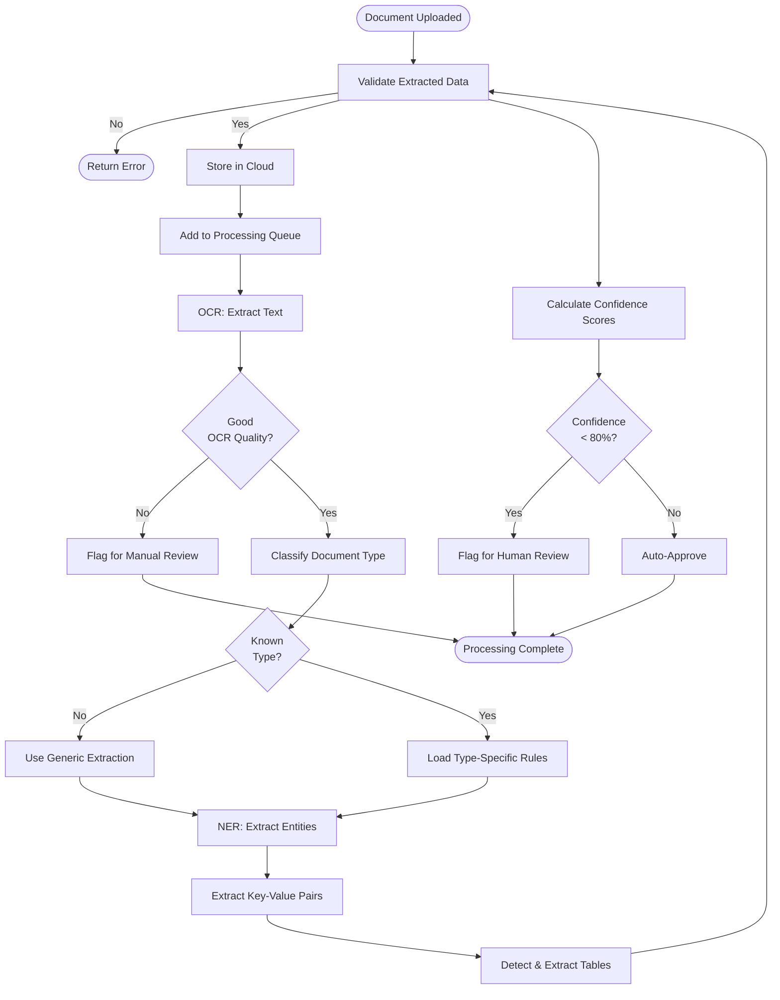
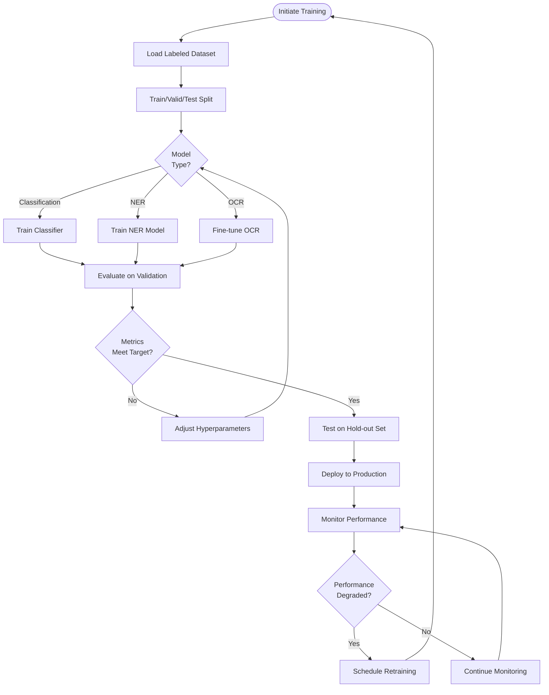
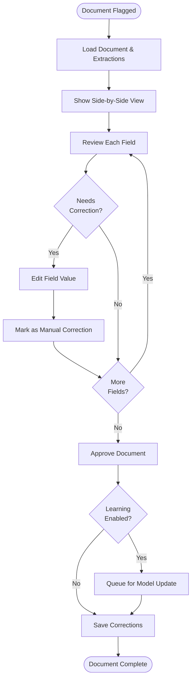

# Activity Diagram - Document Intelligence System

## 1. Document Processing Pipeline

```mermaid
flowchart TD
    Start([Document Uploaded]) --> Validate{Valid<br/>File?}
    Validate -->|No| Error([Return Error])
    Validate -->|Yes| Store[Store in Cloud]
    
    Store --> Queue[Add to Processing Queue]
    Queue --> OCR[OCR: Extract Text]
    
    OCR --> Quality{Good<br/>OCR Quality?}
    Quality -->|No| ManualOCR[Flag for Manual Review]
    Quality -->|Yes| Classify[Classify Document Type]
    
    Classify --> KnownType{Known<br/>Type?}
    KnownType -->|No| Generic[Use Generic Extraction]
    KnownType -->|Yes| LoadRules[Load Type-Specific Rules]
    
    LoadRules --> NER[NER: Extract Entities]
    Generic --> NER
    
    NER --> KV[Extract Key-Value Pairs]
    KV --> Table[Detect & Extract Tables]
    
    Table --> Validate[Validate Extracted Data]
    Validate --> Confidence[Calculate Confidence Scores]
    
    Confidence --> LowConf{Confidence<br/>< 80%?}
    LowConf -->|Yes| FlagReview[Flag for Human Review]
    LowConf -->|No| AutoApprove[Auto-Approve]
    
    FlagReview --> Complete([Processing Complete])
    AutoApprove --> Complete
    ManualOCR --> Complete
```

---

## 2. Model Training Workflow

```mermaid
flowchart TD
    Start([Initiate Training]) --> LoadData[Load Labeled Dataset]
    LoadData --> Split[Train/Valid/Test Split]
    
    Split --> SelectModel{Model<br/>Type?}
    
    SelectModel -->|Classification| TrainCLS[Train Classifier]
    SelectModel -->|NER| TrainNER[Train NER Model]
    SelectModel -->|OCR| TrainOCR[Fine-tune OCR]
    
    TrainCLS --> Eval[Evaluate on Validation]
    TrainNER --> Eval
    TrainOCR --> Eval
    
    Eval --> Acceptable{Metrics<br/>Meet Target?}
    Acceptable -->|No| Tune[Adjust Hyperparameters]
    Tune --> SelectModel
    
    Acceptable -->|Yes| Test[Test on Hold-out Set]
    Test --> Deploy[Deploy to Production]
    Deploy --> Monitor[Monitor Performance]
    Monitor --> Drift{Performance<br/>Degraded?}
    
    Drift -->|Yes| Retrain[Schedule Retraining]
    Drift -->|No| Continue[Continue Monitoring]
    
    Retrain --> Start
    Continue --> Monitor
```

---

## 3. Human Review Process

```mermaid
flowchart TD
    Start([Document Flagged]) --> Load[Load Document & Extractions]
    Load --> Display[Show Side-by-Side View]
    
    Display --> ReviewField[Review Each Field]
    ReviewField --> Correct{Needs<br/>Correction?}
    
    Correct -->|Yes| Edit[Edit Field Value]
    Edit --> MarkManual[Mark as Manual Correction]
    MarkManual --> NextField{More<br/>Fields?}
    
    Correct -->|No| NextField
    NextField -->|Yes| ReviewField
    NextField -->|No| Approve[Approve Document]
    
    Approve --> Learn{Learning<br/>Enabled?}
    Learn -->|Yes| UpdateModel[Queue for Model Update]
    Learn -->|No| Save[Save Corrections]
    
    UpdateModel --> Save
    Save --> End([Document Complete])
```
