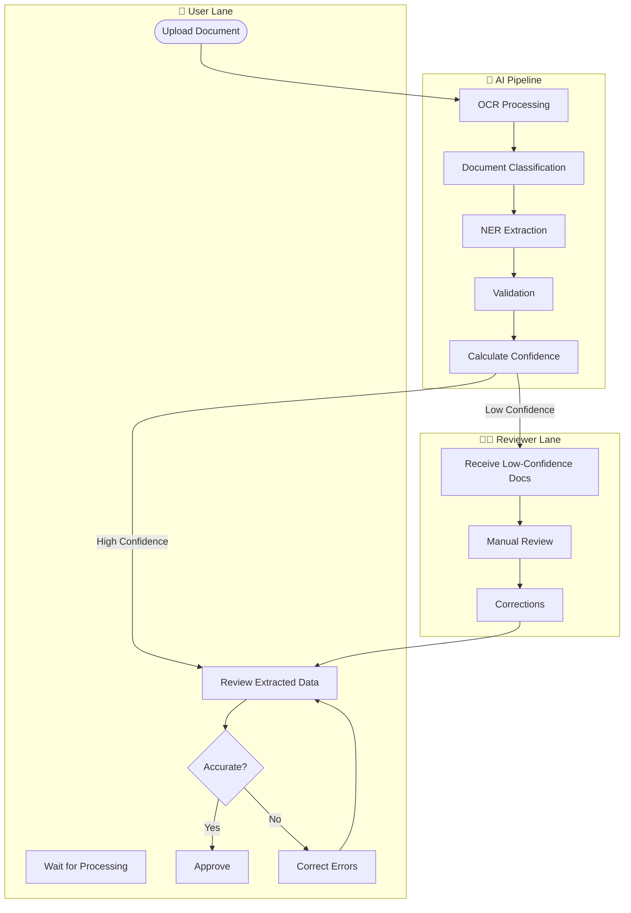
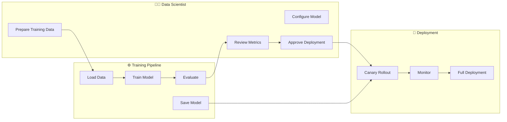

# BPMN / Swimlane Diagram - Document Intelligence System

## Complete Document Processing Flow

```mermaid
flowchart TB
    subgraph User["👤 User Lane"]
        U1([Upload Document])
        U2[Wait for Processing]
        U3[Review Extracted Data]
        U4{Accurate?}
        U5[Approve]
        U6[Correct Errors]
    end
    
    subgraph System["🤖 AI Pipeline"]
        S1[OCR Processing]
        S2[Document Classification]
        S3[NER Extraction]
        S4[Validation]
        S5[Calculate Confidence]
    end
    
    subgraph Reviewer["👨‍💼 Reviewer Lane"]
        R1[Receive Low-Confidence Docs]
        R2[Manual Review]
        R3[Corrections]
    end
    
    U1 -->  S1
    S1 --> S2
    S2 --> S3
    S3 --> S4
    S4 --> S5
    S5 -->|High Confidence| U3
    S5 -->|Low Confidence| R1
    
    U3 --> U4
    U4 -->|Yes| U5
    U4 -->|No| U6
    U6 --> U3
    
    R1 --> R2
    R2 --> R3
    R3 --> U3
```

---

## Model Training & Deployment

```mermaid
flowchart LR
    subgraph DS["👨‍💻 Data Scientist"]
        DS1[Prepare Training Data]
        DS2[Configure Model]
        DS3[Review Metrics]
        DS4[Approve Deployment]
    end
    
    subgraph Train["⚙️ Training Pipeline"]
        T1[Load Data]
        T2[Train Model]
        T3[Evaluate]
        T4[Save Model]
    end
    
    subgraph Deploy["🚀 Deployment"]
        D1[Canary Rollout]
        D2[Monitor]
        D3[Full Deployment]
    end
    
    DS1 --> T1
    T1 --> T2
    T2 --> T3
    T3 --> DS3
    DS3 --> DS4
    DS4 --> D1
    D1 --> D2
    D2 --> D3
    T4 --> D1
```
