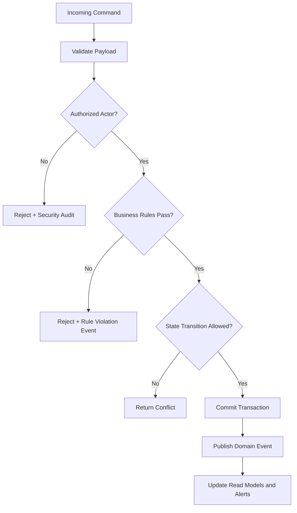

# Business Rules

This document defines enforceable policy rules for **Document Intelligence System** so command processing, asynchronous jobs, and operational actions behave consistently under normal and exceptional conditions.

## Context
- Domain focus: document intelligence workflows.
- Rule categories: lifecycle transitions, authorization, compliance, and resilience.
- Enforcement points: APIs, workflow/state engines, background processors, and administrative consoles.

## Enforceable Rules
1. Every state-changing command must pass authentication, authorization, and schema validation before processing.
2. Lifecycle transitions must follow the configured state graph; invalid transitions are rejected with explicit reason codes.
3. High-impact operations (financial, security, or regulated data actions) require additional approval evidence.
4. Manual overrides must include approver identity, rationale, and expiration timestamp.
5. Retries and compensations must be idempotent and must not create duplicate business effects.

## Rule Evaluation Pipeline

## Exception and Override Handling
- Overrides are restricted to approved exception classes and require dual logging (business + security audit).
- Override windows automatically expire and trigger follow-up verification tasks.
- Repeated override patterns are reviewed for policy redesign and automation improvements.
---

## AI/ML Operations Addendum

### Extraction & Classification Pipeline Detail
- Ingestion normalizes PDFs/images (de-skew, orientation correction, denoise, page splitting) before OCR inference, and preserves page-level provenance (`document_id`, `page_no`, `checksum`) for reproducibility.
- OCR outputs word-level tokens with bounding boxes and confidence, then layout reconstruction builds reading order, sections, tables, and key-value candidates for downstream models.
- Classification runs as a two-stage ensemble: coarse document family classifier followed by template/domain subtype classifier; routing controls which extraction graph, validation rules, and post-processors execute.
- Extraction combines multiple strategies (template anchors, layout-aware transformer NER, regex/rule validators, and table parsers) with conflict resolution and source attribution at field level.

### Confidence Thresholding Logic
- Every predicted artifact (doc type, entity, field, table cell) carries calibrated confidence; calibration is maintained per model version using held-out reliability sets (temperature scaling/isotonic).
- Thresholds are policy-driven and tiered: **auto-accept**, **review-required**, and **reject/reprocess** bands, configurable per document type and field criticality (e.g., totals, IDs, legal dates).
- Composite confidence uses weighted signals: model probability, OCR quality, extraction-rule agreement, cross-field consistency checks, and historical drift indicators.
- Dynamic threshold overrides apply during incidents (e.g., OCR degradation or new template rollout) with explicit expiry, audit log entries, and rollback playbooks.

### Human-in-the-Loop Review Flow
- Low-confidence or policy-flagged documents enter a reviewer queue with SLA tiers, reason codes, and pre-highlighted spans/bounding boxes to minimize correction time.
- Reviewer edits are captured as structured feedback (`before`, `after`, `reason`, `reviewer_role`) and linked to model/version metadata for supervised retraining datasets.
- Dual-review and adjudication is required for high-risk fields or regulated document classes; disagreements are labeled and retained for error analysis.
- Review outcomes feed active-learning samplers that prioritize uncertain/novel templates while enforcing PII minimization and role-based masking in annotation tools.

### Model Lifecycle Governance
- Model registry tracks lineage across datasets, feature pipelines, prompts/config, evaluation reports, approval status, and deployment environment.
- Promotion gates enforce quality thresholds (classification F1, field-level precision/recall, calibration error, latency/cost SLOs) plus fairness and security checks before production release.
- Runtime monitoring covers drift (input schema, token distributions, template novelty), confidence shifts, reviewer override rates, and business KPI regressions with automated alerts.
- Rollout strategy uses canary/shadow deployments, version pinning per tenant/workflow, and deterministic rollback with incident postmortems and governance sign-off.

### Decision Rule Extensions
- Encode field criticality matrices and reviewer assignment logic as versioned rules so threshold/policy changes are managed independently of model code.
---

## Implementation-Ready Deep Dive

### Operational Control Objectives
| Objective | Target | Owner | Evidence |
|---|---|---|---|
| Straight-through processing rate | >= 75% for baseline templates | ML Ops Lead | Weekly quality report |
| Critical-field precision | >= 99% on regulated fields | Applied ML Engineer | Offline eval + reviewer sample audit |
| Reviewer turnaround SLA | P95 < 2 business hours | Review Ops Manager | Queue dashboard + SLA breach alerts |
| Rollback readiness | < 15 min rollback execution | Platform SRE | Change ticket + rollback drill logs |

### Implementation Backlog (Must-Have)
1. Implement per-field threshold policy engine with policy versioning and tenant/document-type overrides.
2. Add calibrated confidence tracking table and nightly reliability job with ECE/Brier drift alarms.
3. Introduce reviewer work allocation service (skill-based routing, dual-review for high-risk forms).
4. Create retraining dataset contracts (gold labels, weak labels, rejected examples, hard-negative mining).
5. Establish model governance workflow (proposal -> validation -> canary -> promotion -> archive).

### Production Acceptance Checklist
- [ ] End-to-end traceability from uploaded file to exported structured payload.
- [ ] Full audit trail for every manual correction and model/policy decision.
- [ ] Canary release + rollback automation validated in staging and production-like data.
- [ ] Drift/quality SLO dashboards wired to paging policy and incident template.
- [ ] Security controls for PII redaction, purpose-limited access, and retention enforcement.

### Critical Decision Rules
1. If critical field confidence < critical threshold then force dual-review and disable auto-export.
2. If document template is unseen and novelty score > cutoff then route to review-first pipeline.
3. If reviewer disagreement persists beyond 2 rounds then escalate to domain adjudicator.
4. If override rate increases > 2x baseline for 24h then freeze model promotion and trigger incident.

