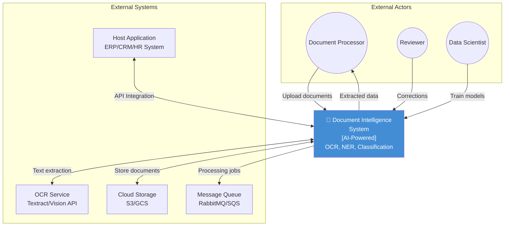

# System Context Diagram - Document Intelligence System

## System Boundaries

### Inside the System
- Document upload & storage
- OCR text extraction
- Document classification
- NER entity extraction
- Key-value pair extraction
- Validation & confidence scoring
- Review UI
- Model training pipeline

### Outside the System
- User authentication (host app)
- Document creation (host app)
- Final data storage (host app database)
- Payment for cloud services
