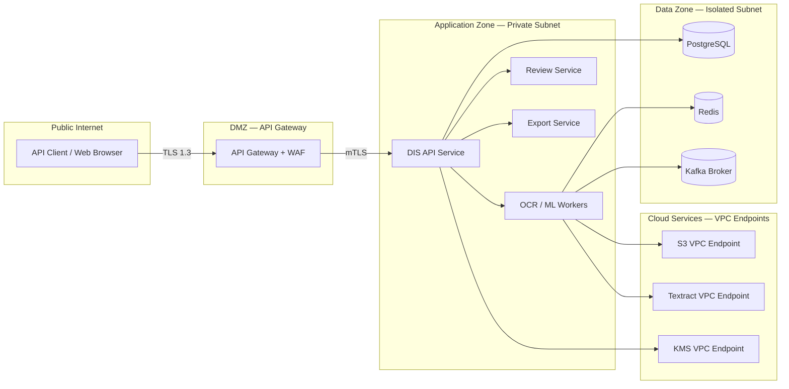

# System Context Diagram — Document Intelligence System

## C4 Level 1 — Context Diagram

The context diagram shows the Document Intelligence System (DIS) in relation to the humans who use it and the external software systems it interacts with.

```mermaid
C4Context
    title Document Intelligence System — C4 Level 1 Context

    Person(doc_processor, "Document Processor", "Submits document batches and monitors pipeline status via REST API or web UI")
    Person(human_reviewer, "Human Reviewer", "Reviews low-confidence extractions; corrects fields in the review interface")
    Person(sys_admin, "System Administrator", "Manages templates, validation rules, users, and retention policies")
    Person(data_scientist, "Data Scientist", "Trains, evaluates, and promotes classification and extraction models")
    Person(compliance_officer, "Compliance Officer", "Audits PII access, manages GDPR erasure, approves medical exports")

    System(dis, "Document Intelligence System", "Automates document ingestion, OCR, classification, field extraction, validation, review, and ERP export. Enforces compliance with GDPR and HIPAA.")

    System_Ext(erp_sap, "SAP ERP", "Enterprise Resource Planning — receives structured invoice, PO, and vendor data via IDOC/RFC")
    System_Ext(erp_oracle, "Oracle ERP", "Enterprise Resource Planning — receives structured data via Oracle REST API")
    System_Ext(aws_textract, "AWS Textract", "Cloud OCR service — extracts text and layout from document images")
    System_Ext(gcp_vision, "Google Cloud Vision API", "Fallback cloud OCR service")
    System_Ext(s3, "Amazon S3 / GCS", "Object storage for raw document binaries and rendered page images")
    System_Ext(mlflow, "MLflow Model Registry", "Tracks model versions, metrics, and artifacts for classification and extraction models")
    System_Ext(iam, "IAM Platform", "Identity and Access Management — issues JWTs, manages user roles and tenant configuration")
    System_Ext(siem, "SIEM (Splunk / Elastic)", "Receives audit log events and security alerts in real time")
    System_Ext(hr_system, "HR System", "Provides reviewer roster and skill tags for automated task assignment")
    System_Ext(kafka, "Apache Kafka", "Distributed event streaming — decouples pipeline stages")
    System_Ext(sagemaker, "AWS SageMaker / Vertex AI", "Managed ML training and inference infrastructure")

    Rel(doc_processor, dis, "Submits batches, monitors status, triggers exports", "HTTPS/REST")
    Rel(human_reviewer, dis, "Reviews tasks, submits corrections", "HTTPS/REST")
    Rel(sys_admin, dis, "Manages templates, rules, users", "HTTPS/REST")
    Rel(data_scientist, dis, "Triggers retraining, promotes models", "HTTPS/REST")
    Rel(compliance_officer, dis, "Audits logs, handles GDPR requests", "HTTPS/REST")

    Rel(dis, aws_textract, "Sends page images, receives OCR results", "HTTPS/AWS SDK")
    Rel(dis, gcp_vision, "Sends page images, receives OCR results (fallback)", "HTTPS/GCP SDK")
    Rel(dis, s3, "Stores and retrieves document files", "HTTPS/S3 API")
    Rel(dis, mlflow, "Loads model artifacts, logs training metrics", "HTTPS/MLflow REST")
    Rel(dis, erp_sap, "Exports structured document data", "RFC/IDOC over HTTPS")
    Rel(dis, erp_oracle, "Exports structured document data", "HTTPS/Oracle REST")
    Rel(dis, iam, "Validates JWT tokens, fetches user roles", "HTTPS/OIDC")
    Rel(dis, siem, "Streams audit log and security events", "TCP/Syslog + HTTPS")
    Rel(dis, hr_system, "Fetches reviewer roster and skills", "HTTPS/REST")
    Rel(dis, kafka, "Publishes and consumes domain events", "TCP/Kafka Protocol")
    Rel(dis, sagemaker, "Submits training jobs, loads inference endpoints", "HTTPS/SDK")
```

## External System Integration Details

| External System | Integration Type | Data Exchanged | Protocol | Auth |
|---|---|---|---|---|
| AWS Textract | Synchronous API | Page images → OCR text + bounding boxes | HTTPS / AWS SDK | IAM Role (instance profile) |
| Google Cloud Vision | Synchronous API | Page images → OCR text + confidence | HTTPS / GCP SDK | Service Account Key / Workload Identity |
| Amazon S3 / GCS | Object Storage | Document binaries, page images | HTTPS / S3 API | IAM Role / Service Account |
| SAP ERP | Batch Export | Structured JSON → IDOC/RFC | RFC over HTTPS | SAP OAuth2 / Basic Auth |
| Oracle ERP | REST Export | Structured JSON payload | HTTPS REST | OAuth2 Client Credentials |
| MLflow Model Registry | API | Model artifacts, metrics, versions | HTTPS | API Token |
| IAM Platform | OIDC | JWT tokens, user metadata, roles | HTTPS / OIDC | mTLS between services |
| SIEM (Splunk/Elastic) | Event Stream | Audit log events (JSON) | TCP Syslog / HEC | Token Auth |
| HR System | REST API | Reviewer list, skills, availability | HTTPS | OAuth2 |
| Apache Kafka | Event Bus | Domain events (JSON + Avro) | TCP | SASL/SCRAM + TLS |
| AWS SageMaker / Vertex AI | Training Job API | Training data S3 URIs, hyperparameters | HTTPS / SDK | IAM Role |

## Security Boundaries

```mermaid
graph LR
    subgraph Internet["Public Internet"]
        Client[API Client / Web Browser]
    end
    subgraph DMZ["DMZ — API Gateway"]
        APIGW[API Gateway + WAF]
    end
    subgraph AppZone["Application Zone — Private Subnet"]
        DIS_API[DIS API Service]
        Workers[OCR / ML Workers]
        ReviewSvc[Review Service]
        ExportSvc[Export Service]
    end
    subgraph DataZone["Data Zone — Isolated Subnet"]
        PG[(PostgreSQL)]
        Redis[(Redis)]
        KafkaBroker[(Kafka Broker)]
    end
    subgraph CloudServices["Cloud Services — VPC Endpoints"]
        S3_EP[S3 VPC Endpoint]
        TextractEP[Textract VPC Endpoint]
        KMS_EP[KMS VPC Endpoint]
    end

    Client -->|TLS 1.3| APIGW
    APIGW -->|mTLS| DIS_API
    DIS_API --> Workers
    DIS_API --> ReviewSvc
    DIS_API --> ExportSvc
    DIS_API --> PG
    Workers --> Redis
    Workers --> KafkaBroker
    Workers --> S3_EP
    Workers --> TextractEP
    DIS_API --> KMS_EP
```
