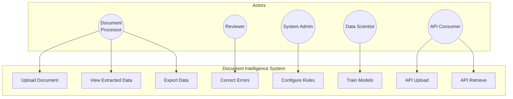

# Use Case Diagram - Document Intelligence System

## Actor Summary

| Actor | Primary Actions |
|-------|----------------|
| Document Processor | Upload documents, view extracted data |
| Reviewer | Validate and correct extractions |
| System Admin | Configure extraction rules |
| Data Scientist | Train and optimize AI models |
| API Consumer | Programmatic document processing |
