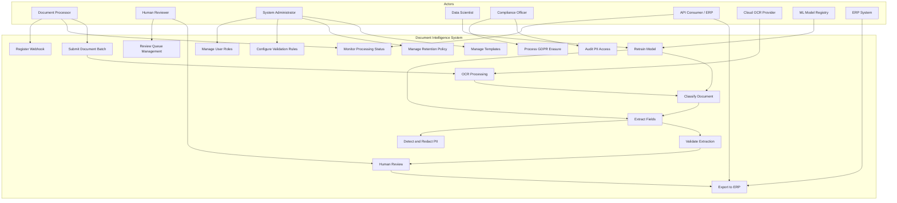

# Use Case Diagram — Document Intelligence System

## System Boundary and Actors

The Document Intelligence System (DIS) boundary encompasses all automated processing pipelines and human-in-the-loop review workflows. External actors interact with the system via REST API, WebUI, and webhook callbacks.

```mermaid
graph TD
    subgraph Actors
        DP[Document Processor]
        HR[Human Reviewer]
        SA[System Administrator]
        DS[Data Scientist]
        CO[Compliance Officer]
        AC[API Consumer / ERP]
        OCR_P[Cloud OCR Provider]
        ML_R[ML Model Registry]
        ERP_S[ERP System]
    end

    subgraph DIS["Document Intelligence System"]
        UC01[Submit Document Batch]
        UC02[OCR Processing]
        UC03[Classify Document]
        UC04[Extract Fields]
        UC05[Validate Extraction]
        UC06[Human Review]
        UC07[Export to ERP]
        UC08[Retrain Model]
        UC09[Manage Templates]
        UC10[Manage Retention Policy]
        UC11[Audit PII Access]
        UC12[Process GDPR Erasure]
        UC13[Configure Validation Rules]
        UC14[Monitor Processing Status]
        UC15[Register Webhook]
        UC16[Detect and Redact PII]
        UC17[Manage User Roles]
        UC18[Review Queue Management]
    end

    DP --> UC01
    DP --> UC14
    DP --> UC15
    HR --> UC06
    HR --> UC18
    SA --> UC09
    SA --> UC10
    SA --> UC13
    SA --> UC17
    DS --> UC08
    CO --> UC11
    CO --> UC12
    AC --> UC07
    AC --> UC14
    OCR_P --> UC02
    ML_R --> UC08
    ERP_S --> UC07

    UC01 --> UC02
    UC02 --> UC03
    UC03 --> UC04
    UC04 --> UC05
    UC05 --> UC06
    UC06 --> UC07
    UC04 --> UC16
    UC08 --> UC03
    UC08 --> UC04
```

## Actor Descriptions

| Actor | Type | Description |
|---|---|---|
| Document Processor | Primary Human | Submits document batches, monitors pipeline, triggers exports |
| Human Reviewer | Primary Human | Reviews low-confidence results, corrects extracted fields |
| System Administrator | Primary Human | Manages configuration: templates, rules, users, retention |
| Data Scientist | Primary Human | Manages model lifecycle: training, evaluation, promotion |
| Compliance Officer | Primary Human | Audits PII access, handles GDPR requests, approves medical exports |
| API Consumer / ERP | Primary System | Receives exported structured data via REST or SFTP |
| Cloud OCR Provider | Secondary System | AWS Textract / Google Cloud Vision API |
| ML Model Registry | Secondary System | MLflow — stores and versions trained models |
| ERP System | Secondary System | SAP, Oracle — target of document data exports |

## Use Case Summary

| ID | Use Case | Primary Actor | Priority |
|---|---|---|---|
| UC-01 | Submit Document Batch | Document Processor | Must Have |
| UC-02 | OCR Processing | Cloud OCR Provider | Must Have |
| UC-03 | Classify Document | DIS (automated) | Must Have |
| UC-04 | Extract Fields | DIS (automated) | Must Have |
| UC-05 | Validate Extraction | DIS (automated) | Must Have |
| UC-06 | Human Review | Human Reviewer | Must Have |
| UC-07 | Export to ERP | API Consumer | Must Have |
| UC-08 | Retrain Model | Data Scientist | Should Have |
| UC-09 | Manage Templates | System Administrator | Must Have |
| UC-10 | Manage Retention Policy | System Administrator | Must Have |
| UC-11 | Audit PII Access | Compliance Officer | Must Have |
| UC-12 | Process GDPR Erasure | Compliance Officer | Must Have |
| UC-13 | Configure Validation Rules | System Administrator | Must Have |
| UC-14 | Monitor Processing Status | Document Processor | Must Have |
| UC-15 | Register Webhook | API Consumer | Should Have |
| UC-16 | Detect and Redact PII | DIS (automated) | Must Have |
| UC-17 | Manage User Roles | System Administrator | Must Have |
| UC-18 | Review Queue Management | Human Reviewer | Must Have |

## Include / Extend Relationships

| Use Case | Relationship | Extended/Included Use Case |
|---|---|---|
| UC-04 Extract Fields | `<<include>>` | UC-16 Detect and Redact PII |
| UC-05 Validate Extraction | `<<extend>>` | UC-06 Human Review (when validation fails) |
| UC-02 OCR Processing | `<<extend>>` | UC-06 Human Review (when confidence < 0.80) |
| UC-03 Classify Document | `<<extend>>` | UC-06 Human Review (when confidence < 0.70) |
| UC-07 Export to ERP | `<<include>>` | UC-11 Audit PII Access |
| UC-08 Retrain Model | `<<include>>` | UC-04 Extract Fields (use validated data) |
