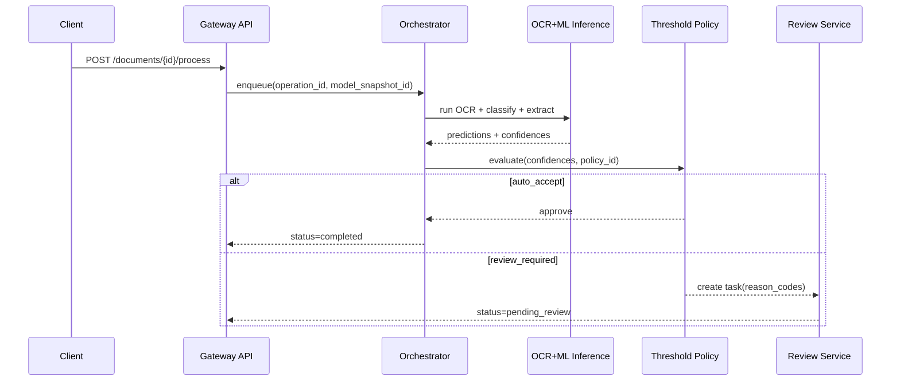

# API Design - Document Intelligence System

**Base URL**: `https://api.example.com/v1`  
**Auth**: Bearer Token

---

## Upload Document
**POST** `/documents`

**Request** (multipart/form-data):
```
file: [PDF/Image file]
documentType: "invoice" (optional)
```

**Response**: `202 Accepted`
```json
{
  "documentId": "uuid",
  "status": "queued",
  "estimatedTime": "30 seconds"
}
```

---

## Get Document Status
**GET** `/documents/{documentId}/status`

**Response**: `200 OK`
```json
{
  "documentId": "uuid",
  "status": "completed",
  "progress": 100,
  "extractionId": "uuid"
}
```

---

## Get Extracted Data
**GET** `/documents/{documentId}/extraction`

**Response**: `200 OK`
```json
{
  "documentId": "uuid",
  "documentType": "invoice",
  "avgConfidence": 0.92,
  "entities": [
    {"type": "vendor", "value": "ABC Corp", "confidence": 0.95},
    {"type": "amount", "value": "1250.00", "confidence": 0.98}
  ],
  "keyValues": [
    {"key": "invoice_number", "value": "INV-001", "confidence": 0.99},
    {"key": "total", "value": "1250.00", "confidence": 0.98}
  ],
  "tables": [
    {"headers": ["Item", "Qty", "Price"], "rows": [["Widget", "5", "250"]]}
  ]
}
```

---

## Update Extraction (Correction)
**PATCH** `/documents/{documentId}/extraction`

**Request**:
```json
{
  "keyValues": [
    {"key": "invoice_number", "value": "INV-002", "manuallyVerified": true}
  ]
}
```

**Response**: `200 OK`

---

## Batch Upload
**POST** `/documents/batch`

**Request**:
```json
{
  "documents": [
    {"fileUrl": "s3://...", "documentType": "invoice"},
    {"fileUrl": "s3://...", "documentType": "receipt"}
  ]
}
```

**Response**: `202 Accepted`
```json
{
  "batchId": "uuid",
  "documentIds": ["uuid1", "uuid2"],
  "status": "queued"
}
```

---

## Export Data
**GET** `/documents/{documentId}/export`

**Query Params**:
- `format`: json | csv | xml

**Response**: Extracted data in requested format

---

## Webhook Configuration
**POST** `/webhooks`

**Request**:
```json
{
  "url": "https://your-app.com/webhook",
  "events": ["document.completed", "document.failed"]
}
```

---

## Error Responses

```json
{
  "error": {
    "code": "INVALID_FILE_TYPE",
    "message": "Only PDF and image files are supported"
  }
}
```

| Code | HTTP | Description |
|------|------|-------------|
| INVALID_FILE_TYPE | 400 | Unsupported file format |
| FILE_TOO_LARGE | 413 | File exceeds 10MB limit |
| DOCUMENT_NOT_FOUND | 404 | Document ID doesn't exist |
| PROCESSING_FAILED | 500 | AI processing error |
| LOW_CONFIDENCE | 422 | Extraction confidence too low |
---

## AI/ML Operations Addendum

### Extraction & Classification Pipeline Detail
- Ingestion normalizes PDFs/images (de-skew, orientation correction, denoise, page splitting) before OCR inference, and preserves page-level provenance (`document_id`, `page_no`, `checksum`) for reproducibility.
- OCR outputs word-level tokens with bounding boxes and confidence, then layout reconstruction builds reading order, sections, tables, and key-value candidates for downstream models.
- Classification runs as a two-stage ensemble: coarse document family classifier followed by template/domain subtype classifier; routing controls which extraction graph, validation rules, and post-processors execute.
- Extraction combines multiple strategies (template anchors, layout-aware transformer NER, regex/rule validators, and table parsers) with conflict resolution and source attribution at field level.

### Confidence Thresholding Logic
- Every predicted artifact (doc type, entity, field, table cell) carries calibrated confidence; calibration is maintained per model version using held-out reliability sets (temperature scaling/isotonic).
- Thresholds are policy-driven and tiered: **auto-accept**, **review-required**, and **reject/reprocess** bands, configurable per document type and field criticality (e.g., totals, IDs, legal dates).
- Composite confidence uses weighted signals: model probability, OCR quality, extraction-rule agreement, cross-field consistency checks, and historical drift indicators.
- Dynamic threshold overrides apply during incidents (e.g., OCR degradation or new template rollout) with explicit expiry, audit log entries, and rollback playbooks.

### Human-in-the-Loop Review Flow
- Low-confidence or policy-flagged documents enter a reviewer queue with SLA tiers, reason codes, and pre-highlighted spans/bounding boxes to minimize correction time.
- Reviewer edits are captured as structured feedback (`before`, `after`, `reason`, `reviewer_role`) and linked to model/version metadata for supervised retraining datasets.
- Dual-review and adjudication is required for high-risk fields or regulated document classes; disagreements are labeled and retained for error analysis.
- Review outcomes feed active-learning samplers that prioritize uncertain/novel templates while enforcing PII minimization and role-based masking in annotation tools.

### Model Lifecycle Governance
- Model registry tracks lineage across datasets, feature pipelines, prompts/config, evaluation reports, approval status, and deployment environment.
- Promotion gates enforce quality thresholds (classification F1, field-level precision/recall, calibration error, latency/cost SLOs) plus fairness and security checks before production release.
- Runtime monitoring covers drift (input schema, token distributions, template novelty), confidence shifts, reviewer override rates, and business KPI regressions with automated alerts.
- Rollout strategy uses canary/shadow deployments, version pinning per tenant/workflow, and deterministic rollback with incident postmortems and governance sign-off.

### API Contract Extensions
- Expose confidence bands, rationale traces, and review-action endpoints (`claim`, `correct`, `adjudicate`) with idempotency and audit metadata guarantees.
---


## Implementation-Ready Deep Dive

### Operational Control Objectives
| Objective | Target | Owner | Evidence |
|---|---|---|---|
| Straight-through processing rate | >= 75% for baseline templates | ML Ops Lead | Weekly quality report |
| Critical-field precision | >= 99% on regulated fields | Applied ML Engineer | Offline eval + reviewer sample audit |
| Reviewer turnaround SLA | P95 < 2 business hours | Review Ops Manager | Queue dashboard + SLA breach alerts |
| Rollback readiness | < 15 min rollback execution | Platform SRE | Change ticket + rollback drill logs |

### Implementation Backlog (Must-Have)
1. Implement per-field threshold policy engine with policy versioning and tenant/document-type overrides.
2. Add calibrated confidence tracking table and nightly reliability job with ECE/Brier drift alarms.
3. Introduce reviewer work allocation service (skill-based routing, dual-review for high-risk forms).
4. Create retraining dataset contracts (gold labels, weak labels, rejected examples, hard-negative mining).
5. Establish model governance workflow (proposal -> validation -> canary -> promotion -> archive).

### Production Acceptance Checklist
- [ ] End-to-end traceability from uploaded file to exported structured payload.
- [ ] Full audit trail for every manual correction and model/policy decision.
- [ ] Canary release + rollback automation validated in staging and production-like data.
- [ ] Drift/quality SLO dashboards wired to paging policy and incident template.
- [ ] Security controls for PII redaction, purpose-limited access, and retention enforcement.

### API Runtime Contracts
- `POST /v1/documents/{id}/process` MUST return operation id plus immutable `model_snapshot_id` and `threshold_policy_id`.
- `GET /v1/operations/{opId}` MUST include per-stage timings (ingest/ocr/classify/extract/validate/review).
- `POST /v1/reviews/{taskId}/decision` MUST require optimistic-lock `revision` to prevent conflicting saves.
- `POST /v1/feedback/bulk` MUST support signed upload manifests and schema validation reports.

### Mermaid: Processing + Review API Lifecycle


