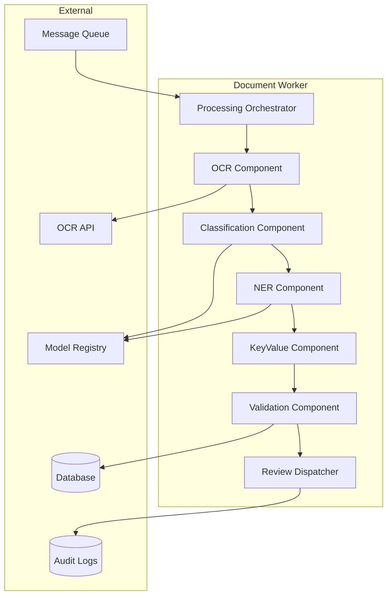
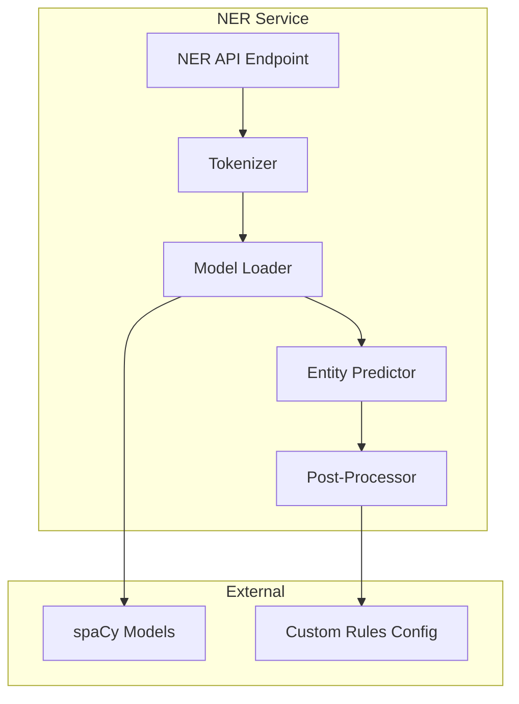

# C4 Component Diagram - Document Intelligence System

## Processing Worker Components

## NER Service Components

**Component Descriptions**:
- **Processing Orchestrator**: Coordinate AI pipeline steps
- **OCR Component**: Extract text from images
- **Classification Component**: Identify document type
- **NER Component**: Extract named entities
- **KeyValue Component**: Extract field-value pairs
- **Validation Component**: Verify accuracy + confidence
- **Review Dispatcher**: Route low-confidence docs to review
- **Model Loader**: Load ML models from registry
- **Post-Processor**: Normalize and validate entities
