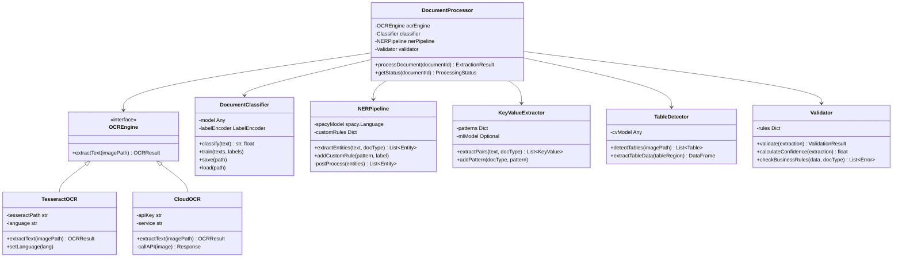
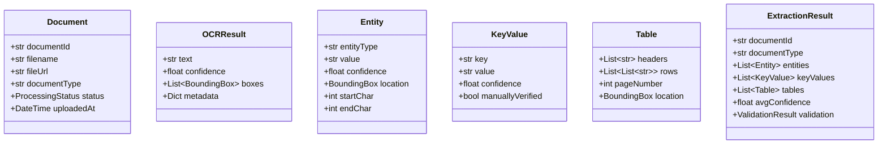

# Class Diagram - Document Intelligence System

## Python AI Classes

## Data Classes

**Key Python Libraries**:
- Tesseract-OCR: Open-source OCR
- spaCy: Industrial-strength NLP
- Hugging Face Transformers: Pre-trained NER models
- OpenCV: Image processing
- pdfplumber: PDF text extraction
- pandas: Data manipulation
