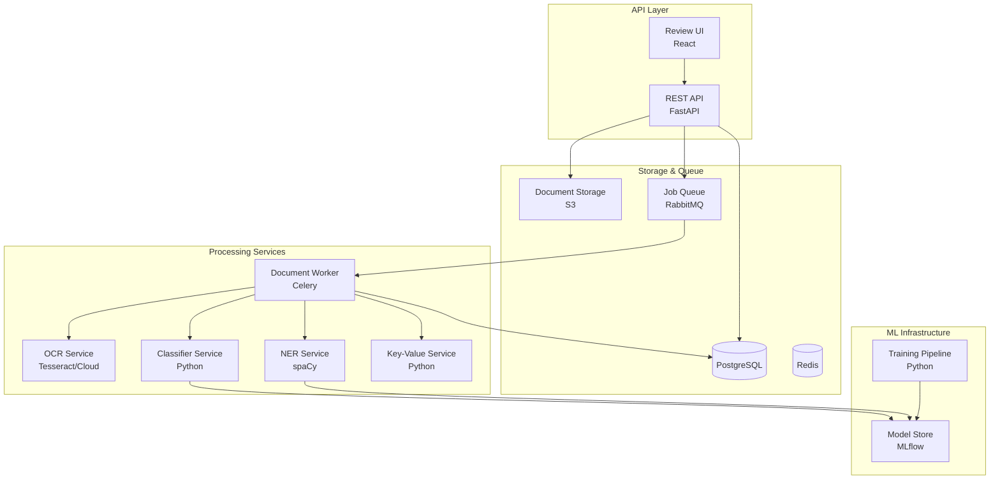

# Component Diagram - Document Intelligence System

## Component Responsibilities

| Component | Technology | Purpose |
|-----------|------------|---------|
| REST API | FastAPI | Handle HTTP requests, serve data |
| Review UI | React | Human review interface |
| Document Worker | Celery | Async document processing |
| OCR Service | Tesseract, AWS Textract | Text extraction |
| Classifier Service | scikit-learn, TensorFlow | Document type classification |
| NER Service | spaCy, Transformers | Entity extraction |
| Key-Value Service | Rule-based + ML | Field-value extraction |
| Training Pipeline | Python, MLflow | Model training & evaluation |
