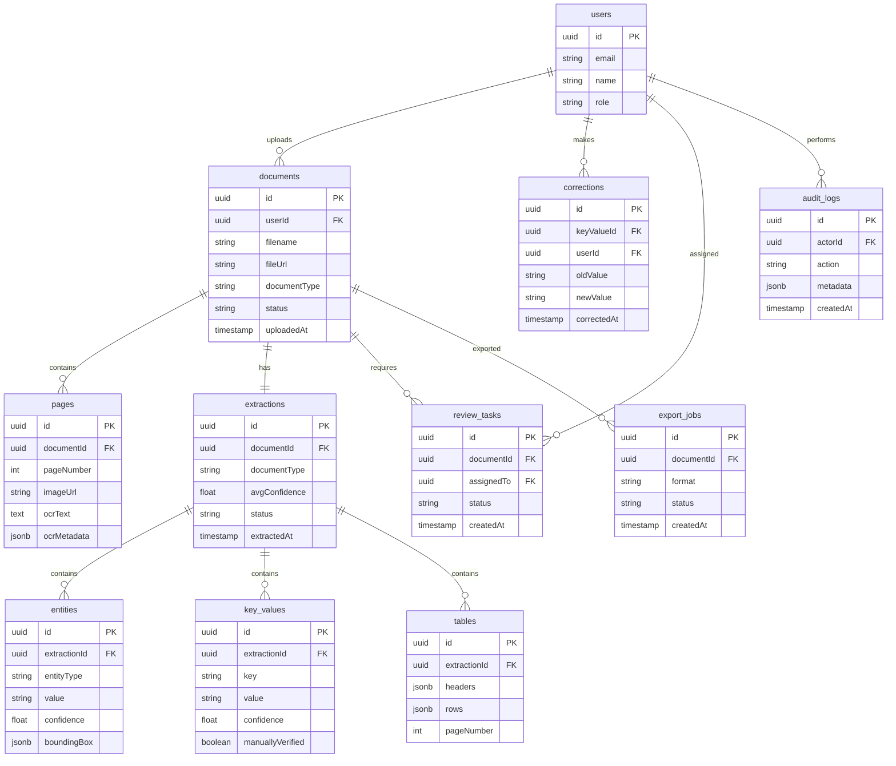

# ERD / Database Schema - Document Intelligence System



## Table Definitions

### documents
```sql
CREATE TABLE documents (
    id UUID PRIMARY KEY DEFAULT gen_random_uuid(),
    user_id UUID NOT NULL,
    filename VARCHAR(255) NOT NULL,
    file_url VARCHAR(500) NOT NULL,
    document_type VARCHAR(50),
    status VARCHAR(20) DEFAULT 'uploaded',
    uploaded_at TIMESTAMP DEFAULT NOW(),
    INDEX idx_user_status (user_id, status),
    INDEX idx_type (document_type)
);
```

### extractions
```sql
CREATE TABLE extractions (
    id UUID PRIMARY KEY DEFAULT gen_random_uuid(),
    document_id UUID NOT NULL REFERENCES documents(id),
    document_type VARCHAR(50),
    avg_confidence FLOAT,
    status VARCHAR(20) DEFAULT 'pending',
    extracted_at TIMESTAMP DEFAULT NOW()
);
```

### entities
```sql
CREATE TABLE entities (
    id UUID PRIMARY KEY DEFAULT gen_random_uuid(),
    extraction_id UUID NOT NULL REFERENCES extractions(id),
    entity_type VARCHAR(50) NOT NULL,  -- 'person', 'date', 'amount', etc.
    value TEXT NOT NULL,
    confidence FLOAT NOT NULL,
    bounding_box JSONB,  -- {x, y, width, height}
    INDEX idx_extraction (extraction_id),
    INDEX idx_type (entity_type)
);
```

### key_values
```sql
CREATE TABLE key_values (
    id UUID PRIMARY KEY DEFAULT gen_random_uuid(),
    extraction_id UUID NOT NULL REFERENCES extractions(id),
    key VARCHAR(100) NOT NULL,
    value TEXT,
    confidence FLOAT NOT NULL,
    manually_verified BOOLEAN DEFAULT FALSE,
    INDEX idx_extraction (extraction_id),
    INDEX idx_key (key)
);
```

### review_tasks
```sql
CREATE TABLE review_tasks (
    id UUID PRIMARY KEY DEFAULT gen_random_uuid(),
    document_id UUID NOT NULL REFERENCES documents(id),
    assigned_to UUID REFERENCES users(id),
    status VARCHAR(20) DEFAULT 'open',
    created_at TIMESTAMP DEFAULT NOW()
);
```

### export_jobs
```sql
CREATE TABLE export_jobs (
    id UUID PRIMARY KEY DEFAULT gen_random_uuid(),
    document_id UUID NOT NULL REFERENCES documents(id),
    format VARCHAR(10) NOT NULL,
    status VARCHAR(20) DEFAULT 'queued',
    created_at TIMESTAMP DEFAULT NOW()
);
```

### audit_logs
```sql
CREATE TABLE audit_logs (
    id UUID PRIMARY KEY DEFAULT gen_random_uuid(),
    actor_id UUID REFERENCES users(id),
    action VARCHAR(100) NOT NULL,
    metadata JSONB,
    created_at TIMESTAMP DEFAULT NOW()
);
```

## Enum Definitions

| Enum | Values |
|------|--------|
| document_status | uploaded, queued, processing, completed, failed, needs_review |
| extraction_status | pending, completed, reviewed, approved |
| entity_type | person, organization, date, amount, address, email, phone |
| user_role | processor, reviewer, admin, data_scientist |
