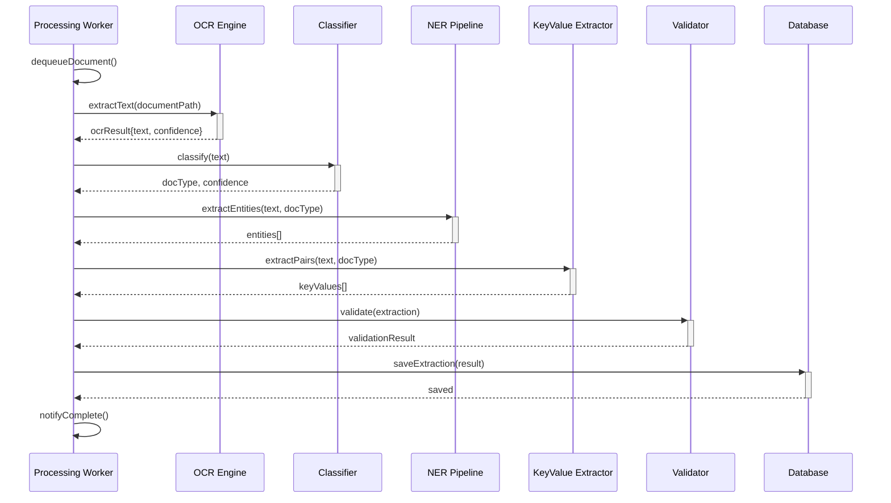
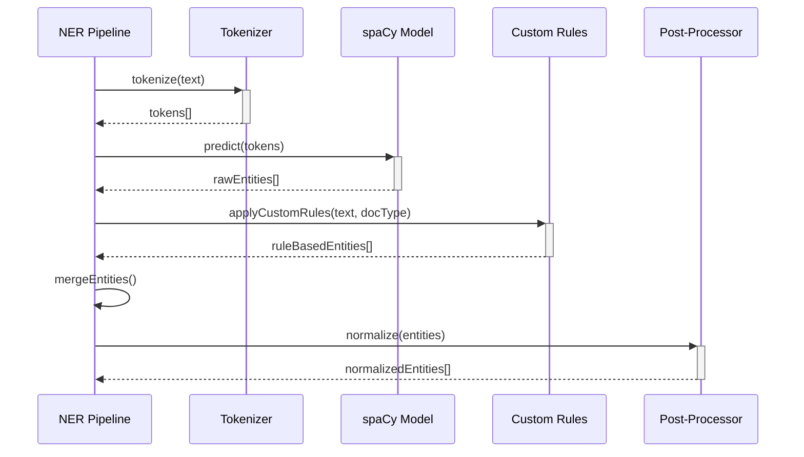
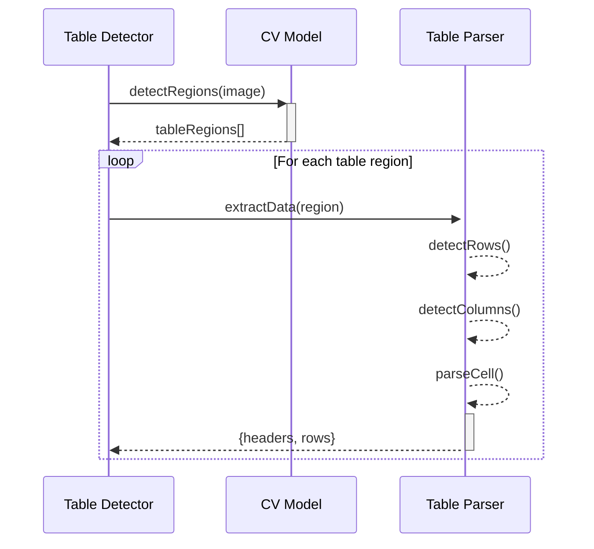

# Sequence Diagram - Document Intelligence System

## SD-01: Complete Document Processing

```mermaid
sequenceDiagram
    participant Worker as Processing Worker
    participant OCR as OCR Engine
    participant CLS as Classifier
    participant NER as NER Pipeline
    participant KV as KeyValue Extractor
    participant VAL as Validator
    participant DB as Database
    
    Worker->>Worker: dequeueDocument()
    Worker->>+OCR: extractText(documentPath)
    OCR-->>-Worker: ocrResult{text, confidence}
    
    Worker->>+CLS: classify(text)
    CLS-->>-Worker: docType, confidence
    
    Worker->>+NER: extractEntities(text, docType)
    NER-->>-Worker: entities[]
    
    Worker->>+KV: extractPairs(text, docType)
    KV-->>-Worker: keyValues[]
    
    Worker->>+VAL: validate(extraction)
    VAL-->>-Worker: validationResult
    
    Worker->>+DB: saveExtraction(result)
    DB-->>-Worker: saved
    
    Worker->>Worker: notifyComplete()
```

## SD-02: NER Entity Extraction

```mermaid
sequenceDiagram
    participant NER as NER Pipeline
    participant Tokenizer
    participant Model as spaCy Model
    participant Rules as Custom Rules
    participant Post as Post-Processor
    
    NER->>+Tokenizer: tokenize(text)
    Tokenizer-->>-NER: tokens[]
    
    NER->>+Model: predict(tokens)
    Model-->>-NER: rawEntities[]
    
    NER->>+Rules: applyCustomRules(text, docType)
    Rules-->>-NER: ruleBasedEntities[]
    
    NER->>NER: mergeEntities()
    NER->>+Post: normalize(entities)
    Post-->>-NER: normalizedEntities[]
```

## SD-03: Table Extraction

```mermaid
sequenceDiagram
    participant TD as Table Detector
    participant CV as CV Model
    participant Parser as Table Parser
    
    TD->>+CV: detectRegions(image)
    CV-->>-TD: tableRegions[]
    
    loop For each table region
        TD->>+Parser: extractData(region)
        Parser-->>Parser: detectRows()
        Parser-->>Parser: detectColumns()
        Parser-->>+Parser: parseCell()
        Parser-->>-TD: {headers, rows}
    end
```
