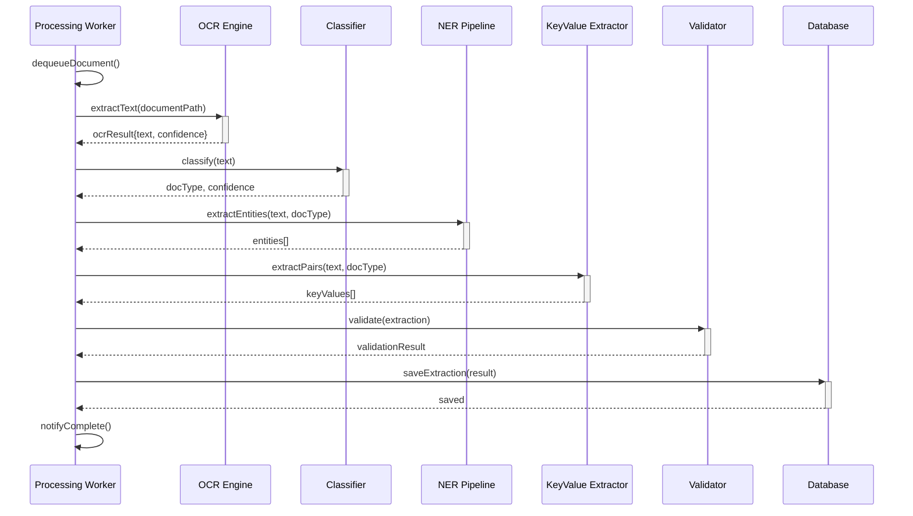
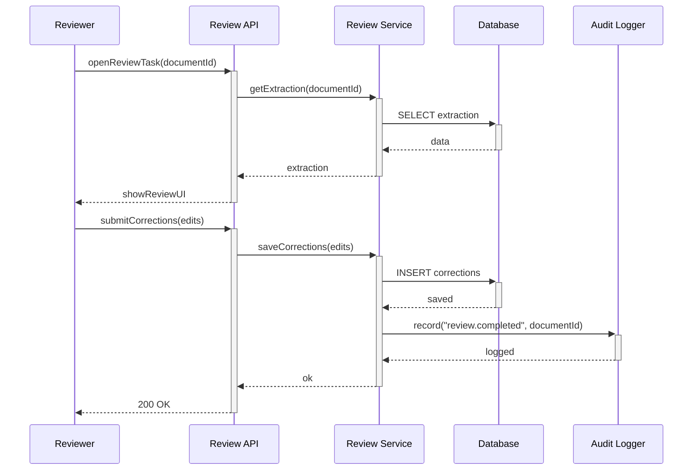
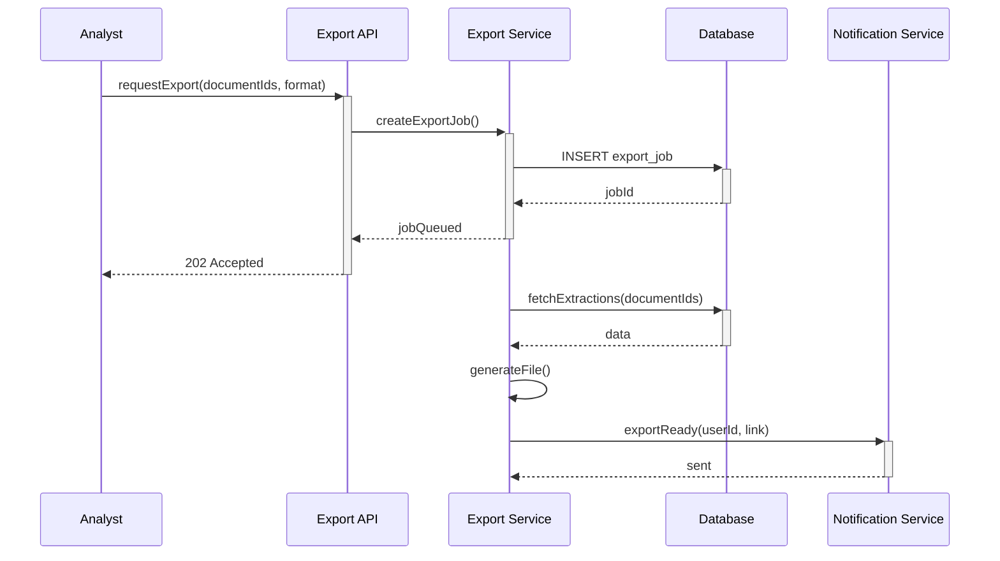
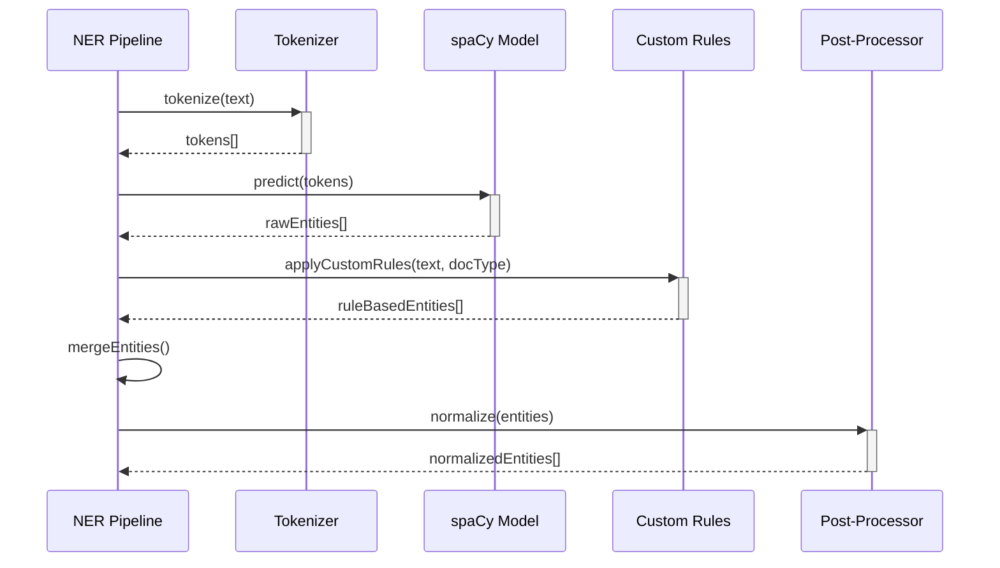
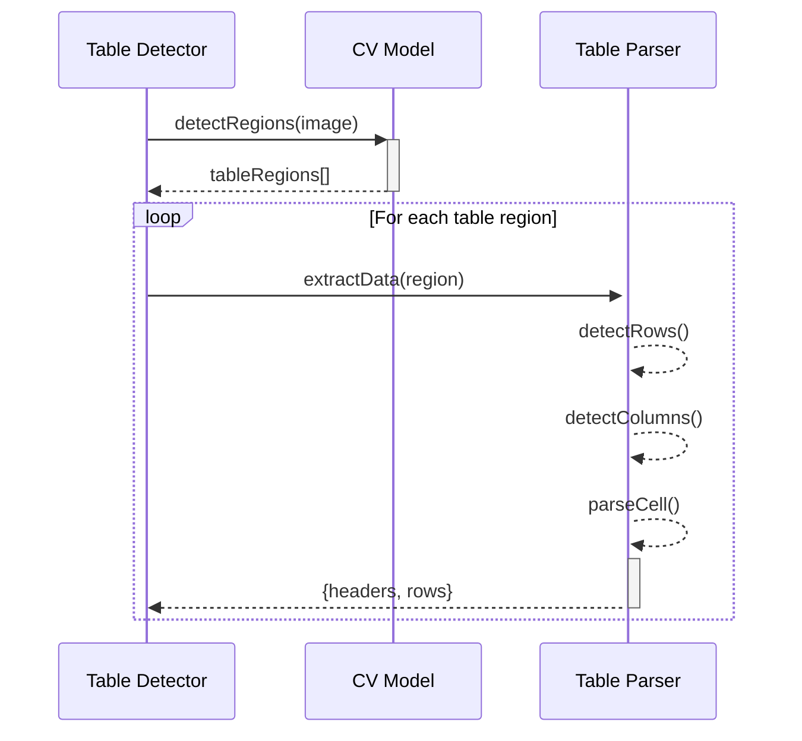

# Sequence Diagram - Document Intelligence System

## SD-01: Complete Document Processing

## SD-04: Review & Correction

## SD-05: Export Extracted Data

## SD-02: NER Entity Extraction

## SD-03: Table Extraction

