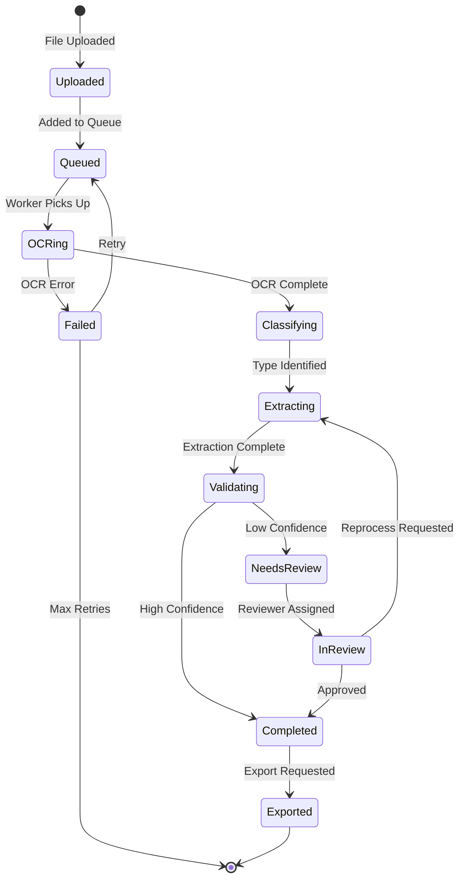
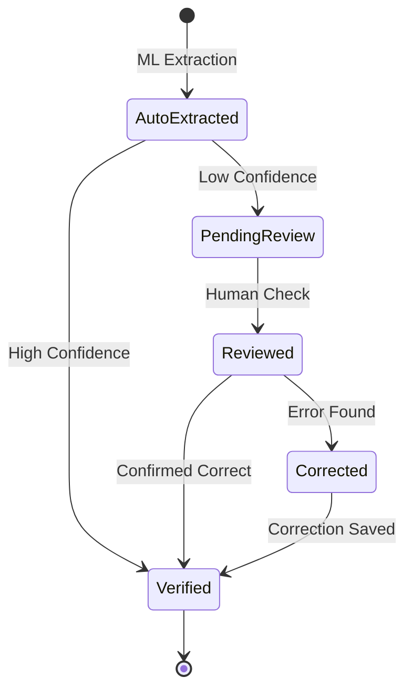
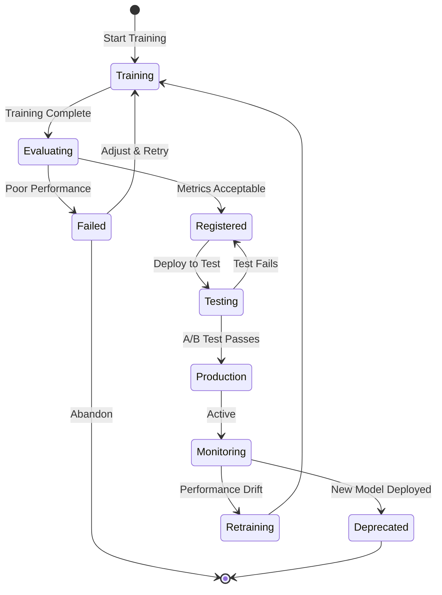

# State Machine Diagram - Document Intelligence System

## 1. Document Processing State

```mermaid
stateDiagram-v2
    [*] --> Uploaded: File Uploaded
    Uploaded --> Queued: Added to Queue
    Queued --> OCRing: Worker Picks Up
    OCRing --> Classifying: OCR Complete
    OCRing --> Failed: OCR Error
    
    Classifying --> Extracting: Type Identified
    Extracting --> Validating: Extraction Complete
    Validating --> NeedsReview: Low Confidence
    Validating --> Completed: High Confidence
    
    NeedsReview --> InReview: Reviewer Assigned
    InReview --> Completed: Approved
    InReview --> Extracting: Reprocess Requested
    
    Failed --> Queued: Retry
    Failed --> [*]: Max Retries
    Completed --> Exported: Export Requested
    Exported --> [*]
```

## 2. Extraction Field State

```mermaid
stateDiagram-v2
    [*] --> AutoExtracted: ML Extraction
    AutoExtracted --> Verified: High Confidence
    AutoExtracted --> PendingReview: Low Confidence
    
    PendingReview --> Reviewed: Human Check
    Reviewed --> Corrected: Error Found
    Reviewed --> Verified: Confirmed Correct
    
    Corrected --> Verified: Correction Saved
    Verified --> [*]
```

## 3. ML Model Lifecycle

```mermaid
stateDiagram-v2
    [*] --> Training: Start Training
    Training --> Evaluating: Training Complete
    Evaluating --> Registered: Metrics Acceptable
    Evaluating --> Failed: Poor Performance
    
    Failed --> Training: Adjust & Retry
    Failed --> [*]: Abandon
    
    Registered --> Testing: Deploy to Test
    Testing --> Production: A/B Test Passes
    Testing --> Registered: Test Fails
    
    Production --> Monitoring: Active
    Monitoring --> Deprecated: New Model Deployed
    Monitoring --> Retraining: Performance Drift
    
    Retraining --> Training
    Deprecated --> [*]
```
