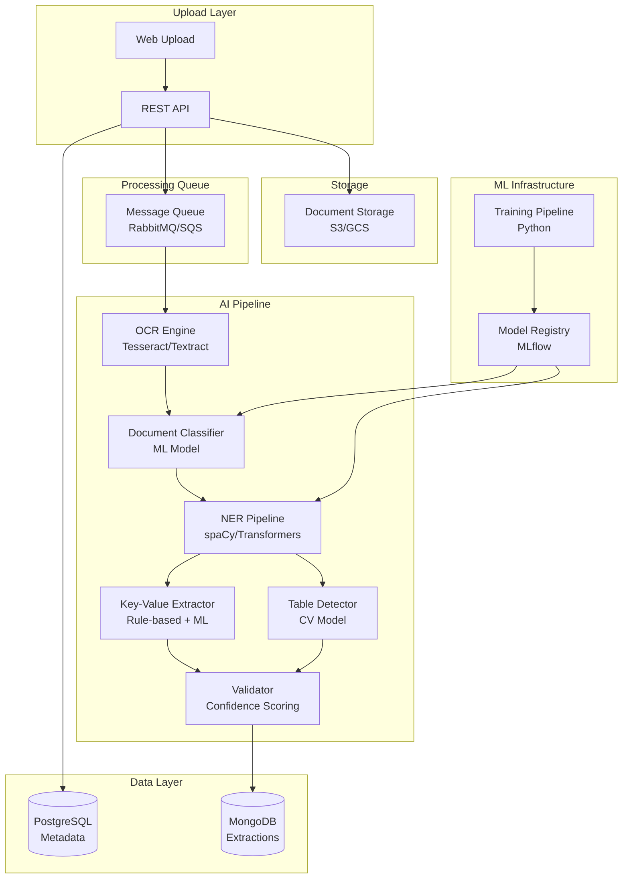

# Architecture Diagram - Document Intelligence System

## AI Processing Pipeline



## Layered Architecture

```
┌─────────────────────────────────────────┐
│      Presentation Layer                 │
│  (Web UI, REST API)                     │
└───────────────┬─────────────────────────┘
                │
┌───────────────▼─────────────────────────┐
│      Service Layer                      │
│  (Document Processing, Extraction)      │
└───────────────┬─────────────────────────┘
                │
┌───────────────▼─────────────────────────┐
│      AI/ML Layer                        │
│  (OCR, NER, Classification)             │
└───────────────┬─────────────────────────┘
                │
┌───────────────▼─────────────────────────┐
│      Data Layer                         │
│  (Storage, Database, Queue)             │
└─────────────────────────────────────────┘
```

## Technology Recommendations

| Component | Technology Options |
|-----------|-------------------|
| OCR | Tesseract (open-source), AWS Textract, Google Vision API |
| NER | spaCy, Hugging Face Transformers (BERT, RoBERTa) |
| Classification | scikit-learn, TensorFlow, PyTorch |
| API | FastAPI, Flask |
| Storage | S3, Google Cloud Storage, Azure Blob |
| Database | PostgreSQL (metadata), MongoDB (JSON extractions) |
| Queue | RabbitMQ, AWS SQS, Google Pub/Sub |
| Model Registry | MLflow, Weights & Biases |
