# C4 Context & Container - Document Intelligence System

## Level 1: System Context

```mermaid
graph TB
    USER((Document Processor))
    REVIEWER((Reviewer))
    
    DIS["📄 Document Intelligence System<br/>[Software System]<br/>AI-powered document processing"]
    
    OCR_API[OCR Service API]
    STORAGE[Cloud Storage]
    
    USER -->|Uploads documents| DIS
    DIS -->|Extracted data| USER
    REVIEWER -->|Validates extractions| DIS
    
    DIS <-->|Text extraction| OCR_API
    DIS <-->|Store files| STORAGE
```

## Level 2: Container Diagram

## Container Descriptions

| Container | Technology | Purpose |
|-----------|------------|---------|
| Web Application | React/Vue | User interface for upload & review |
| API Service | FastAPI | Handle HTTP requests, orchestrate processing |
| Processing Worker | Python, Celery | Async document processing |
| PostgreSQL | Database |Store document metadata, users |
| MongoDB | NoSQL | Store JSON extraction results |
| S3 Bucket | Object Storage | Store uploaded documents |
| RabbitMQ | Message Queue | Distribute processing jobs |
| OCR Service | Tesseract/Cloud API | Text extraction |
| NER Service | spaCy | Entity extraction |
| Classifier Service | ML Model | Document classification |
