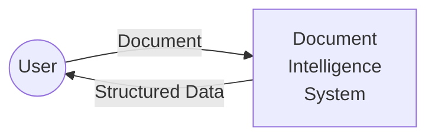
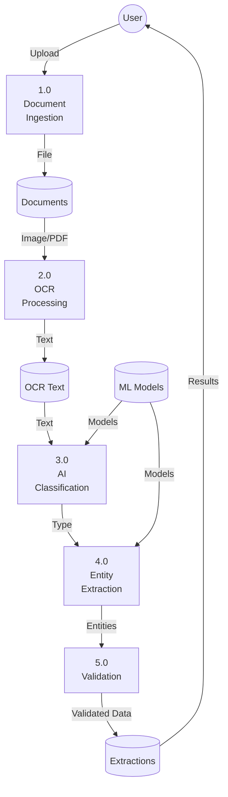
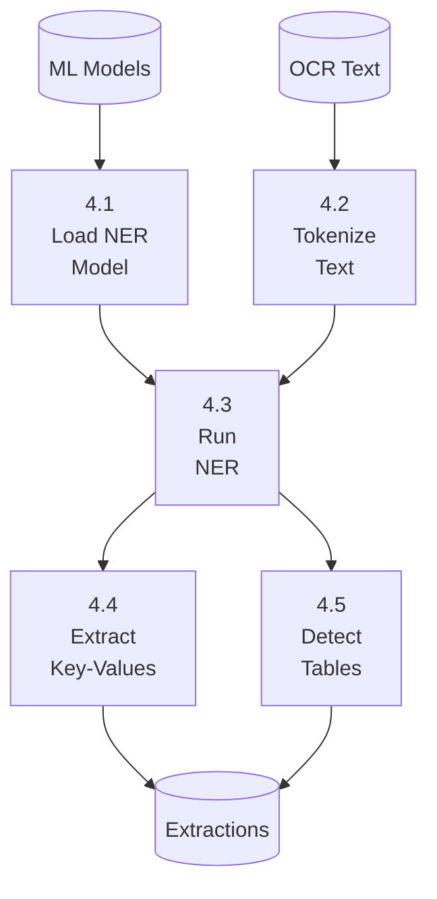

# Data Flow Diagram - Document Intelligence System

## Level 0: Context

```mermaid
flowchart LR
    USER((User)) -->|Document| DIS[Document<br/>Intelligence<br/>System]
    DIS -->|Structured Data| USER
```

## Level 1: Main Processes

```mermaid
flowchart TB
    USER((User))
    
    P1[1.0<br/>Document<br/>Ingestion]
    P2[2.0<br/>OCR<br/>Processing]
    P3[3.0<br/>AI<br/>Classification]
    P4[4.0<br/>Entity<br/>Extraction]
    P5[5.0<br/>Validation]
    
    D1[(Documents)]
    D2[(OCR Text)]
    D3[(Extractions)]
    D4[(ML Models)]
    
    USER -->|Upload| P1
    P1 -->|File| D1
    D1 -->|Image/PDF| P2
    P2 -->| Text| D2
    D2 -->|Text| P3
    P3 -->|Type| P4
    D4 -->|Models| P3
    D4 -->|Models| P4
    P4 -->|Entities| P5
    P5 -->|Validated Data| D3
    D3 -->|Results| USER
```

## Level 2: Entity Extraction (4.0)

```mermaid
flowchart TB
    P4_1[4.1<br/>Load NER<br/>Model]
    P4_2[4.2<br/>Tokenize<br/>Text]
    P4_3[4.3<br/>Run<br/>NER]
    P4_4[4.4<br/>Extract<br/>Key-Values]
    P4_5[4.5<br/>Detect<br/>Tables]
    
    D2[(OCR Text)]
    D3[(Extractions)]
    D4[(ML Models)]
    
    D2 --> P4_2
    D4 --> P4_1
    P4_1 --> P4_3
    P4_2 --> P4_3
    P4_3 --> P4_4
    P4_3 --> P4_5
    P4_4 --> D3
    P4_5 --> D3
```
