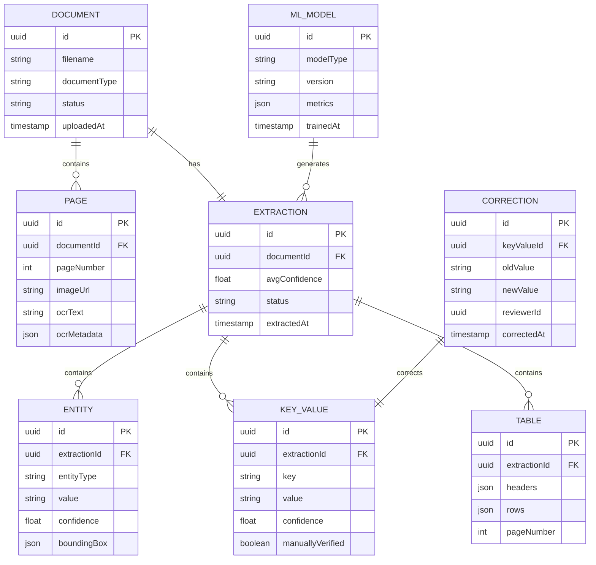

# Domain Model - Document Intelligence System

**Key Entities**:
- **Document**: Uploaded file (PDF/image)
- **Page**: Individual page with OCR text
- **Extraction**: Complete extraction result
- **Entity**: Named entity (name, date, amount)
- **Key-Value**: Field-value pair
- **Table**: Tabular data
- **ML Model**: OCR/NER/Classification model
- **Correction**: Human review correction
