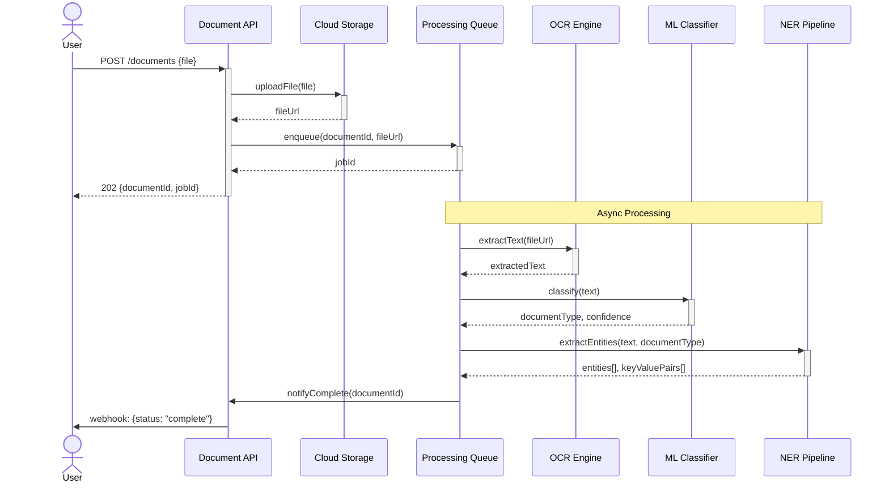
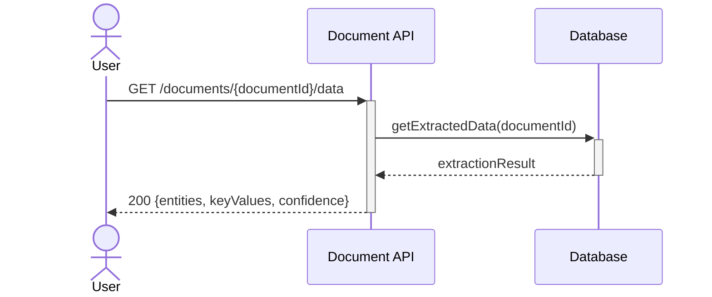
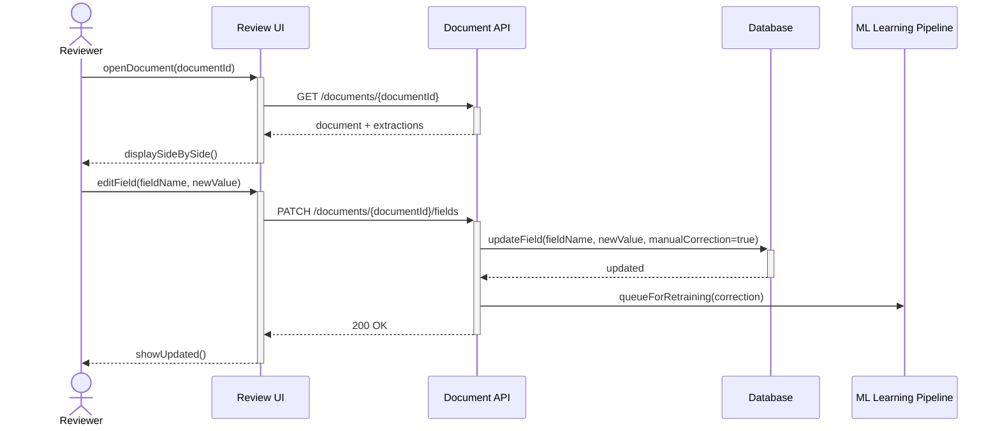

# System Sequence Diagram - Document Intelligence System

## SSD-01: Upload and Process Document

```mermaid
sequenceDiagram
    actor User
    participant API as Document API
    participant Storage as Cloud Storage
    participant Queue as Processing Queue
    participant OCR as OCR Engine
    participant Classifier as ML Classifier
    participant NER as NER Pipeline
    
    User->>+API: POST /documents {file}
    API->>+Storage: uploadFile(file)
    Storage-->>-API: fileUrl
    API->>+Queue: enqueue(documentId, fileUrl)
    Queue-->>-API: jobId
    API-->>-User: 202 {documentId, jobId}
    
    Note over Queue,NER: Async Processing
    
    Queue->>+OCR: extractText(fileUrl)
    OCR-->>-Queue: extractedText
    
    Queue->>+Classifier: classify(text)
    Classifier-->>-Queue: documentType, confidence
    
    Queue->>+NER: extractEntities(text, documentType)
    NER-->>-Queue: entities[], keyValuePairs[]
    
    Queue->>API: notifyComplete(documentId)
    API->>User: webhook: {status: "complete"}
```

## SSD-02: Retrieve Extracted Data

```mermaid
sequenceDiagram
    actor User
    participant API as Document API
    participant DB as Database
    
    User->>+API: GET /documents/{documentId}/data
    API->>+DB: getExtractedData(documentId)
    DB-->>-API: extractionResult
    API-->>-User: 200 {entities, keyValues, confidence}
```

## SSD-03: Correct Extraction

```mermaid
sequenceDiagram
    actor Reviewer
    participant UI as Review UI
    participant API as Document API
    participant DB as Database
    participant Learning as ML Learning Pipeline
    
    Reviewer->>+UI: openDocument(documentId)
    UI->>+API: GET /documents/{documentId}
    API-->>-UI: document + extractions
    UI-->>-Reviewer: displaySideBySide()
    
    Reviewer->>+UI: editField(fieldName, newValue)
    UI->>+API: PATCH /documents/{documentId}/fields
    API->>+DB: updateField(fieldName, newValue, manualCorrection=true)
    DB-->>-API: updated
    API->>Learning: queueForRetraining(correction)
    API-->>-UI: 200 OK
    UI-->>-Reviewer: showUpdated()
```
