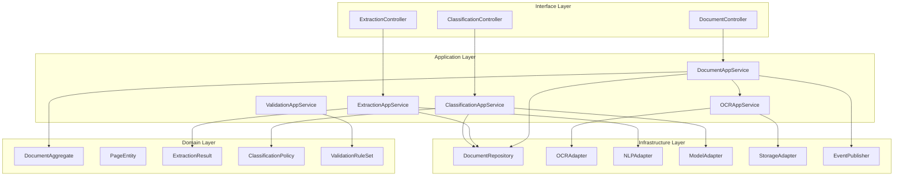
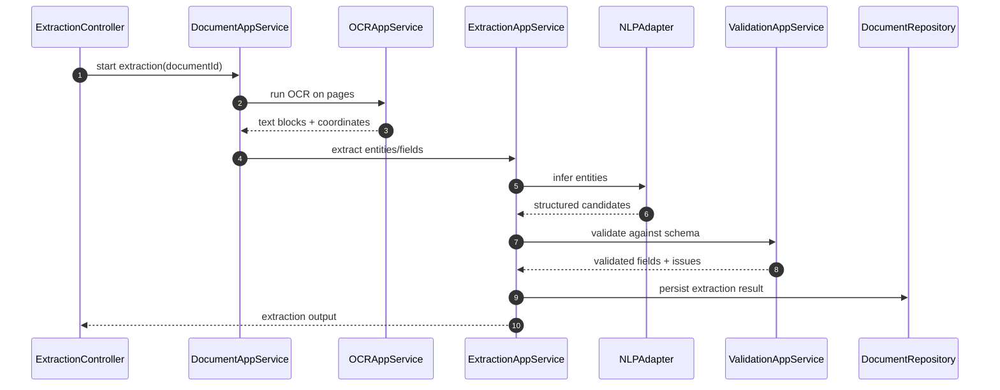

# C4 Code Diagram

This document provides a detailed **code-level C4 view** for the Document Intelligence System.

## Code-Level Structure

## Critical Runtime Sequence: Extract Structured Fields

## Module Responsibilities
- **DocumentAppService**: lifecycle orchestration for upload, processing, and status transitions.
- **OCR/Extraction/Classification services**: isolated ML-enabled concerns with clear interfaces.
- **Validation service**: business-rule and schema validation before final persistence.
- **Infrastructure adapters**: model execution, object storage, and event publication.

## Implementation Notes
- Persist page-level provenance (bounding boxes, confidence scores, model versions).
- Keep extraction schema versioned per document type.
- Use asynchronous processing for large documents; expose status polling endpoints.
