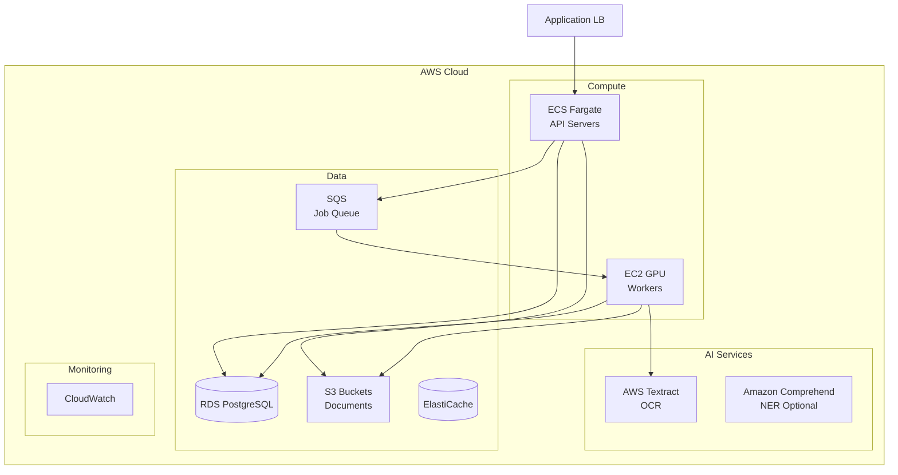
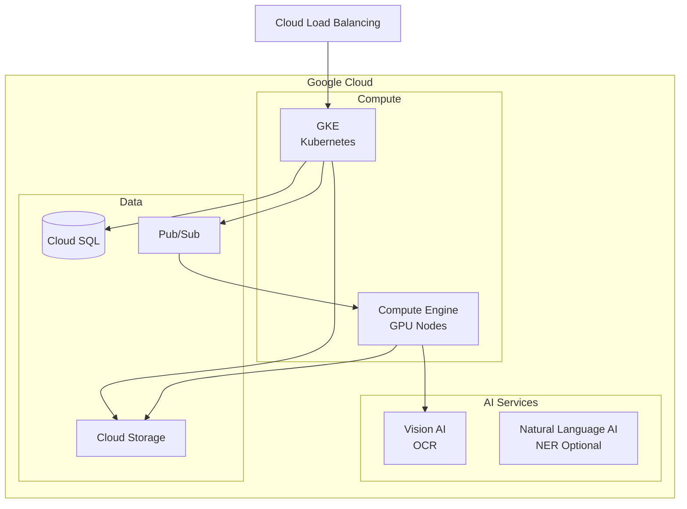

# Cloud Architecture - Document Intelligence System

## AWS Architecture

## GCP Architecture

## Provider Mapping

| Component | AWS | GCP | Azure |
|-----------|-----|-----|-------|
| Container Runtime | ECS/EKS | GKE | AKS |
| OCR Service | Textract | Vision AI | Form Recognizer |
| NER (Optional) | Comprehend | Natural Language AI | Text Analytics |
| GPU Compute | EC2 P3/G4 | Compute Engine GPU | NC-series VMs |
| Database | RDS PostgreSQL | Cloud SQL | Azure PostgreSQL |
| Storage | S3 | Cloud Storage | Blob Storage |
| Queue | SQS | Pub/Sub | Service Bus |
| Cache | ElastiCache | Memorystore | Azure Cache |

## Cost Estimation (AWS)

| Tier | Monthly Cost | Specs |
|------|--------------|-------|
| **Starter** | ~$800 | API: t3.medium x2, Workers: CPU-only, Textract API |
| **Growth** | ~$2500 | Auto-scaling, g4dn.xlarge GPU x2, RDS Multi-AZ |
| **Enterprise** | ~$8000+ | Multi-region, p3.2xlarge GPU x4, HA |

**Key Cost Drivers**:
- GPU instances for AI models
- Cloud OCR API usage (pay per page)
- Document storage (S3)
- Data transfer (outbound)
