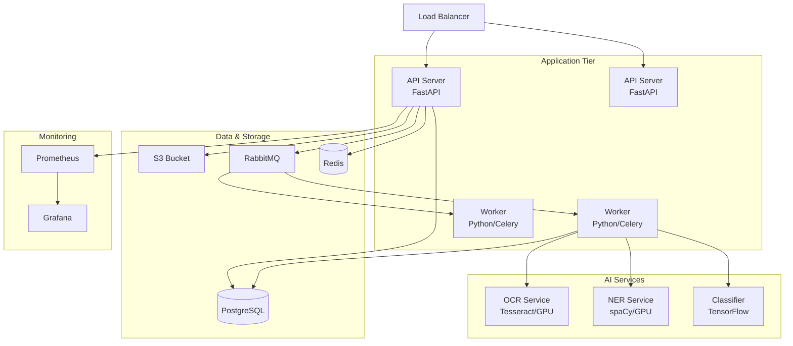

# Deployment Diagram - Document Intelligence System



## Kubernetes Deployment

```yaml
# API Deployment
apiVersion: apps/v1
kind: Deployment
metadata:
  name: document-api
spec:
  replicas: 3
  template:
    spec:
      containers:
      - name: api
        image: doc-intelligence-api:latest
        resources:
          requests:
            memory: "2Gi"
            cpu: "1"
          limits:
            memory: "4Gi"
            cpu: "2"
        env:
        - name: DATABASE_URL
          valueFrom:
            secretKeyRef:
              name: db-secret
              key: url

---
# Worker Deployment with GPU
apiVersion: apps/v1
kind: Deployment
metadata:
  name: processing-worker
spec:
  replicas: 2
  template:
    spec:
      containers:
      - name: worker
        image: doc-intelligence-worker:latest
        resources:
          requests:
            memory: "8Gi"
            cpu: "4"
            nvidia.com/gpu: 1
          limits:
            memory: "16Gi"
            cpu: "8"
            nvidia.com/gpu: 1
```

## Node Specifications

| Service | CPU | RAM | GPU | Purpose |
|---------|-----|-----|-----|---------|
| API Server | 2 vCPU | 4GB | - | Handle HTTP requests |
| Processing Worker | 4 vCPU | 8GB | T4/V100 | AI processing |
| OCR Service | 4 vCPU | 8GB | Optional | Text extraction |
| NER Service | 4 vCPU | 8GB | T4 | Entity extraction |
| Database | 4 vCPU | 16GB | - | PostgreSQL |
| RabbitMQ | 2 vCPU | 4GB | - | Message queue |
