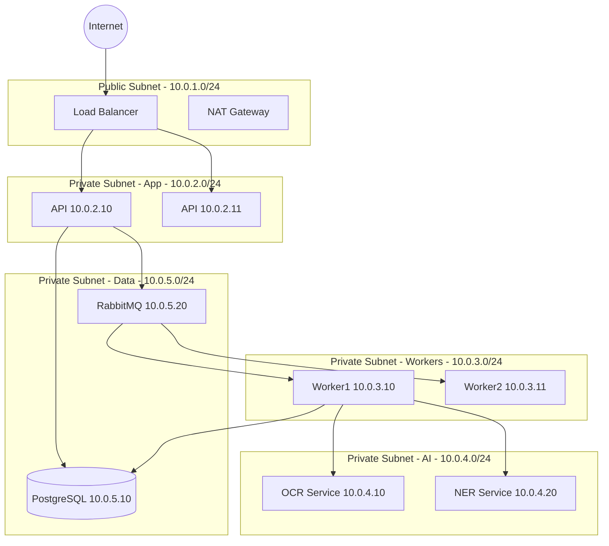

# Network / Infrastructure Diagram - Document Intelligence System

## Firewall Rules

| From | To | Port | Protocol | Purpose |
|------|-----|------|----------|---------|
| Internet | LB | 443 | HTTPS | API access |
| LB | API Servers | 8000 | HTTP | Internal routing |
| API | Workers | - | Internal | Job dispatch |
| Workers | AI Services | 5000 | HTTP | AI inference |
| Workers | Database | 5432 | TCP | Data storage |
| All | NAT | 443 | HTTPS | Outbound (cloud APIs) |

**Security Zones**:
- **DMZ**: Load balancer, NAT gateway
- **Application**: API servers
- **Processing**: Worker nodes
- **AI**: GPU-enabled AI services
- **Data**:Databases, queues
