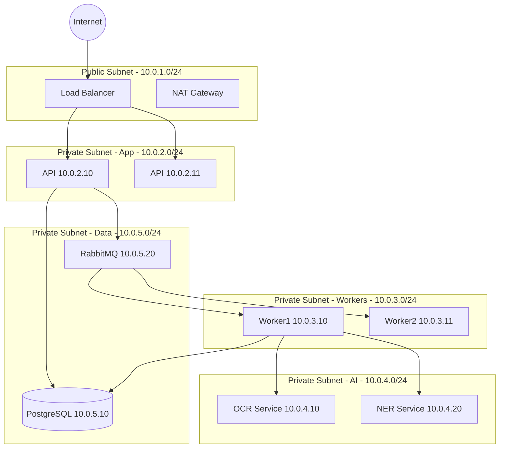
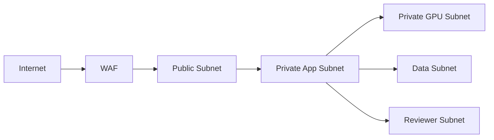

# Network / Infrastructure Diagram - Document Intelligence System

```mermaid
graph TB
    subgraph "Public Subnet - 10.0.1.0/24"
        LB[Load Balancer]
        NAT[NAT Gateway]
    end
    
    subgraph "Private Subnet - App - 10.0.2.0/24"
        API1[API 10.0.2.10]
        API2[API 10.0.2.11]
    end
    
    subgraph "Private Subnet - Workers - 10.0.3.0/24"
        WORKER1[Worker1 10.0.3.10]
        WORKER2[Worker2 10.0.3.11]
    end
    
    subgraph "Private Subnet - AI - 10.0.4.0/24"
        OCR[OCR Service 10.0.4.10]
        NER[NER Service 10.0.4.20]
    end
    
    subgraph "Private Subnet - Data - 10.0.5.0/24"
        DB[(PostgreSQL 10.0.5.10)]
        QUEUE[RabbitMQ 10.0.5.20]
    end
    
    INTERNET((Internet)) --> LB
    LB --> API1
    LB --> API2
    
    API1 --> QUEUE
    API1 --> DB
    
    QUEUE --> WORKER1
    QUEUE --> WORKER2
    
    WORKER1 --> OCR
    WORKER1 --> NER
    WORKER1 --> DB
```

## Firewall Rules

| From | To | Port | Protocol | Purpose |
|------|-----|------|----------|---------|
| Internet | LB | 443 | HTTPS | API access |
| LB | API Servers | 8000 | HTTP | Internal routing |
| API | Workers | - | Internal | Job dispatch |
| Workers | AI Services | 5000 | HTTP | AI inference |
| Workers | Database | 5432 | TCP | Data storage |
| All | NAT | 443 | HTTPS | Outbound (cloud APIs) |

**Security Zones**:
- **DMZ**: Load balancer, NAT gateway
- **Application**: API servers
- **Processing**: Worker nodes
- **AI**: GPU-enabled AI services
- **Data**:Databases, queues
---

## AI/ML Operations Addendum

### Extraction & Classification Pipeline Detail
- Ingestion normalizes PDFs/images (de-skew, orientation correction, denoise, page splitting) before OCR inference, and preserves page-level provenance (`document_id`, `page_no`, `checksum`) for reproducibility.
- OCR outputs word-level tokens with bounding boxes and confidence, then layout reconstruction builds reading order, sections, tables, and key-value candidates for downstream models.
- Classification runs as a two-stage ensemble: coarse document family classifier followed by template/domain subtype classifier; routing controls which extraction graph, validation rules, and post-processors execute.
- Extraction combines multiple strategies (template anchors, layout-aware transformer NER, regex/rule validators, and table parsers) with conflict resolution and source attribution at field level.

### Confidence Thresholding Logic
- Every predicted artifact (doc type, entity, field, table cell) carries calibrated confidence; calibration is maintained per model version using held-out reliability sets (temperature scaling/isotonic).
- Thresholds are policy-driven and tiered: **auto-accept**, **review-required**, and **reject/reprocess** bands, configurable per document type and field criticality (e.g., totals, IDs, legal dates).
- Composite confidence uses weighted signals: model probability, OCR quality, extraction-rule agreement, cross-field consistency checks, and historical drift indicators.
- Dynamic threshold overrides apply during incidents (e.g., OCR degradation or new template rollout) with explicit expiry, audit log entries, and rollback playbooks.

### Human-in-the-Loop Review Flow
- Low-confidence or policy-flagged documents enter a reviewer queue with SLA tiers, reason codes, and pre-highlighted spans/bounding boxes to minimize correction time.
- Reviewer edits are captured as structured feedback (`before`, `after`, `reason`, `reviewer_role`) and linked to model/version metadata for supervised retraining datasets.
- Dual-review and adjudication is required for high-risk fields or regulated document classes; disagreements are labeled and retained for error analysis.
- Review outcomes feed active-learning samplers that prioritize uncertain/novel templates while enforcing PII minimization and role-based masking in annotation tools.

### Model Lifecycle Governance
- Model registry tracks lineage across datasets, feature pipelines, prompts/config, evaluation reports, approval status, and deployment environment.
- Promotion gates enforce quality thresholds (classification F1, field-level precision/recall, calibration error, latency/cost SLOs) plus fairness and security checks before production release.
- Runtime monitoring covers drift (input schema, token distributions, template novelty), confidence shifts, reviewer override rates, and business KPI regressions with automated alerts.
- Rollout strategy uses canary/shadow deployments, version pinning per tenant/workflow, and deterministic rollback with incident postmortems and governance sign-off.

### Network Extensions
- Enforce segmented network paths for PII-bearing OCR payloads, inference traffic, and reviewer interfaces with least-privilege service-to-service policies.
---

## Implementation-Ready Deep Dive

### Operational Control Objectives
| Objective | Target | Owner | Evidence |
|---|---|---|---|
| Straight-through processing rate | >= 75% for baseline templates | ML Ops Lead | Weekly quality report |
| Critical-field precision | >= 99% on regulated fields | Applied ML Engineer | Offline eval + reviewer sample audit |
| Reviewer turnaround SLA | P95 < 2 business hours | Review Ops Manager | Queue dashboard + SLA breach alerts |
| Rollback readiness | < 15 min rollback execution | Platform SRE | Change ticket + rollback drill logs |

### Implementation Backlog (Must-Have)
1. Implement per-field threshold policy engine with policy versioning and tenant/document-type overrides.
2. Add calibrated confidence tracking table and nightly reliability job with ECE/Brier drift alarms.
3. Introduce reviewer work allocation service (skill-based routing, dual-review for high-risk forms).
4. Create retraining dataset contracts (gold labels, weak labels, rejected examples, hard-negative mining).
5. Establish model governance workflow (proposal -> validation -> canary -> promotion -> archive).

### Production Acceptance Checklist
- [ ] End-to-end traceability from uploaded file to exported structured payload.
- [ ] Full audit trail for every manual correction and model/policy decision.
- [ ] Canary release + rollback automation validated in staging and production-like data.
- [ ] Drift/quality SLO dashboards wired to paging policy and incident template.
- [ ] Security controls for PII redaction, purpose-limited access, and retention enforcement.

### Network Security Detail
- Isolate reviewer frontends, inference clusters, and data services in distinct subnets/security groups.
- Enforce mTLS for service-to-service communication and rotate certificates automatically.
- Capture east-west flow logs for regulated environments and anomaly detection.

### Mermaid: Network Segmentation

```mermaid
flowchart LR
    Internet --> WAF --> DMZ[Public Subnet]
    DMZ --> App[Private App Subnet]
    App --> Inference[Private GPU Subnet]
    App --> Data[Data Subnet]
    App --> Review[Reviewer Subnet]
```

