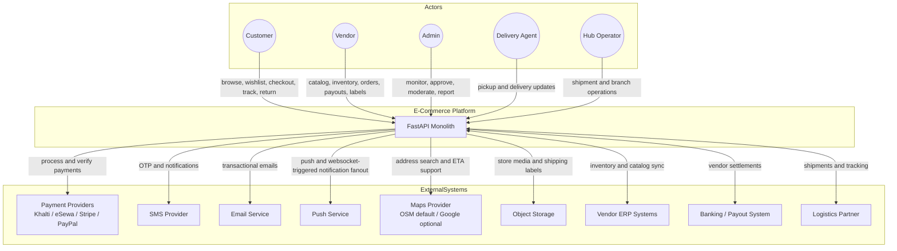
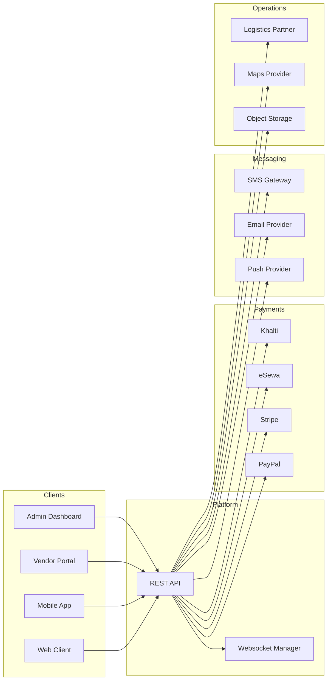
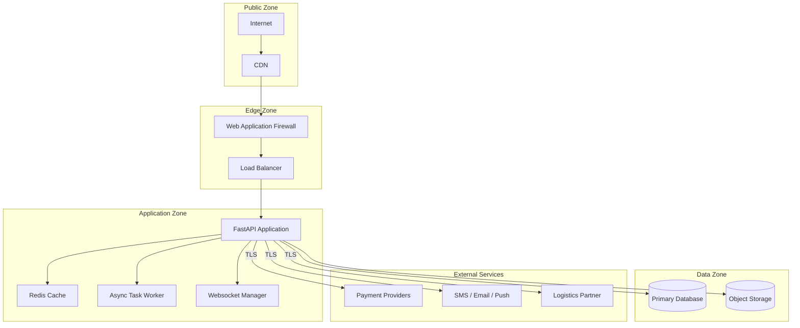

# System Context Diagram

## Overview
The system context below reflects the implemented backend and its external actors and dependencies.

---

## Main System Context Diagram

---

## Detailed Context With Data Flows

---

## Security Boundaries

---

## External Dependency Notes

| System | Purpose | Current Role |
|--------|---------|--------------|
| Payment providers | Charge, authorize, capture, refund | Implemented |
| SMS / Email / Push | OTP and transactional notifications | Implemented |
| Maps provider | Address autocomplete and ETA support | Implemented with OSM default |
| Object storage | Product media and shipping labels | Implemented |
| ERP sync | Vendor integration option | Partial / integration dependent |
| External route optimization | Advanced delivery planning | Future-only |
