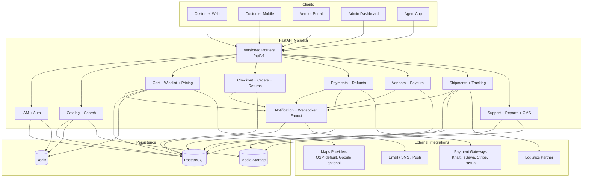

# API Design

## Overview
This document describes the current repository implementation of the backend API. The running system is a FastAPI monolith with versioned routers under `/api/v1`, hashid-style public IDs, persisted idempotency for checkout/payment flows, asynchronous notifications, websocket fanout, and stored shipping-label artifacts.

---

## API Architecture



---

## API Conventions

| Convention | Current Behavior |
|-----------|------------------|
| Versioning | Versioned under `/api/v1` |
| Resource identifiers | Public API uses hashid-style IDs; internal storage uses integer/UUID primary keys as defined by models |
| Authentication | JWT bearer tokens; OTP challenge may be required when enabled |
| Admin login | Admin and superuser logins may include `otp_recommended` and `otp_recommendation_message` without blocking access |
| Idempotency | Checkout/payment mutations support persisted request keys and request fingerprint validation |
| Quote safety | `GET /checkout/quote` returns a fingerprint that must match the final checkout request when supplied |
| Notifications | Order, return, payout, low-stock, delivery-exception, and wishlist price-drop events create persisted notifications and websocket events automatically |
| Shipping labels | Shipping label generation is idempotent per shipment unless force-regenerated |

---

## Authentication API

### Endpoints

| Method | Endpoint | Description |
|--------|----------|-------------|
| POST | `/auth/signup` | Register a user account |
| POST | `/auth/login` | Login with username/email and password |
| POST | `/auth/logout` | Logout current session |
| POST | `/auth/refresh` | Refresh access token |
| POST | `/auth/otp/enable` | Start OTP setup and return QR payload |
| POST | `/auth/otp/verify` | Verify OTP and enable it |
| POST | `/auth/otp/disable` | Disable OTP |
| POST | `/auth/otp/validate` | Complete OTP challenge during login |
| GET | `/auth/admin/security/admin-otp-status` | View OTP readiness for privileged accounts |

### Login Response Note

```http
POST /api/v1/auth/login
Content-Type: application/json

{
  "username": "admin@example.com",
  "password": "SecurePass123!"
}
```

```json
{
  "access": "jwt",
  "refresh": "jwt",
  "token_type": "bearer",
  "otp_required": false,
  "otp_recommended": true,
  "otp_recommendation_message": "Admin accounts should enable OTP for stronger account protection."
}
```

---

## Catalog API

### Endpoints

| Method | Endpoint | Description |
|--------|----------|-------------|
| GET | `/products` | List products with filters for category, brand, vendor, rating, price, stock state, featured state, and attributes |
| GET | `/products/search` | Search catalog with ranked and fuzzy matching |
| GET | `/products/autocomplete` | Return short autocomplete suggestions |
| GET | `/products/{id}` | Get product details |
| GET | `/categories` | List categories |
| GET | `/brands` | List brands |
| GET | `/address/autocomplete` | Address suggestions using configured maps provider |
| POST | `/vendor/products/import/preview` | Dry-run CSV validation with row-level errors |
| POST | `/vendor/products/import/commit` | Commit validated CSV import |

### Product Query Parameters

| Parameter | Type | Description |
|-----------|------|-------------|
| `q` | string | Search query |
| `category` | string | Category public ID or slug |
| `brand` | string | Brand public ID or slug |
| `vendor` | string | Vendor public ID |
| `minPrice` | number | Minimum selling price |
| `maxPrice` | number | Maximum selling price |
| `rating` | number | Minimum average rating |
| `inStock` | boolean | Filter to available inventory |
| `featured` | boolean | Filter featured products |
| `attributes` | string | Attribute filters in key/value form |

---

## Cart And Wishlist API

### Endpoints

| Method | Endpoint | Description |
|--------|----------|-------------|
| GET | `/cart` | Get active cart |
| POST | `/cart/items` | Add item to cart |
| PATCH | `/cart/items/{id}` | Update cart item quantity |
| DELETE | `/cart/items/{id}` | Remove cart item |
| POST | `/cart/coupon` | Apply coupon or promotion |
| GET | `/wishlist` | Get wishlist contents |
| POST | `/wishlist/{product_id}` | Add product to wishlist |
| DELETE | `/wishlist/{product_id}` | Remove product from wishlist |
| POST | `/wishlist/share-links` | Create a revocable wishlist share link |
| GET | `/wishlist/share-links` | List wishlist share links |
| DELETE | `/wishlist/share-links/{share_id}` | Revoke a wishlist share link |
| GET | `/wishlist/shared/{token}` | Read a shared wishlist without authentication |

### Shared Wishlist Example

```http
POST /api/v1/wishlist/share-links
Authorization: Bearer {token}
Content-Type: application/json

{
  "title": "Festival gift ideas"
}
```

```json
{
  "success": true,
  "data": {
    "id": "hashid",
    "title": "Festival gift ideas",
    "token": "wl_3VPab8r...",
    "active": true,
    "shareUrl": "https://example.com/wishlist/shared/wl_3VPab8r..."
  }
}
```

---

## Checkout, Orders, And Returns API

### Endpoints

| Method | Endpoint | Description |
|--------|----------|-------------|
| GET | `/checkout/quote` | Build a tax/shipping/promotion quote and quote fingerprint |
| POST | `/checkout` | Create order with idempotency and quote fingerprint validation |
| GET | `/orders` | List user orders |
| GET | `/orders/{id}` | Get order details |
| POST | `/orders/{id}/cancel` | Cancel order when allowed |
| GET | `/orders/{id}/timeline` | View order timeline events |
| GET | `/orders/{id}/notes` | View order notes |
| GET | `/orders/{id}/invoice` | View invoice metadata |
| GET | `/tracking/{id}` | View shipment tracking for the order |
| POST | `/returns` | Create a return request |
| GET | `/returns/{id}/timeline` | View return timeline |
| GET | `/admin/orders/live-feed` | View recent order, return, payout, and delivery events |

### Checkout Example

```http
GET /api/v1/checkout/quote?addressId=hashid&paymentMethod=stripe
Authorization: Bearer {token}
```

```json
{
  "success": true,
  "data": {
    "subtotal": 499.98,
    "discount": 49.99,
    "shippingCharge": 15.0,
    "tax": 80.99,
    "total": 545.97,
    "quoteFingerprint": "fp_1b5e8d..."
  }
}
```

```http
POST /api/v1/checkout
Authorization: Bearer {token}
Idempotency-Key: 2ed1db72-c8d2-4f61-8fd4-0c65eb8c965f
Content-Type: application/json

{
  "addressId": "hashid",
  "paymentMethod": "stripe",
  "quoteFingerprint": "fp_1b5e8d...",
  "notes": "Please leave at door"
}
```

---

## Payments API

### Endpoints

| Method | Endpoint | Description |
|--------|----------|-------------|
| POST | `/payments/initiate` | Create a payment transaction |
| POST | `/payments/verify` | Verify payment after redirect or provider callback |
| GET | `/payments/{id}` | Get payment status |
| POST | `/payments/webhooks/{gateway}` | Provider webhook endpoint |
| POST | `/payments/{id}/capture` | Capture authorized payment when applicable |
| POST | `/payments/{id}/void` | Void payment when applicable |
| POST | `/payments/{id}/refunds` | Create refund |

Supported providers in the running backend: `khalti`, `esewa`, `stripe`, `paypal`, `wallet`, and `cod`.

---

## Vendor API

### Endpoints

| Method | Endpoint | Description |
|--------|----------|-------------|
| GET | `/vendor/analytics` | Vendor dashboard metrics |
| GET | `/vendor/products` | List vendor products |
| POST | `/vendor/products` | Create product |
| PATCH | `/vendor/products/{id}` | Update product and record price history when prices change |
| DELETE | `/vendor/products/{id}` | Delete product |
| PATCH | `/vendor/inventory/{variant_id}` | Update inventory |
| GET | `/vendor/orders` | List vendor orders |
| POST | `/vendor/orders/{id}/status` | Update vendor order status |
| POST | `/vendor/orders/{id}/reject` | Reject order |
| GET | `/vendor/payouts` | List completed payouts |
| GET | `/vendor/payout-requests` | List payout requests |
| POST | `/vendor/payout-requests` | Create payout request |
| POST | `/vendor/shipments/{shipment_id}/label` | Generate shipping label artifact |
| GET | `/vendor/shipments/{shipment_id}/label` | Fetch shipping label metadata and URL |

---

## Logistics And Admin API

### Logistics Endpoints

| Method | Endpoint | Description |
|--------|----------|-------------|
| GET | `/tracking/{id}` | Public/customer tracking view |
| POST | `/logistics/shipments/{shipment_id}/exceptions` | Record failed-delivery or related exception |
| POST | `/logistics/exceptions/{id}/reschedule` | Reschedule delivery |
| POST | `/logistics/exceptions/{id}/rto` | Initiate RTO |
| GET | `/logistics/shipments/{shipment_id}/label` | Admin/logistics shipping label fetch |

### Admin Endpoints

| Method | Endpoint | Description |
|--------|----------|-------------|
| GET | `/admin/orders` | List all orders |
| GET | `/admin/orders/live-feed` | Cross-domain live operations feed |
| GET | `/admin/vendors` | List vendors |
| POST | `/admin/vendors/{id}/approve` | Approve vendor |
| POST | `/admin/vendors/{id}/reject` | Reject vendor |
| GET | `/admin/returns` | List returns |
| POST | `/admin/returns/{id}/status` | Update return status |
| POST | `/admin/orders/{id}/notes` | Add order note |
| GET | `/admin/reports/overview` | Admin overview report |
| GET | `/admin/reports/export` | Export report CSV |
| POST | `/admin/reports/jobs` | Create report job |
| GET | `/admin/reports/jobs` | List report jobs |
| GET | `/admin/security/admin-otp-status` | Admin OTP readiness view when mounted outside auth router |

---

## Cross-Cutting Behavior

### Notifications

The backend emits persisted notifications and websocket events automatically for:

- order created, paid, cancelled, shipped, out for delivery, delivered
- return requested, approved, rejected, picked up, received, refunded
- payout request created, approved, batch created, payout paid or failed
- low-stock alerts
- delivery exceptions, reschedules, and RTO events
- wishlist price-drop events

### Public IDs

User-facing routes should use encoded public IDs consistently. Documentation examples use hashid-style strings for that reason.

### Future-Only Areas

The API surface intentionally keeps Razorpay-specific routes and external routing-vendor integrations out of the implemented feature set. The current repository does implement recommendation ranking plus logistics route planning and courier GPS ingestion through the monolith API.

Implemented examples:

- `GET /api/v1/recommendations`
- `POST /api/v1/recommendations/events`
- `POST /api/v1/logistics/manifests/{manifest_id}/optimize-route`
- `GET /api/v1/logistics/manifests/{manifest_id}/route-plan`
- `POST /api/v1/logistics/trips/{trip_id}/optimize-route`
- `GET /api/v1/logistics/trips/{trip_id}/route-plan`
- `POST /api/v1/logistics/trips/{trip_id}/gps`
- `GET /api/v1/logistics/trips/{trip_id}/gps`
