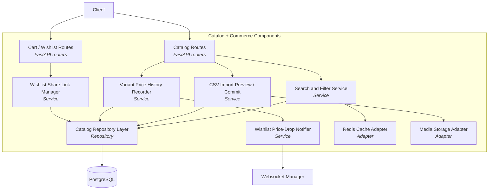
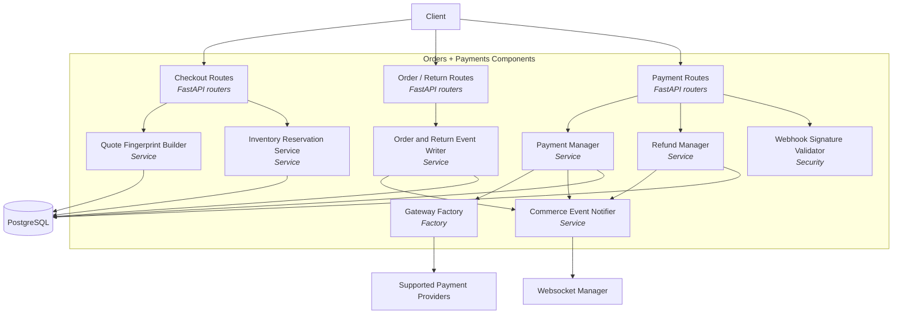
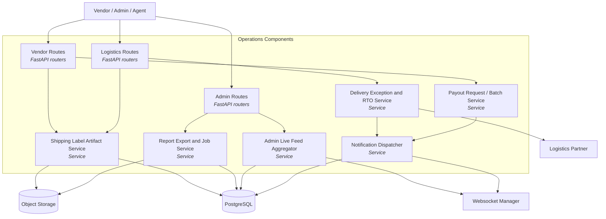

# C4 Component Diagram

## Overview
This document captures component-level structure for the current FastAPI backend. It intentionally reflects the monolith in the repository instead of the earlier separate-service proposal.

---

## Catalog And Commerce Components

---

## Orders And Payments Components

---

## Logistics, Vendors, And Admin Components

---

## IAM Component Notes

| Capability | Component Role |
|-----------|----------------|
| OTP setup and verification | IAM routers + OTP service |
| Admin OTP readiness | IAM admin security endpoint |
| Audit visibility | Observability log writer and reader |
| Login recommendation | Auth login response builder for privileged users without OTP |
