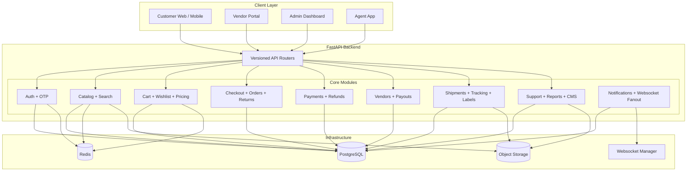
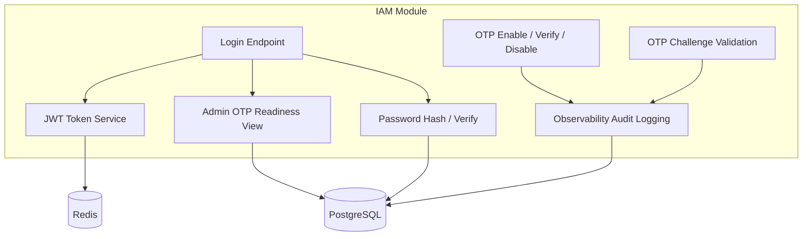
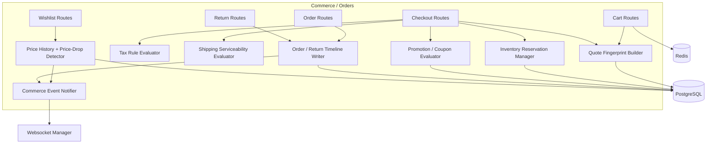
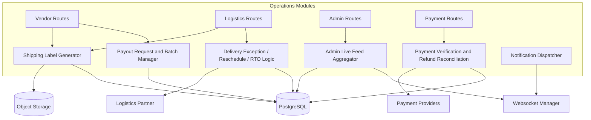

# Component Diagrams

## Overview
These component diagrams reflect the implemented FastAPI monolith rather than an older service-by-service split.

---

## System Component Overview

---

## Identity And Security Components

---

## Commerce And Order Components

---

## Logistics, Payouts, And Operations Components

