# ERD / Database Schema

## Overview
This ERD reflects the current backend shape after the commerce-completion passes. Public API IDs are encoded hashids; the ERD below shows persisted domain entities and relationships.

---

## Current Commerce ERD

```mermaid
erDiagram
    users {
        int id PK
        varchar email
        varchar username
        varchar hashed_password
        boolean is_superuser
        boolean otp_enabled
        boolean otp_verified
        datetime created_at
        datetime updated_at
    }

    vendors {
        int id PK
        int user_id FK
        varchar business_name
        varchar status
        datetime approved_at
    }

    products {
        int id PK
        int vendor_id FK
        int category_id FK
        int brand_id FK
        varchar name
        varchar slug
        boolean is_featured
        varchar status
        datetime created_at
        datetime updated_at
    }

    product_variants {
        int id PK
        int product_id FK
        varchar sku
        decimal mrp
        decimal selling_price
        json attributes_json
        boolean is_default
        datetime created_at
        datetime updated_at
    }

    variant_price_history {
        int id PK
        int variant_id FK
        decimal previous_price
        decimal new_price
        varchar change_source
        int changed_by_user_id FK
        datetime created_at
    }

    inventories {
        int id PK
        int variant_id FK
        int warehouse_id FK
        int quantity
        int reserved_qty
        int reorder_level
        datetime updated_at
    }

    inventory_reservations {
        int id PK
        int variant_id FK
        int order_id FK
        int quantity
        varchar status
        datetime expires_at
        datetime created_at
        datetime committed_at
    }

    carts {
        int id PK
        int user_id FK
        int coupon_id FK
        datetime updated_at
    }

    cart_items {
        int id PK
        int cart_id FK
        int variant_id FK
        int quantity
        decimal price_at_add
        datetime created_at
    }

    wishlists {
        int id PK
        int user_id FK
        int product_id FK
        datetime created_at
    }

    wishlist_share_links {
        int id PK
        int owner_id FK
        varchar token
        varchar title
        boolean active
        datetime created_at
        datetime updated_at
    }

    orders {
        int id PK
        int user_id FK
        int address_id FK
        varchar order_number
        varchar status
        varchar payment_method
        varchar payment_status
        decimal subtotal
        decimal discount
        decimal shipping_charge
        decimal tax
        decimal total
        datetime created_at
        datetime confirmed_at
    }

    order_items {
        int id PK
        int order_id FK
        int vendor_id FK
        int product_id FK
        int variant_id FK
        int quantity
        decimal unit_price
        decimal total_price
    }

    order_events {
        int id PK
        int order_id FK
        varchar event_type
        varchar title
        text message
        int actor_user_id FK
        datetime created_at
    }

    payments {
        int id PK
        int order_id FK
        varchar gateway
        varchar status
        decimal amount
        varchar gateway_order_id
        varchar gateway_payment_id
        datetime created_at
        datetime captured_at
    }

    returns {
        int id PK
        int order_id FK
        int order_item_id FK
        int user_id FK
        varchar return_number
        varchar status
        decimal refund_amount
        datetime created_at
    }

    return_events {
        int id PK
        int return_id FK
        varchar event_type
        text message
        int actor_user_id FK
        datetime created_at
    }

    shipments {
        int id PK
        int order_id FK
        int vendor_order_id FK
        varchar awb
        varchar status
        varchar current_location
        varchar label_url
        json label_payload_json
        datetime label_generated_at
        datetime created_at
    }

    shipment_tracking {
        int id PK
        int shipment_id FK
        varchar status
        varchar location
        text remarks
        datetime created_at
    }

    delivery_exceptions {
        int id PK
        int shipment_id FK
        varchar exception_type
        varchar failure_reason
        datetime rescheduled_for
        varchar resolution_status
        datetime created_at
    }

    payout_requests {
        int id PK
        int vendor_id FK
        decimal amount
        varchar status
        datetime created_at
        datetime approved_at
    }

    payout_batches {
        int id PK
        varchar batch_reference
        varchar status
        datetime created_at
        datetime paid_at
    }

    notifications {
        int id PK
        int user_id FK
        varchar event_type
        varchar title
        text body
        boolean is_read
        json payload_json
        datetime created_at
    }

    support_tickets {
        int id PK
        int user_id FK
        int order_id FK
        int return_id FK
        varchar status
        varchar priority
        datetime sla_due_at
        datetime created_at
    }

    ticket_comments {
        int id PK
        int ticket_id FK
        int author_user_id FK
        text body
        datetime created_at
    }

    report_jobs {
        int id PK
        varchar report_type
        varchar status
        json filters_json
        varchar artifact_url
        datetime created_at
    }

    static_pages {
        int id PK
        varchar slug
        varchar title
        boolean is_published
        datetime updated_at
    }

    banners {
        int id PK
        varchar title
        varchar image_url
        varchar target_url
        boolean is_active
        datetime updated_at
    }

    users ||--o{ vendors : owns
    users ||--o{ carts : owns
    users ||--o{ wishlists : creates
    users ||--o{ wishlist_share_links : shares
    users ||--o{ orders : places
    users ||--o{ returns : requests
    users ||--o{ notifications : receives
    users ||--o{ support_tickets : opens

    vendors ||--o{ products : sells
    vendors ||--o{ payout_requests : requests

    products ||--o{ product_variants : has
    products ||--o{ wishlists : appears_in

    product_variants ||--o{ variant_price_history : snapshots
    product_variants ||--o{ inventories : stocked_as
    product_variants ||--o{ inventory_reservations : reserved_as
    product_variants ||--o{ cart_items : referenced_in
    product_variants ||--o{ order_items : ordered_as

    carts ||--o{ cart_items : contains

    orders ||--o{ order_items : contains
    orders ||--o{ order_events : logs
    orders ||--o{ payments : paid_by
    orders ||--o{ returns : may_have
    orders ||--o{ shipments : ships_via

    returns ||--o{ return_events : logs
    shipments ||--o{ shipment_tracking : tracks
    shipments ||--o{ delivery_exceptions : may_have

    support_tickets ||--o{ ticket_comments : contains
```

---

## New Or Changed Persistence Areas

### Wishlist Sharing

`wishlist_share_links` provides revocable, token-based public sharing for wishlists. Links are owned by a user, may include an optional title, and remain read-only for public consumers.

### Price History And Price-Drop Detection

`variant_price_history` stores before/after prices whenever a variant price changes. This is the source of truth for price-drop detection and related wishlist notifications.

### Reservation-Safe Checkout

`inventory_reservations` prevents overselling during payment windows. Reservations are created at checkout, committed on payment success, and released on failure, expiry, or cancellation.

### Domain Timelines

`order_events` and `return_events` back customer, vendor, and admin timeline views as well as the live operations feed.

### Shipping Labels

Shipping label artifacts are stored through the storage abstraction and referenced from shipment records using `label_url`, `label_payload_json`, and `label_generated_at`.

### Notifications And Operations Feed

`notifications` stores persisted user-facing events. Observability logs and timeline tables together support the admin live feed without requiring a separate event-bus persistence model.

---

## Implementation Notes

| Area | Current Design Choice |
|------|-----------------------|
| IDs | Encoded public IDs at API boundaries; relational keys remain internal |
| Payments | Active providers are Khalti, eSewa, Stripe, PayPal, wallet, and COD |
| Shipping labels | Stored as generated artifacts with stable URLs |
| Live operations feed | Aggregated from persisted order, shipment, return, payout, and audit events |
| Logistics telemetry | Route plans and courier GPS pings are now persisted in the implemented schema |
| Future-only | Razorpay and external routing-vendor integrations remain outside the implemented schema |
