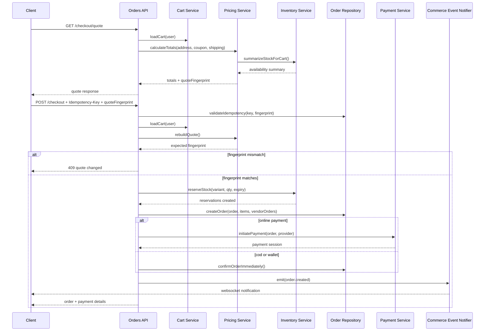
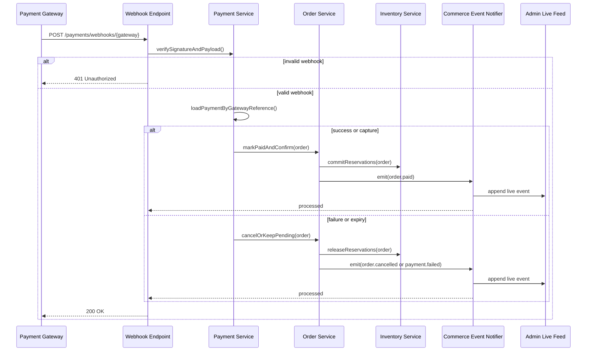
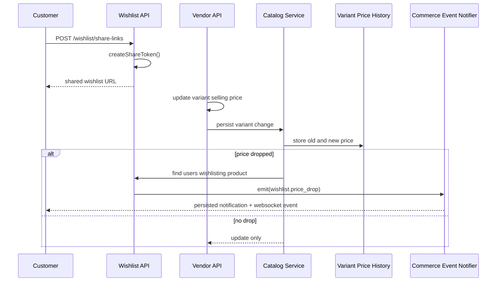
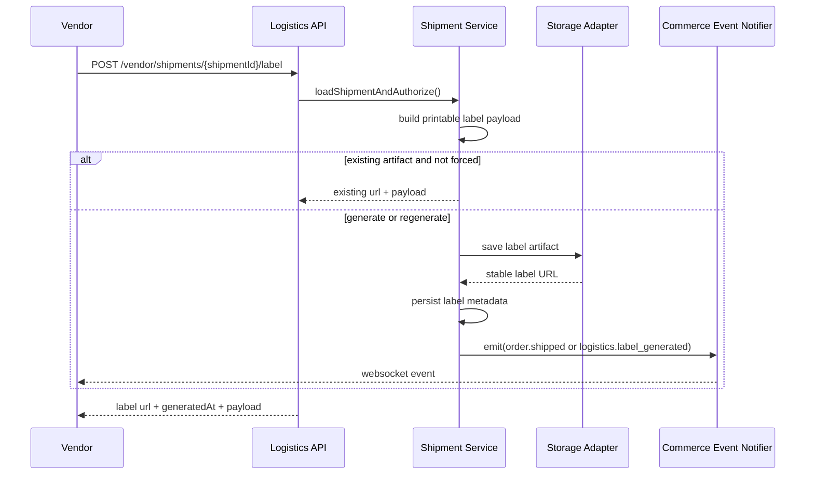
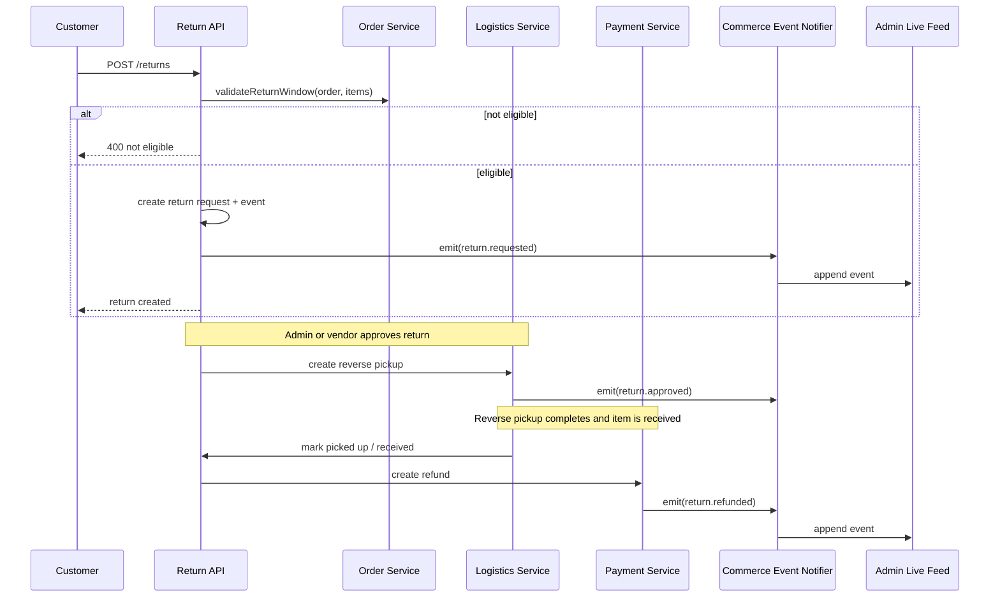
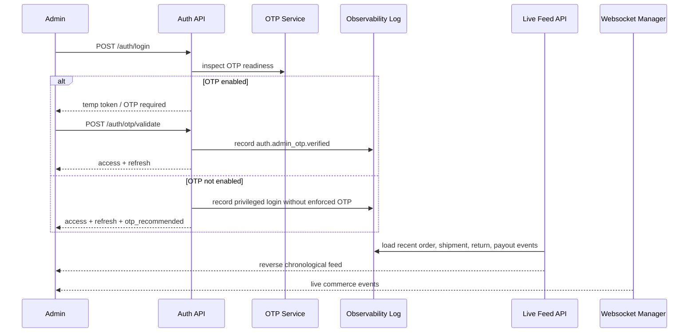

# Sequence Diagrams

## Overview
Detailed sequence diagrams for the current backend implementation. These flows use the FastAPI monolith, persisted domain events, notification services, websocket fanout, and stored artifacts instead of a separate Kafka-based service split.

---

## Checkout With Quote Fingerprint And Inventory Reservation

---

## Payment Verification And Order Reconciliation

---

## Wishlist Sharing And Price-Drop Notifications

---

## Shipping Label Generation And Retrieval

---

## Return Lifecycle With Reverse Pickup And Refund

---

## Admin Login And Live Operations Monitoring

