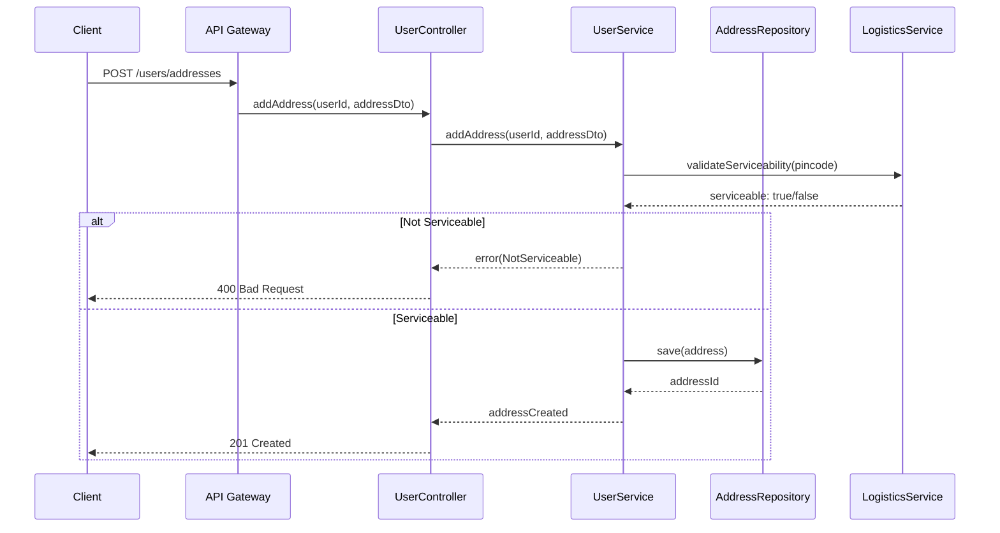

# Address Management Sequence Diagram

Detailed sequence showing internal object interactions for address management.

```mermaid
sequenceDiagram
    participant Client
    participant Gateway as API Gateway
    participant UserCtrl as UserController
    participant UserSvc as UserService
    participant AddressRepo as AddressRepository
    participant LogisticsSvc as LogisticsService
    
    Client->>Gateway: POST /users/addresses
    Gateway->>UserCtrl: addAddress(userId, addressDto)
    
    UserCtrl->>UserSvc: addAddress(userId, addressDto)
    
    UserSvc->>LogisticsSvc: validateServiceability(pincode)
    LogisticsSvc-->>UserSvc: serviceable: true/false
    
    alt Not Serviceable
        UserSvc-->>UserCtrl: error(NotServiceable)
        UserCtrl-->>Client: 400 Bad Request
    else Serviceable
        UserSvc->>AddressRepo: save(address)
        AddressRepo-->>UserSvc: addressId
        
        UserSvc-->>UserCtrl: addressCreated
        UserCtrl-->>Client: 201 Created
    end
```
