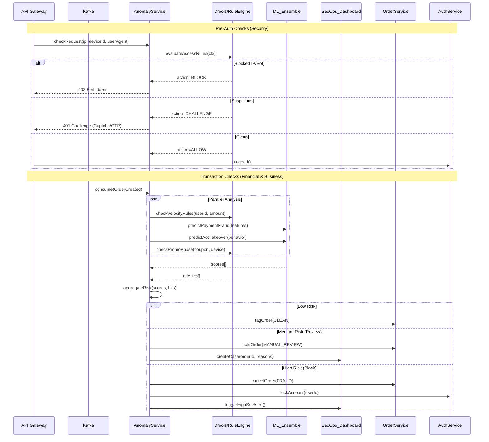

# Anomaly Detection Sequence Diagram

Detailed sequence showing internal object interactions for the comprehensive Anomaly Detection System (Financial, Security, Ops).

```mermaid
sequenceDiagram
    participant Gateway as API Gateway
    participant EventBus as Kafka
    participant AnomalySvc as AnomalyService
    participant RuleEngine as Drools/RuleEngine
    participant MLModels as ML_Ensemble
    participant SecurityOps as SecOps_Dashboard
    participant OrderSvc as OrderService
    participant AuthSvc as AuthService
    
    Note over Gateway,AuthSvc: Pre-Auth Checks (Security)
    
    Gateway->>AnomalySvc: checkRequest(ip, deviceId, userAgent)
    AnomalySvc->>RuleEngine: evaluateAccessRules(ctx)
    
    alt Blocked IP/Bot
        RuleEngine-->>AnomalySvc: action=BLOCK
        AnomalySvc-->>Gateway: 403 Forbidden
    else Suspicious
        RuleEngine-->>AnomalySvc: action=CHALLENGE
        AnomalySvc-->>Gateway: 401 Challenge (Captcha/OTP)
    else Clean
        RuleEngine-->>AnomalySvc: action=ALLOW
        Gateway->>AuthSvc: proceed()
    end
    
    Note over Gateway,AuthSvc: Transaction Checks (Financial & Business)
    
    EventBus->>AnomalySvc: consume(OrderCreated)
    
    par Parallel Analysis
        AnomalySvc->>RuleEngine: checkVelocityRules(userId, amount)
        AnomalySvc->>MLModels: predictPaymentFraud(features)
        AnomalySvc->>MLModels: predictAccTakeover(behavior)
        AnomalySvc->>RuleEngine: checkPromoAbuse(coupon, device)
    end
    
    MLModels-->>AnomalySvc: scores[]
    RuleEngine-->>AnomalySvc: ruleHits[]
    
    AnomalySvc->>AnomalySvc: aggregateRisk(scores, hits)
    
    alt Low Risk
        AnomalySvc->>OrderSvc: tagOrder(CLEAN)
    else Medium Risk (Review)
        AnomalySvc->>OrderSvc: holdOrder(MANUAL_REVIEW)
        AnomalySvc->>SecurityOps: createCase(orderId, reasons)
    else High Risk (Block)
        AnomalySvc->>OrderSvc: cancelOrder(FRAUD)
        AnomalySvc->>AuthSvc: lockAccount(userId)
        AnomalySvc->>SecurityOps: triggerHighSevAlert()
    end
```
