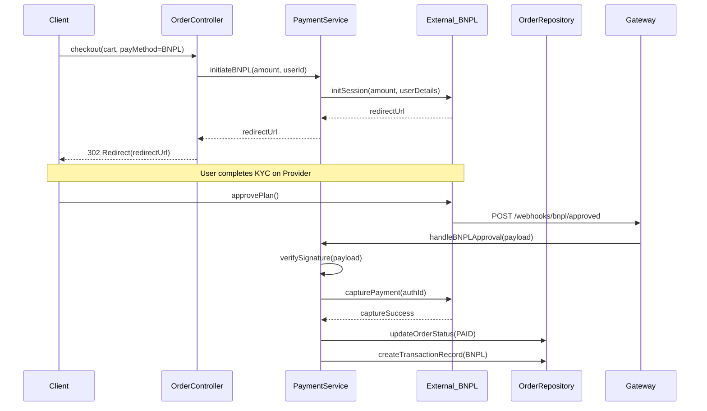

# BNPL Checkout Sequence Diagram

Detailed sequence showing internal object interactions for Buy Now Pay Later checkout.

```mermaid
sequenceDiagram
    participant Client
    participant OrderCtrl as OrderController
    participant PaySvc as PaymentService
    participant BNPLProvider as External_BNPL
    participant OrderRepo as OrderRepository
    
    Client->>OrderCtrl: checkout(cart, payMethod=BNPL)
    OrderCtrl->>PaySvc: initiateBNPL(amount, userId)
    
    PaySvc->>BNPLProvider: initSession(amount, userDetails)
    BNPLProvider-->>PaySvc: redirectUrl
    
    PaySvc-->>OrderCtrl: redirectUrl
    OrderCtrl-->>Client: 302 Redirect(redirectUrl)
    
    Note over Client,BNPLProvider: User completes KYC on Provider
    
    Client->>BNPLProvider: approvePlan()
    BNPLProvider->>Gateway: POST /webhooks/bnpl/approved
    
    Gateway->>PaySvc: handleBNPLApproval(payload)
    PaySvc->>PaySvc: verifySignature(payload)
    
    PaySvc->>BNPLProvider: capturePayment(authId)
    BNPLProvider-->>PaySvc: captureSuccess
    
    PaySvc->>OrderRepo: updateOrderStatus(PAID)
    PaySvc->>OrderRepo: createTransactionRecord(BNPL)
```
