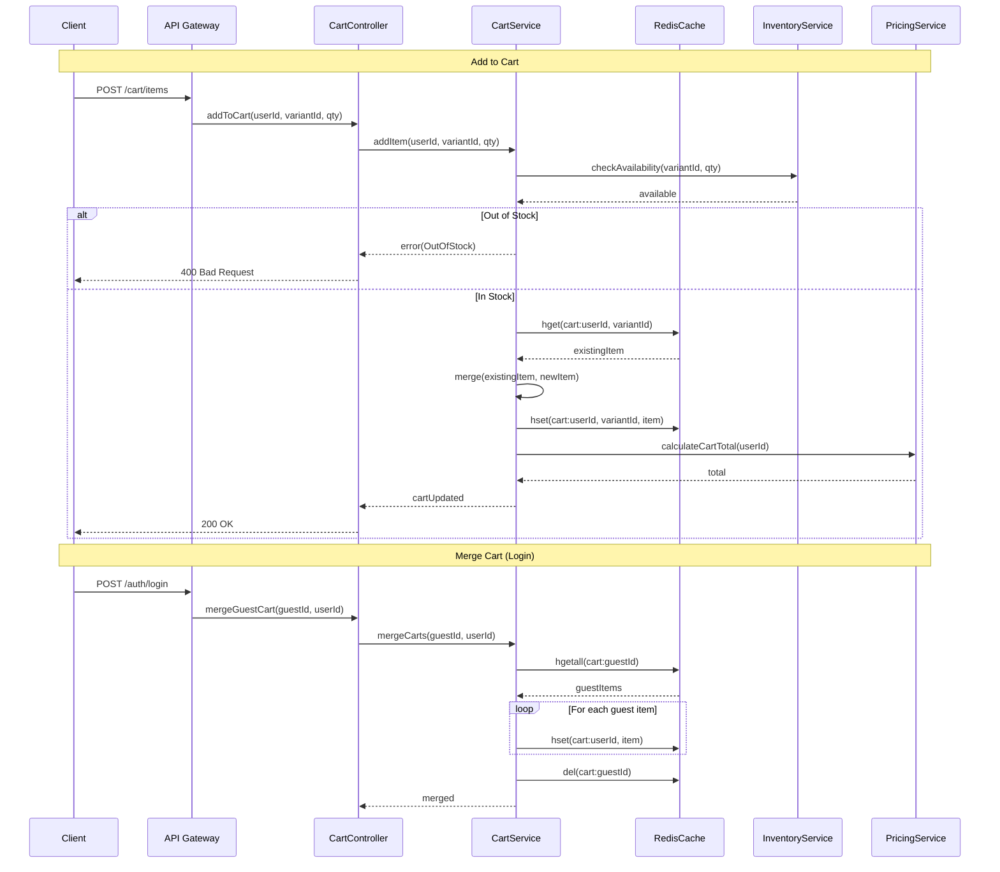

# Cart Operations Sequence Diagram

Detailed sequence showing internal object interactions for shopping cart management.

```mermaid
sequenceDiagram
    participant Client
    participant Gateway as API Gateway
    participant CartCtrl as CartController
    participant CartSvc as CartService
    participant Redis as RedisCache
    participant InventorySvc as InventoryService
    participant PricingSvc as PricingService
    
    Note over Client,PricingSvc: Add to Cart
    
    Client->>Gateway: POST /cart/items
    Gateway->>CartCtrl: addToCart(userId, variantId, qty)
    
    CartCtrl->>CartSvc: addItem(userId, variantId, qty)
    
    CartSvc->>InventorySvc: checkAvailability(variantId, qty)
    InventorySvc-->>CartSvc: available
    
    alt Out of Stock
        CartSvc-->>CartCtrl: error(OutOfStock)
        CartCtrl-->>Client: 400 Bad Request
    else In Stock
        CartSvc->>Redis: hget(cart:userId, variantId)
        Redis-->>CartSvc: existingItem
        
        CartSvc->>CartSvc: merge(existingItem, newItem)
        CartSvc->>Redis: hset(cart:userId, variantId, item)
        
        CartSvc->>PricingSvc: calculateCartTotal(userId)
        PricingSvc-->>CartSvc: total
        
        CartSvc-->>CartCtrl: cartUpdated
        CartCtrl-->>Client: 200 OK
    end
    
    Note over Client,PricingSvc: Merge Cart (Login)
    
    Client->>Gateway: POST /auth/login
    Gateway->>CartCtrl: mergeGuestCart(guestId, userId)
    
    CartCtrl->>CartSvc: mergeCarts(guestId, userId)
    
    CartSvc->>Redis: hgetall(cart:guestId)
    Redis-->>CartSvc: guestItems
    
    loop For each guest item
        CartSvc->>Redis: hset(cart:userId, item)
    end
    
    CartSvc->>Redis: del(cart:guestId)
    CartSvc-->>CartCtrl: merged
```
