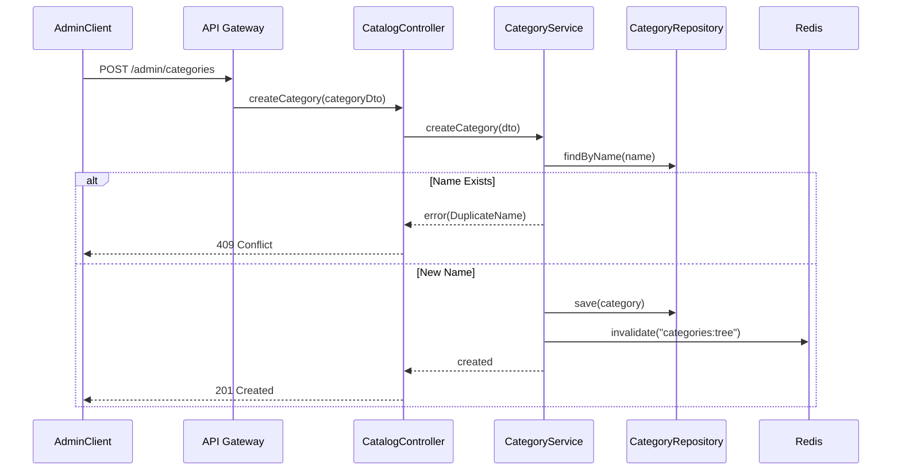

# Category Management Sequence Diagram

Detailed sequence showing internal object interactions for admin category management.

```mermaid
sequenceDiagram
    participant AdminClient
    participant Gateway as API Gateway
    participant CatalogCtrl as CatalogController
    participant CategorySvc as CategoryService
    participant CategoryRepo as CategoryRepository
    participant Cache as Redis
    
    AdminClient->>Gateway: POST /admin/categories
    Gateway->>CatalogCtrl: createCategory(categoryDto)
    
    CatalogCtrl->>CategorySvc: createCategory(dto)
    
    CategorySvc->>CategoryRepo: findByName(name)
    
    alt Name Exists
        CategorySvc-->>CatalogCtrl: error(DuplicateName)
        CatalogCtrl-->>AdminClient: 409 Conflict
    else New Name
        CategorySvc->>CategoryRepo: save(category)
        
        CategorySvc->>Cache: invalidate("categories:tree")
        
        CategorySvc-->>CatalogCtrl: created
        CatalogCtrl-->>AdminClient: 201 Created
    end
```
