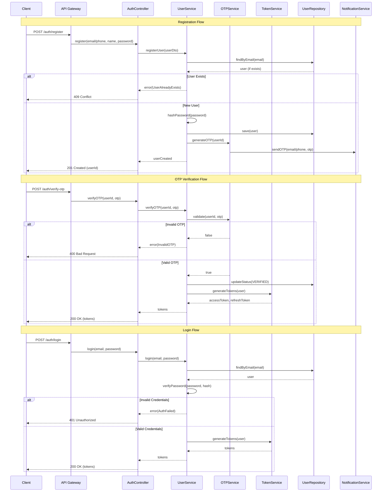

# Customer Authentication Sequence Diagram

Detailed sequence showing internal object interactions for customer registration and authentication.

```mermaid
sequenceDiagram
    participant Client
    participant Gateway as API Gateway
    participant AuthCtrl as AuthController
    participant UserSvc as UserService
    participant OTPSvc as OTPService
    participant TokenSvc as TokenService
    participant UserRepo as UserRepository
    participant NotifSvc as NotificationService
    
    Note over Client,NotifSvc: Registration Flow
    
    Client->>Gateway: POST /auth/register
    Gateway->>AuthCtrl: register(email/phone, name, password)
    
    AuthCtrl->>UserSvc: registerUser(userDto)
    UserSvc->>UserRepo: findByEmail(email)
    UserRepo-->>UserSvc: user (if exists)
    
    alt User Exists
        UserSvc-->>AuthCtrl: error(UserAlreadyExists)
        AuthCtrl-->>Client: 409 Conflict
    else New User
        UserSvc->>UserSvc: hashPassword(password)
        UserSvc->>UserRepo: save(user)
        UserSvc->>OTPSvc: generateOTP(userId)
        OTPSvc->>NotifSvc: sendOTP(email/phone, otp)
        UserSvc-->>AuthCtrl: userCreated
        AuthCtrl-->>Client: 201 Created (userId)
    end
    
    Note over Client,NotifSvc: OTP Verification Flow
    
    Client->>Gateway: POST /auth/verify-otp
    Gateway->>AuthCtrl: verifyOTP(userId, otp)
    
    AuthCtrl->>UserSvc: verifyOTP(userId, otp)
    UserSvc->>OTPSvc: validate(userId, otp)
    
    alt Invalid OTP
        OTPSvc-->>UserSvc: false
        UserSvc-->>AuthCtrl: error(InvalidOTP)
        AuthCtrl-->>Client: 400 Bad Request
    else Valid OTP
        OTPSvc-->>UserSvc: true
        UserSvc->>UserRepo: updateStatus(VERIFIED)
        UserSvc->>TokenSvc: generateTokens(user)
        TokenSvc-->>UserSvc: accessToken, refreshToken
        UserSvc-->>AuthCtrl: tokens
        AuthCtrl-->>Client: 200 OK (tokens)
    end
    
    Note over Client,NotifSvc: Login Flow
    
    Client->>Gateway: POST /auth/login
    Gateway->>AuthCtrl: login(email, password)
    
    AuthCtrl->>UserSvc: login(email, password)
    UserSvc->>UserRepo: findByEmail(email)
    UserRepo-->>UserSvc: user
    
    UserSvc->>UserSvc: verifyPassword(password, hash)
    
    alt Invalid Credentials
        UserSvc-->>AuthCtrl: error(AuthFailed)
        AuthCtrl-->>Client: 401 Unauthorized
    else Valid Credentials
        UserSvc->>TokenSvc: generateTokens(user)
        TokenSvc-->>UserSvc: tokens
        UserSvc-->>AuthCtrl: tokens
        AuthCtrl-->>Client: 200 OK (tokens)
    end
```
