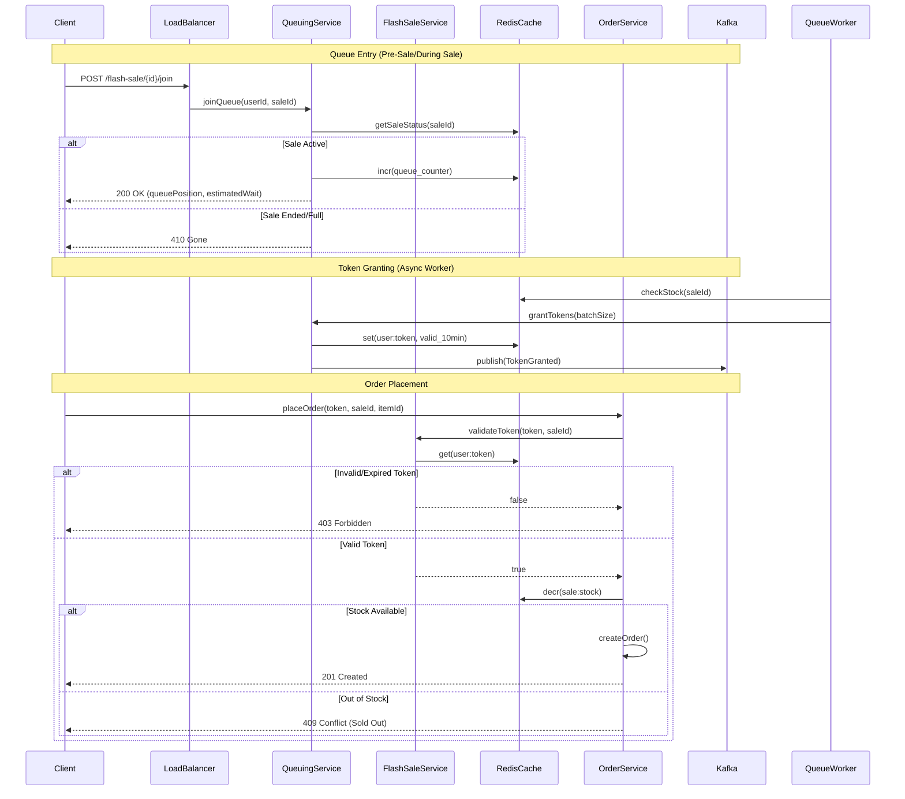

# Flash Sale Sequence Diagram

Detailed sequence showing internal object interactions for high-concurrency flash sales.

```mermaid
sequenceDiagram
    participant Client
    participant LoadBalancer
    participant QueueSvc as QueuingService
    participant FlashSvc as FlashSaleService
    participant Redis as RedisCache
    participant OrderSvc as OrderService
    participant EventBus as Kafka
    
    Note over Client,EventBus: Queue Entry (Pre-Sale/During Sale)
    
    Client->>LoadBalancer: POST /flash-sale/{id}/join
    LoadBalancer->>QueueSvc: joinQueue(userId, saleId)
    
    QueueSvc->>Redis: getSaleStatus(saleId)
    
    alt Sale Active
        QueueSvc->>Redis: incr(queue_counter)
        QueueSvc-->>Client: 200 OK (queuePosition, estimatedWait)
    else Sale Ended/Full
        QueueSvc-->>Client: 410 Gone
    end
    
    Note over Client,EventBus: Token Granting (Async Worker)
    
    QueueWorker->>Redis: checkStock(saleId)
    QueueWorker->>QueueSvc: grantTokens(batchSize)
    QueueSvc->>Redis: set(user:token, valid_10min)
    QueueSvc->>EventBus: publish(TokenGranted)
    
    Note over Client,EventBus: Order Placement
    
    Client->>OrderSvc: placeOrder(token, saleId, itemId)
    
    OrderSvc->>FlashSvc: validateToken(token, saleId)
    FlashSvc->>Redis: get(user:token)
    
    alt Invalid/Expired Token
        FlashSvc-->>OrderSvc: false
        OrderSvc-->>Client: 403 Forbidden
    else Valid Token
        FlashSvc-->>OrderSvc: true
        OrderSvc->>Redis: decr(sale:stock)
        
        alt Stock Available
            OrderSvc->>OrderSvc: createOrder()
            OrderSvc-->>Client: 201 Created
        else Out of Stock
            OrderSvc-->>Client: 409 Conflict (Sold Out)
        end
    end
```
