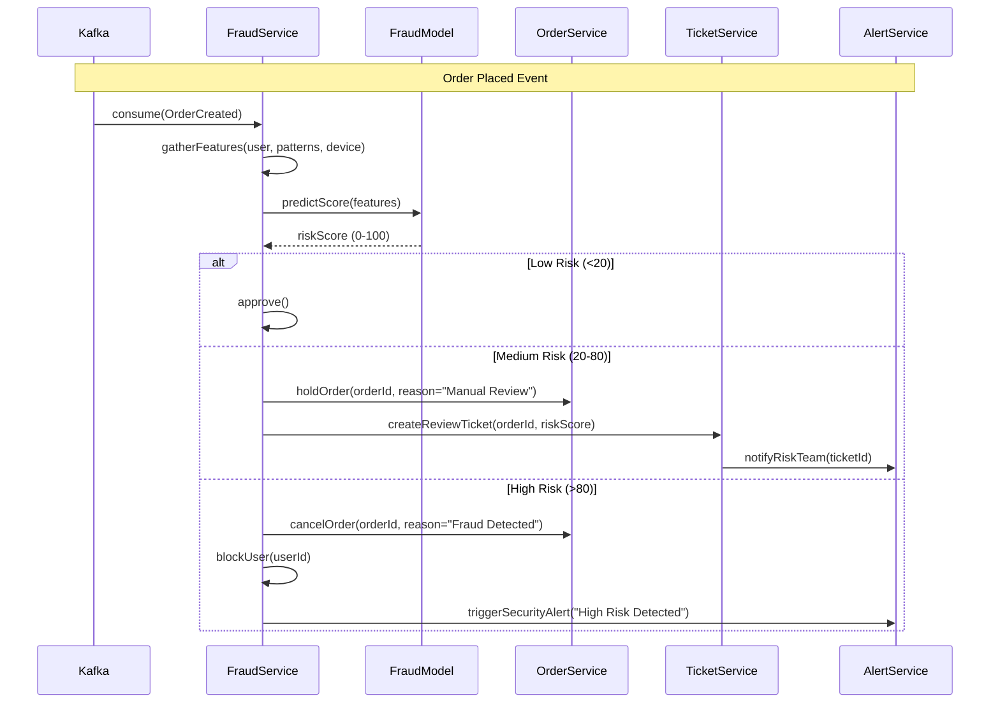

# Fraud Detection Sequence Diagram

Detailed sequence showing internal object interactions for asynchronous fraud detection.

```mermaid
sequenceDiagram
    participant EventBus as Kafka
    participant FraudSvc as FraudService
    participant MLResource as FraudModel
    participant OrderSvc as OrderService
    participant TicketSvc as TicketService
    participant AlertSvc as AlertService
    
    Note over EventBus,AlertSvc: Order Placed Event
    
    EventBus->>FraudSvc: consume(OrderCreated)
    
    FraudSvc->>FraudSvc: gatherFeatures(user, patterns, device)
    
    FraudSvc->>MLResource: predictScore(features)
    MLResource-->>FraudSvc: riskScore (0-100)
    
    alt Low Risk (<20)
        FraudSvc->>FraudSvc: approve()
    else Medium Risk (20-80)
        FraudSvc->>OrderSvc: holdOrder(orderId, reason="Manual Review")
        FraudSvc->>TicketSvc: createReviewTicket(orderId, riskScore)
        TicketSvc->>AlertSvc: notifyRiskTeam(ticketId)
    else High Risk (>80)
        FraudSvc->>OrderSvc: cancelOrder(orderId, reason="Fraud Detected")
        FraudSvc->>FraudSvc: blockUser(userId)
        FraudSvc->>AlertSvc: triggerSecurityAlert("High Risk Detected")
    end
```
