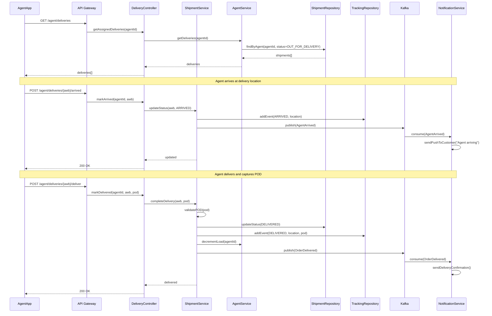

# Last Mile Delivery Sequence Diagram

Detailed sequence showing internal object interactions for last mile delivery.

```mermaid
sequenceDiagram
    participant App as AgentApp
    participant Gateway as API Gateway
    participant DeliveryCtrl as DeliveryController
    participant ShipmentSvc as ShipmentService
    participant AgentSvc as AgentService
    participant ShipmentRepo as ShipmentRepository
    participant TrackingRepo as TrackingRepository
    participant EventBus as Kafka
    participant NotifSvc as NotificationService
    
    App->>Gateway: GET /agent/deliveries
    Gateway->>DeliveryCtrl: getAssignedDeliveries(agentId)
    DeliveryCtrl->>AgentSvc: getDeliveries(agentId)
    AgentSvc->>ShipmentRepo: findByAgent(agentId, status=OUT_FOR_DELIVERY)
    ShipmentRepo-->>AgentSvc: shipments[]
    AgentSvc-->>DeliveryCtrl: deliveries
    DeliveryCtrl-->>App: deliveries[]
    
    Note over App,NotifSvc: Agent arrives at delivery location
    
    App->>Gateway: POST /agent/deliveries/{awb}/arrived
    Gateway->>DeliveryCtrl: markArrived(agentId, awb)
    
    DeliveryCtrl->>ShipmentSvc: updateStatus(awb, ARRIVED)
    ShipmentSvc->>TrackingRepo: addEvent(ARRIVED, location)
    ShipmentSvc->>EventBus: publish(AgentArrived)
    
    EventBus->>NotifSvc: consume(AgentArrived)
    NotifSvc->>NotifSvc: sendPushToCustomer("Agent arriving")
    
    ShipmentSvc-->>DeliveryCtrl: updated
    DeliveryCtrl-->>App: 200 OK
    
    Note over App,NotifSvc: Agent delivers and captures POD
    
    App->>Gateway: POST /agent/deliveries/{awb}/deliver
    Gateway->>DeliveryCtrl: markDelivered(agentId, awb, pod)
    
    DeliveryCtrl->>ShipmentSvc: completeDelivery(awb, pod)
    ShipmentSvc->>ShipmentSvc: validatePOD(pod)
    
    ShipmentSvc->>ShipmentRepo: updateStatus(DELIVERED)
    ShipmentSvc->>TrackingRepo: addEvent(DELIVERED, location, pod)
    
    ShipmentSvc->>AgentSvc: decrementLoad(agentId)
    
    ShipmentSvc->>EventBus: publish(OrderDelivered)
    
    EventBus->>NotifSvc: consume(OrderDelivered)
    NotifSvc->>NotifSvc: sendDeliveryConfirmation()
    
    ShipmentSvc-->>DeliveryCtrl: delivered
    DeliveryCtrl-->>App: 200 OK
```
