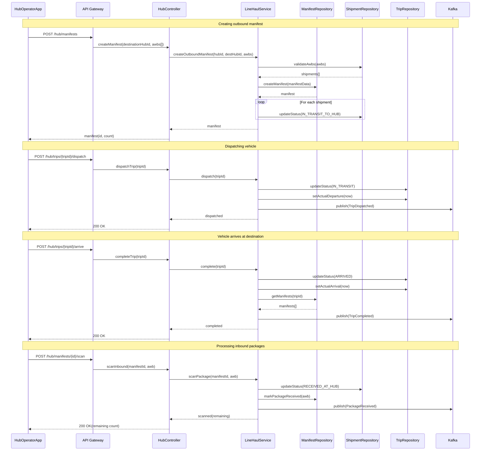

# Line Haul Transit Sequence Diagram

Detailed sequence showing internal object interactions for line haul operations.

```mermaid
sequenceDiagram
    participant HubApp as HubOperatorApp
    participant Gateway as API Gateway
    participant HubCtrl as HubController
    participant LineHaulSvc as LineHaulService
    participant ManifestRepo as ManifestRepository
    participant ShipmentRepo as ShipmentRepository
    participant TripRepo as TripRepository
    participant EventBus as Kafka
    
    Note over HubApp,EventBus: Creating outbound manifest
    
    HubApp->>Gateway: POST /hub/manifests
    Gateway->>HubCtrl: createManifest(destinationHubId, awbs[])
    
    HubCtrl->>LineHaulSvc: createOutboundManifest(hubId, destHubId, awbs)
    LineHaulSvc->>ShipmentRepo: validateAwbs(awbs)
    ShipmentRepo-->>LineHaulSvc: shipments[]
    
    LineHaulSvc->>ManifestRepo: createManifest(manifestData)
    ManifestRepo-->>LineHaulSvc: manifest
    
    loop For each shipment
        LineHaulSvc->>ShipmentRepo: updateStatus(IN_TRANSIT_TO_HUB)
    end
    
    LineHaulSvc-->>HubCtrl: manifest
    HubCtrl-->>HubApp: manifest(id, count)
    
    Note over HubApp,EventBus: Dispatching vehicle
    
    HubApp->>Gateway: POST /hub/trips/{tripId}/dispatch
    Gateway->>HubCtrl: dispatchTrip(tripId)
    
    HubCtrl->>LineHaulSvc: dispatch(tripId)
    LineHaulSvc->>TripRepo: updateStatus(IN_TRANSIT)
    LineHaulSvc->>TripRepo: setActualDeparture(now)
    
    LineHaulSvc->>EventBus: publish(TripDispatched)
    
    LineHaulSvc-->>HubCtrl: dispatched
    HubCtrl-->>HubApp: 200 OK
    
    Note over HubApp,EventBus: Vehicle arrives at destination
    
    HubApp->>Gateway: POST /hub/trips/{tripId}/arrive
    Gateway->>HubCtrl: completeTrip(tripId)
    
    HubCtrl->>LineHaulSvc: complete(tripId)
    LineHaulSvc->>TripRepo: updateStatus(ARRIVED)
    LineHaulSvc->>TripRepo: setActualArrival(now)
    
    LineHaulSvc->>ManifestRepo: getManifests(tripId)
    ManifestRepo-->>LineHaulSvc: manifests[]
    
    LineHaulSvc->>EventBus: publish(TripCompleted)
    
    LineHaulSvc-->>HubCtrl: completed
    HubCtrl-->>HubApp: 200 OK
    
    Note over HubApp,EventBus: Processing inbound packages
    
    HubApp->>Gateway: POST /hub/manifests/{id}/scan
    Gateway->>HubCtrl: scanInbound(manifestId, awb)
    
    HubCtrl->>LineHaulSvc: scanPackage(manifestId, awb)
    LineHaulSvc->>ShipmentRepo: updateStatus(RECEIVED_AT_HUB)
    LineHaulSvc->>ManifestRepo: markPackageReceived(awb)
    
    LineHaulSvc->>EventBus: publish(PackageReceived)
    
    LineHaulSvc-->>HubCtrl: scanned(remaining)
    HubCtrl-->>HubApp: 200 OK(remaining count)
```
