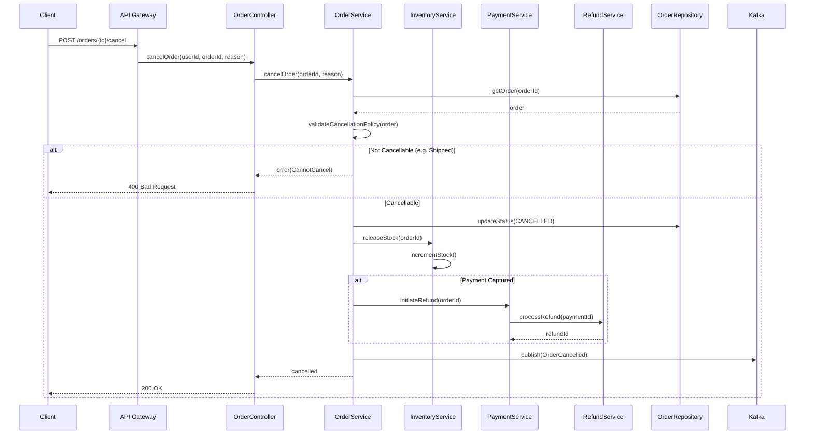

# Order Cancellation Sequence Diagram

Detailed sequence showing internal object interactions for order cancellation.

```mermaid
sequenceDiagram
    participant Client
    participant Gateway as API Gateway
    participant OrderCtrl as OrderController
    participant OrderSvc as OrderService
    participant InventorySvc as InventoryService
    participant PaymentSvc as PaymentService
    participant RefundSvc as RefundService
    participant OrderRepo as OrderRepository
    participant EventBus as Kafka
    
    Client->>Gateway: POST /orders/{id}/cancel
    Gateway->>OrderCtrl: cancelOrder(userId, orderId, reason)
    
    OrderCtrl->>OrderSvc: cancelOrder(orderId, reason)
    
    OrderSvc->>OrderRepo: getOrder(orderId)
    OrderRepo-->>OrderSvc: order
    
    OrderSvc->>OrderSvc: validateCancellationPolicy(order)
    
    alt Not Cancellable (e.g. Shipped)
        OrderSvc-->>OrderCtrl: error(CannotCancel)
        OrderCtrl-->>Client: 400 Bad Request
    else Cancellable
        OrderSvc->>OrderRepo: updateStatus(CANCELLED)
        
        OrderSvc->>InventorySvc: releaseStock(orderId)
        InventorySvc->>InventorySvc: incrementStock()
        
        alt Payment Captured
            OrderSvc->>PaymentSvc: initiateRefund(orderId)
            PaymentSvc->>RefundSvc: processRefund(paymentId)
            RefundSvc-->>PaymentSvc: refundId
        end
        
        OrderSvc->>EventBus: publish(OrderCancelled)
        
        OrderSvc-->>OrderCtrl: cancelled
        OrderCtrl-->>Client: 200 OK
    end
```
